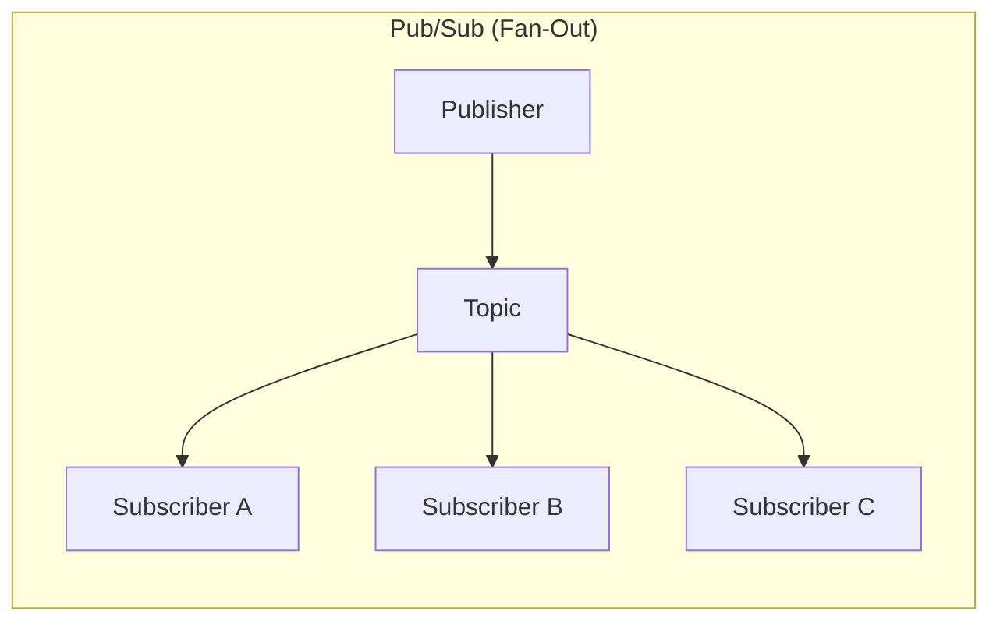
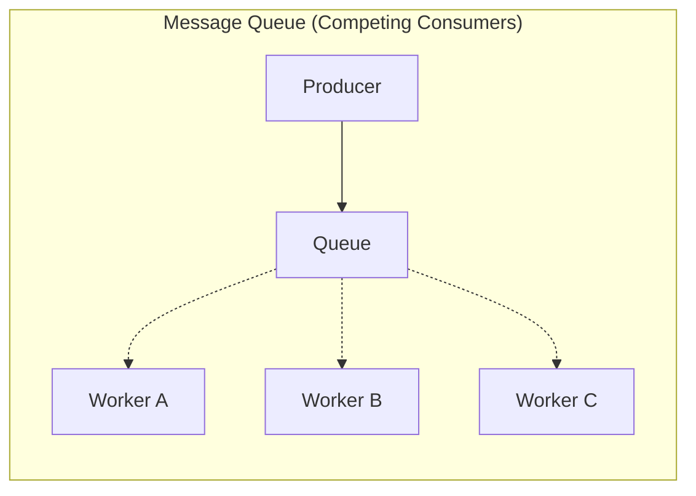
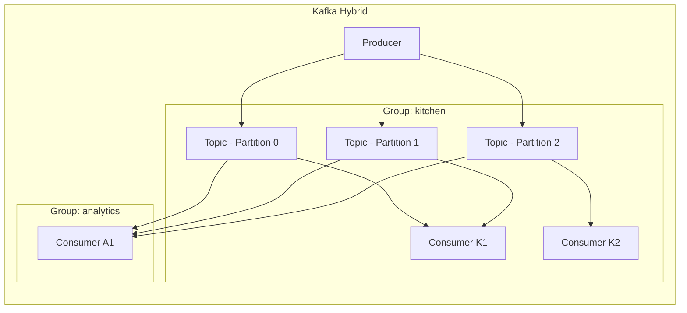

# Appendix B -- Message Queues vs Pub/Sub

## Why This Appendix Exists

In Ch07 we built an in-process pub/sub broker. One publisher, multiple subscribers, all living inside the same Python process. That is fine for understanding the pattern, but it is not how production systems work.

In production, you will choose between **Redis Pub/Sub**, **RabbitMQ**, **Kafka**, and others. These are NOT interchangeable -- they make fundamentally different trade-offs about persistence, ordering, throughput, and delivery guarantees. **Choosing wrong can cost you months of rework.**

This appendix does three things:

1. Clarifies the distinction between **message queues** and **pub/sub** -- two patterns that are often confused.
2. Covers the three production systems you will actually encounter: Redis, RabbitMQ, and Kafka.
3. Gives you a decision framework for choosing between them.

---

## Message Queue vs Pub/Sub -- The Core Distinction

These are two fundamentally different patterns. Many engineers use the terms interchangeably. Do not make that mistake.

### Pub/Sub: One Message, Many Consumers (Fan-Out)

```
Publisher ---> [TOPIC: "order.placed"] ---> Subscriber A (kitchen)
                                       ---> Subscriber B (billing)
                                       ---> Subscriber C (analytics)

Each subscriber gets a COPY of every message.
If you add Subscriber D, it also gets every message.
The publisher does not know how many subscribers exist.
```

This is a **broadcast**. Like a radio station: everyone tuned in hears the same thing. In Ch07, this is exactly what our broker did. The kitchen, billing, and driver matching services all received the same `order.placed` event.

**Key property**: adding a new subscriber does not affect existing subscribers or the publisher. This is the decoupling that makes pub/sub powerful.

### Message Queue: One Message, ONE Consumer (Competing Consumers)

```
Producer ---> [QUEUE: "order-processing"] ---> Worker A
                                           |-> Worker B  (only ONE gets each message)
                                           |-> Worker C

Message 1 --> Worker A
Message 2 --> Worker B
Message 3 --> Worker C
Message 4 --> Worker A
```

This is a **work queue**. Like a checkout line at a grocery store: there is one line, and the next available cashier takes the next customer. Each message is processed by exactly one worker.

**Key property**: adding more workers increases throughput. No message is processed twice.

### The Hybrid: Kafka Consumer Groups

Kafka blurs the line. Within a **consumer group**, consumers compete for messages (message queue behavior). Across **different consumer groups**, each group gets every message (pub/sub behavior).

```
Producer ---> [TOPIC: "orders", 3 partitions]

Consumer Group "kitchen" (2 consumers):
  Consumer K1: reads partitions 0, 1
  Consumer K2: reads partition 2
  --> Each order goes to ONE kitchen consumer (competing)

Consumer Group "analytics" (1 consumer):
  Consumer A1: reads partitions 0, 1, 2
  --> Each order ALSO goes to analytics (fan-out)

Result: kitchen and analytics both see every message,
but within each group, work is distributed.
```

This is the most common production pattern: fan-out across services, competing consumers within each service for horizontal scaling.

### Mermaid: Pub/Sub vs Message Queue







---

## The Three Production Systems

### 1. Redis Pub/Sub + Streams

Redis started as a cache, but it has two messaging mechanisms built in.

#### Redis Pub/Sub (PUBLISH / SUBSCRIBE)

```
SUBSCRIBE order.placed
PUBLISH order.placed '{"order_id": "abc123"}'
```

This is the simplest possible pub/sub. A subscriber connects to Redis, says "I want messages on this channel," and Redis delivers them in real-time.

**The catch**: it is **fire-and-forget**. There is no persistence. If a subscriber is not connected when a message is published, that message is gone forever. There is no buffer, no replay, no acknowledgment. Redis does not even know if anyone received the message.

This is fine for some use cases:
- Real-time notifications where missing one is acceptable
- Cache invalidation ("hey, this key changed")
- Live dashboards and metrics

This is catastrophic for others:
- Order processing (lost order = lost revenue)
- Payment events (lost charge event = money leak)
- Anything where "at-least-once" delivery matters

#### Redis Streams (XADD / XREAD / XREADGROUP)

Added in Redis 5.0, Streams fix the persistence problem. A stream is an append-only log (sound familiar? Kafka pioneered this).

```
XADD orders * order_id abc123 status placed
XREADGROUP GROUP kitchen consumer1 COUNT 1 BLOCK 0 STREAMS orders >
XACK orders kitchen 1234567890-0
```

Streams give you:
- **Persistence**: messages survive restarts (if you have persistence enabled)
- **Consumer groups**: competing consumers, like Kafka
- **Acknowledgment**: consumers must ACK messages, unacknowledged messages can be reclaimed
- **Replay**: read from any point in the stream by ID

#### Redis Constraints

- **Single-threaded**: Redis processes commands on one CPU core. This is what gives it sub-millisecond latency, but it means throughput is CPU-bound. You cannot just add cores.
- **Memory-bound**: all data lives in RAM. If your stream grows to 10GB, you need 10GB+ of RAM. This makes long retention expensive.
- **No built-in clustering for pub/sub**: Redis Cluster shards data, but pub/sub messages are broadcast to every node. This means pub/sub does not scale with the cluster.
- **No built-in exactly-once**: Redis Streams have at-least-once semantics. Your consumers must be idempotent.

#### When to Use Redis

- You already have Redis in your stack (adding another system has operational cost)
- Low-latency is critical (sub-millisecond)
- Message loss is acceptable (pub/sub) or you use Streams for persistence
- Simple use cases: cache invalidation, real-time updates, lightweight task queues
- Moderate throughput needs (~100K msg/s)

---

### 2. RabbitMQ

RabbitMQ is a traditional message broker implementing the AMQP protocol. Where Redis is "a cache that can do messaging," RabbitMQ is "a message broker, period."

#### The AMQP Model

RabbitMQ has four core concepts:

```
Publisher ---> [Exchange] --routing--> [Queue] ---> Consumer
                  |                      |
                  |-- type: direct       |-- durable
                  |-- type: fanout       |-- exclusive
                  |-- type: topic        |-- auto-delete
                  |-- type: headers
```

1. **Exchanges** receive messages from publishers. They do not store messages -- they route them.
2. **Queues** store messages until consumers process them.
3. **Bindings** connect exchanges to queues with routing rules.
4. **Routing keys** determine which queue(s) receive each message.

The exchange types give you powerful routing:

- **Direct**: message goes to queues whose binding key exactly matches the routing key. `routing_key="order.placed"` -> queue bound with `"order.placed"`.
- **Fanout**: message goes to ALL bound queues, regardless of routing key. This is pub/sub.
- **Topic**: pattern matching. `routing_key="order.placed"` matches `"order.*"` and `"order.#"` but not `"payment.*"`.
- **Headers**: route based on message headers instead of routing key. Rarely used but powerful for complex routing.

#### Delivery Guarantees

RabbitMQ provides the strongest delivery guarantees of the three systems:

**Publisher Confirms**: the broker acknowledges receipt of each message. The publisher knows the message made it to disk.

```
channel.confirm_delivery()
channel.basic_publish(exchange='orders', routing_key='order.placed', body=message)
# If this returns without exception, broker has the message
```

**Consumer Acknowledgments**: a message is not removed from the queue until the consumer explicitly ACKs it. If the consumer crashes, the message is redelivered to another consumer.

```
def callback(ch, method, properties, body):
    process(body)
    ch.basic_ack(delivery_tag=method.delivery_tag)  # Only now is it removed
```

**Dead Letter Queues (DLQ)**: if a message is rejected, expires, or a queue overflows, the message goes to a DLQ instead of being lost. This is critical for debugging and recovery.

```
Queue "orders" --[message rejected 3x]--> DLQ "orders.dead"
                                              |
                                              v
                                         Human reviews,
                                         fixes, re-publishes
```

#### RabbitMQ Constraints

- **Broker is stateful**: all messages live in the broker. If the broker goes down, messages are at risk (unless you use mirrored queues or quorum queues).
- **Clustering is complex**: RabbitMQ clustering requires careful network setup. Split-brain scenarios are a real operational concern.
- **Throughput ceiling**: ~50K msg/s per node is a realistic ceiling for persistent messages. You can go higher with non-persistent messages, but then why use RabbitMQ?
- **No replay**: once a message is consumed and acknowledged, it is gone. There is no "go back and reprocess yesterday's orders."
- **Memory pressure**: if consumers fall behind, queues grow in memory. RabbitMQ has flow control (it blocks publishers), but this can cascade into upstream failures.

#### When to Use RabbitMQ

- Complex routing requirements (topic exchanges, header-based routing)
- Strong delivery guarantees matter (publisher confirms, consumer ACKs, DLQs)
- Traditional enterprise messaging patterns (request/reply over queues, RPC)
- Moderate throughput with guaranteed delivery
- You need fine-grained control over message TTL, priorities, and retry policies

---

### 3. Apache Kafka

Kafka is fundamentally different from Redis and RabbitMQ. It is not a message broker -- it is a **distributed commit log**. This changes everything.

#### The Log-Based Model

In Redis and RabbitMQ, consuming a message removes it (or it is fire-and-forget). In Kafka, messages are **appended to a log** and **stay there** for a configurable retention period (hours, days, weeks, forever).

```
Topic: "orders" (3 partitions)

Partition 0: [msg0] [msg3] [msg6] [msg9]  ...
Partition 1: [msg1] [msg4] [msg7] [msg10] ...
Partition 2: [msg2] [msg5] [msg8] [msg11] ...
              ^                          ^
              oldest                     newest (append here)

Consumer Group "kitchen":
  Consumer K1: partition 0, offset=3 (reading msg9 next)
  Consumer K2: partition 1, offset=2 (reading msg7 next)
  Consumer K3: partition 2, offset=4 (reading msg11 next)
```

Consumers do not "take" messages from Kafka. They **read** from the log at a position (offset) and advance their own pointer. The messages stay. This means:

- **Multiple consumer groups** can read the same data independently. Kitchen is at offset 50, analytics is at offset 47, and the new fraud detection service starts from offset 0.
- **Replay** is trivial. Reset your consumer's offset to yesterday, and you reprocess all of yesterday's messages.
- **Retention** is time-based or size-based, not consumption-based. "Keep 7 days of data" means any consumer can read the last 7 days at any time.

#### Partitions and Ordering

Kafka guarantees ordering **within a partition**, not across partitions. This is a critical design decision.

If order #123 and order #456 go to different partitions, there is no guarantee which one a consumer sees first. But all events for order #123 (placed, confirmed, preparing, delivered) go to the same partition if you use `order_id` as the partition key.

```python
# Partition key determines which partition gets the message
producer.send("orders", key=order.id, value=event)
# All events for order "abc123" go to the same partition
# This guarantees they are consumed in order
```

Partition strategies:
- **Hash-based** (default): `hash(key) % num_partitions`. Deterministic, same key always goes to same partition. Use this when ordering per entity matters.
- **Round-robin**: no key, messages spread evenly. Maximum throughput, no ordering guarantee. Use this for independent, stateless processing.
- **Custom partitioner**: you control the assignment. Use this for data locality (all orders from the same restaurant on the same partition) or hot-key handling.

#### Consumer Groups and Rebalancing

Within a consumer group, Kafka assigns partitions to consumers. The rule: **each partition is consumed by exactly one consumer in the group**.

```
3 partitions, 2 consumers:
  Consumer A: partition 0, partition 1
  Consumer B: partition 2

Add Consumer C (rebalancing happens):
  Consumer A: partition 0
  Consumer B: partition 1
  Consumer C: partition 2

Add Consumer D (wasted -- only 3 partitions):
  Consumer A: partition 0
  Consumer B: partition 1
  Consumer C: partition 2
  Consumer D: idle (no partition to assign)
```

**Key insight**: the maximum parallelism in a consumer group equals the number of partitions. If you have 10 partitions and 15 consumers, 5 consumers sit idle. Plan your partition count at topic creation time -- increasing it later changes key-to-partition mapping and breaks ordering guarantees.

**Rebalancing** happens when consumers join or leave a group. During rebalancing, consumption pauses briefly. This is called a "stop-the-world" event. Cooperative rebalancing (Kafka 2.4+) reduces this, but it is still a concern at scale.

#### Kafka Constraints

- **Operational complexity**: Kafka requires ZooKeeper (or KRaft in newer versions), careful partition planning, and monitoring of consumer lag, disk usage, and replication.
- **Higher latency**: Kafka batches writes for throughput. Typical latency is 5-20ms, compared to sub-millisecond for Redis.
- **Partition count is (mostly) permanent**: increasing partitions breaks key-based ordering. Decreasing partitions is not supported. Plan carefully.
- **Consumer rebalancing**: adding/removing consumers causes brief pauses. In a large cluster with many consumer groups, this can be disruptive.
- **Overkill for simple cases**: if you just need a simple task queue with 100 messages/second, Kafka's operational burden is not justified.

#### When to Use Kafka

- High throughput requirements (hundreds of thousands to millions of messages per second)
- Event sourcing: using the log as the source of truth, not just a transport
- Replay is required: reprocessing historical data, backfilling new services
- Data pipelines: streaming data between systems (databases, data warehouses, search indices)
- Multiple consumer groups need the same data independently
- Long retention periods (days, weeks, or permanent)

---

## Systems Constraints Comparison

| Dimension | Redis (Pub/Sub / Streams) | RabbitMQ | Apache Kafka |
|-----------|---------------------------|----------|--------------|
| **Model** | Pub/Sub + Append-only streams | AMQP: exchanges, queues, bindings | Distributed commit log |
| **Throughput** | ~100K msg/s | ~50K msg/s (persistent) | ~1M msg/s |
| **Latency** | <1ms | 1-5ms | 5-20ms |
| **Persistence** | Optional (Streams) | Yes (disk-backed queues) | Yes (log-based, always) |
| **Ordering** | Per-channel (Pub/Sub), per-stream | Per-queue (FIFO) | Per-partition only |
| **Replay** | Streams only (by ID) | No (consumed = gone) | Yes (offset-based, any point) |
| **Delivery** | At-most-once (Pub/Sub), at-least-once (Streams) | At-least-once (ACKs + confirms) | At-least-once (exactly-once with transactions) |
| **Storage** | All in RAM | RAM + disk | Disk (OS page cache) |
| **Routing** | Channel names, patterns | Exchanges: direct, fanout, topic, headers | Topics + partitions |
| **Consumer scaling** | Limited | Competing consumers on a queue | Consumer groups, max = partition count |
| **Operational cost** | Low (you probably already have Redis) | Medium (broker management, clustering) | High (ZooKeeper/KRaft, partitions, monitoring) |

---

## Production Depth

### Exactly-Once Semantics

"Exactly-once" is the holy grail of messaging: every message is processed exactly once, even in the face of failures. It is also the most misunderstood guarantee.

**Why it is hard**: in a distributed system, a consumer processes a message and then crashes before acknowledging it. The broker redelivers. Now the message is processed twice. Or: the consumer acknowledges but the ACK is lost in transit. The broker redelivers. Processed twice again.

**Redis**: no exactly-once support. Streams provide at-least-once. Your consumers must be idempotent (processing the same message twice produces the same result).

**RabbitMQ**: no native exactly-once. At-least-once with consumer ACKs. Deduplication is your responsibility.

**Kafka**: supports exactly-once semantics (EOS) through two mechanisms:
1. **Idempotent producers**: each producer gets a unique ID, and each message gets a sequence number. The broker deduplicates. This ensures each message is written to the log exactly once.
2. **Transactions**: a producer can atomically write to multiple partitions and commit consumer offsets in the same transaction. This gives end-to-end exactly-once when consuming from and producing to Kafka.

```
# Kafka transactional flow (conceptual):
producer.begin_transaction()
producer.send("output-topic", processed_result)
producer.send_offsets_to_transaction(consumer_offsets, consumer_group)
producer.commit_transaction()
# If any step fails, everything is rolled back
```

**The practical truth**: even with Kafka EOS, exactly-once only applies within Kafka. If your consumer writes to an external database, you need idempotent writes regardless. "Exactly-once" is really "effectively-once" -- the system may process the message multiple times internally, but the externally visible effect happens once.

### Dead Letter Queues (DLQ)

A poison message is one that consistently fails processing. Without a DLQ, it blocks the queue forever (or gets silently dropped).

**RabbitMQ**: built-in DLQ support. Configure `x-dead-letter-exchange` on a queue. Messages that are rejected, expire, or overflow go to the DLQ automatically.

**Kafka**: no built-in DLQ. Common pattern: catch processing errors, publish the failed message to a `.dlq` topic, and continue. A separate service monitors the DLQ topic for human review.

**Redis Streams**: no built-in DLQ. Use `XPENDING` to find messages that have been delivered but not acknowledged for a long time. Claim them with `XCLAIM` and route to a separate "dead" stream manually.

### Backpressure

What happens when consumers cannot keep up with producers?

**Redis Pub/Sub**: messages are **dropped**. Redis does not buffer pub/sub messages. If the subscriber's TCP buffer fills up, Redis disconnects it. This is by design -- Redis prioritizes the publisher's performance.

**Redis Streams**: messages accumulate in the stream (in RAM). You must set `MAXLEN` to cap growth, or eventually Redis runs out of memory and evicts data or crashes.

**RabbitMQ**: RabbitMQ implements **flow control**. When memory or disk usage hits a threshold, RabbitMQ blocks publishers. They physically cannot send more messages until consumers catch up. This prevents data loss but can cascade upstream -- if your API server is the publisher, it starts timing out.

**Kafka**: consumers simply **lag**. Messages stay in the log (on disk), and consumers read at their own pace. The key metric is **consumer lag** -- the difference between the latest offset and the consumer's current offset. As long as messages have not expired (retention period), consumers can catch up. Kafka handles backpressure the most gracefully because its storage is disk-based, not memory-based.

### Schema Evolution

As your system evolves, message formats change. How do you handle old consumers that expect the old format?

**Kafka + Schema Registry**: the industry standard. Producers register schemas (typically Avro or Protobuf) with a central Schema Registry. Consumers fetch the schema to deserialize. The registry enforces compatibility rules (backward, forward, full) so you cannot accidentally break consumers.

```
v1: {"order_id": "abc", "total": 1500}
v2: {"order_id": "abc", "total": 1500, "currency": "USD"}  # backward compatible
v3: {"order_id": "abc", "amount": 1500}  # BREAKING -- "total" renamed to "amount"
    --> Schema Registry rejects this if backward compatibility is enforced
```

**RabbitMQ**: no built-in schema registry. Common approaches: JSON Schema validation in application code, or use a separate schema registry service.

**Redis**: no schema support. You are on your own. Use JSON with explicit version fields.

### Event Sourcing with Kafka

Kafka's log-based nature makes it uniquely suited for event sourcing -- storing every state change as an immutable event, and deriving current state by replaying events.

```
Topic: "orders"
  offset 0: {type: "OrderPlaced", order_id: "abc", items: [...], total: 1500}
  offset 1: {type: "OrderConfirmed", order_id: "abc", restaurant: "Pizza Palace"}
  offset 2: {type: "DriverAssigned", order_id: "abc", driver: "Dave"}
  offset 3: {type: "OrderPickedUp", order_id: "abc", timestamp: "..."}
  offset 4: {type: "OrderDelivered", order_id: "abc", timestamp: "..."}

Current state of order "abc":
  Replay offsets 0-4 --> status=DELIVERED, driver=Dave, ...
```

This is powerful because:
- You have a complete audit trail of everything that happened
- You can rebuild any service's state by replaying events from the beginning
- You can add new services that process historical events (backfill)
- You can debug by replaying to the exact point where something went wrong

This is also dangerous because:
- Replaying millions of events is slow. You need **snapshots** (periodic checkpoints of current state).
- Schema evolution is critical -- events are immutable, so you cannot change old events. You must handle all historical formats.
- Storage grows without bound. You need a retention and compaction strategy.

### Multi-Region Replication

**Kafka**: MirrorMaker 2 replicates topics between Kafka clusters in different regions. Each region has its own cluster, and MirrorMaker handles the cross-region sync. Confluent offers Cluster Linking as a more integrated alternative.

**RabbitMQ**: Federation plugin connects brokers across regions with store-and-forward semantics. Shovel plugin moves messages between specific queues across brokers. Both handle network partitions gracefully.

**Redis**: Redis does not natively support cross-region pub/sub replication. You would need application-level bridging or use Redis Enterprise's Active-Active geo-distribution feature.

---

## Decision Framework

```
START: Do you need a message broker?
  |
  +--> Is message loss acceptable?
  |     |
  |     +--> YES: Redis Pub/Sub (simplest, fastest)
  |     |
  |     +--> NO: Continue...
  |
  +--> Do you need to replay historical messages?
  |     |
  |     +--> YES: Kafka (log-based, replay by offset)
  |     |         or Redis Streams (simpler, less throughput)
  |     |
  |     +--> NO: Continue...
  |
  +--> Do you need complex routing (topic patterns, headers)?
  |     |
  |     +--> YES: RabbitMQ (AMQP exchanges are unmatched)
  |     |
  |     +--> NO: Continue...
  |
  +--> What throughput do you need?
  |     |
  |     +--> >100K msg/s: Kafka
  |     +--> 10K-100K msg/s: RabbitMQ or Redis Streams
  |     +--> <10K msg/s: Any of them works. Pick the one
  |                       you already operate.
  |
  +--> Do you already run Redis?
        |
        +--> YES: Redis Streams (no new infrastructure)
        +--> NO: RabbitMQ (best delivery guarantees for
                 moderate throughput)
```

---

## FoodDash Application: Which System for What?

Applying these systems to our food delivery platform:

| Use Case | Best Choice | Why |
|----------|-------------|-----|
| **Order placed events** (kitchen, billing, driver matching all need it) | **Kafka** | Multiple consumer groups need the same event. Replay if a new service joins. Cannot lose orders. |
| **Real-time driver location updates** (100s of drivers, 1 update/sec each) | **Redis Pub/Sub** | High frequency, low latency, loss of one GPS ping is fine. Subscribers (map UI, ETA service) need real-time, not historical. |
| **Payment processing queue** (charge customer, handle retries, DLQ for failures) | **RabbitMQ** | Strong delivery guarantees. Publisher confirms ensure payment event is persisted. DLQ catches failed charges. Complex retry logic with TTL and backoff. |
| **Order status change stream** (for analytics, data warehouse) | **Kafka** | Append-only log is perfect for data pipelines. Analytics can replay, data warehouse connector reads at its own pace. Long retention. |
| **Cache invalidation** (menu item updated, invalidate all API server caches) | **Redis Pub/Sub** | Simple, fast, fire-and-forget. If one server misses the invalidation, the cache TTL handles it eventually. |
| **Push notification queue** (send SMS/email/push to customer) | **RabbitMQ** | Each notification should be delivered exactly once. Rate limiting with prefetch count. DLQ for failed sends. Priority queues for urgent notifications (order cancelled). |

---

## Running the Demos

**Queue vs Pub/Sub comparison** -- see the difference between competing consumers and fan-out:

```bash
uv run python -m appendices.appendix_b_message_queues.queue_vs_pubsub_demo
```

**Kafka simulation** -- partitions, consumer groups, offsets, and rebalancing:

```bash
uv run python -m appendices.appendix_b_message_queues.kafka_simulation
```

**Interactive visualization** -- open `visual.html` in a browser to see animated message flow for queues, pub/sub, and Kafka.

---

## Key Takeaways

1. **Pub/Sub and message queues are different patterns.** Pub/Sub is fan-out (everyone gets every message). Message queues are competing consumers (one worker per message). Do not confuse them.

2. **Redis is the fastest but the least reliable.** Sub-millisecond latency, but pub/sub is fire-and-forget. Use Streams if you need persistence, but you are still memory-bound.

3. **RabbitMQ has the best delivery guarantees.** Publisher confirms, consumer ACKs, dead letter queues, complex routing. The traditional choice for "this message must not be lost."

4. **Kafka is the most powerful but the most complex.** Log-based storage, replay, consumer groups, millions of messages per second. The right choice for event sourcing, data pipelines, and high throughput. Overkill for a simple task queue.

5. **You will probably use more than one.** Most production systems use Kafka for the event backbone, Redis for real-time ephemeral messaging, and sometimes RabbitMQ for specific task queues. They are complementary, not competing.

6. **The choice depends on your constraints.** Throughput, latency, persistence, ordering, replay, operational cost. There is no universally "best" system -- only the best system for your specific trade-offs.
