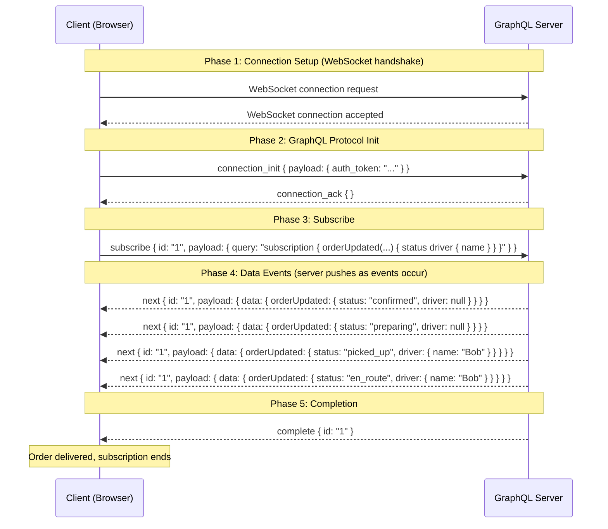

# Appendix C — GraphQL Subscriptions

## Why GraphQL Belongs Here

GraphQL isn't a new communication pattern — it's a layer that remixes patterns we already know. Queries and mutations are request-response (Ch01) with a flexible schema. Subscriptions are WebSockets (Ch05) with a typed event contract. Understanding GraphQL through the lens of underlying patterns demystifies it.

You've already learned every building block GraphQL uses. REST request-response? That's queries and mutations. Server-Sent Events for streaming? That's the mental model behind subscriptions. WebSocket for the transport? That's literally what subscriptions ride on. GraphQL doesn't invent new network primitives — it adds a **type system and query language** on top of the ones you already understand.

The insight: GraphQL is an **application-layer protocol**, not a transport-layer one. It doesn't replace HTTP or WebSocket. It uses them. The value is in the schema contract between client and server, not in how bytes move over the wire.

---

## GraphQL as Communication Pattern

### The Three Operations

GraphQL defines exactly three operation types. Each maps directly to a pattern from the main chapters:

| GraphQL Operation | Underlying Pattern | Chapter Equivalent |
|------------------|-------------------|-------------------|
| **Query** | HTTP GET (request-response) | Ch01 — REST Request-Response |
| **Mutation** | HTTP POST/PUT/DELETE (request-response) | Ch01 — REST Request-Response |
| **Subscription** | WebSocket stream | Ch05 — WebSockets |

### Query = GET, But You Choose the Fields

In REST, the server decides what fields to return. The client gets everything, whether it needs it or not:

```
GET /api/orders/ord_a1b2

Response (full object — 847 bytes):
{
  "id": "ord_a1b2",
  "customer": { "id": "cust_01", "name": "Alice", "address": "742 Evergreen Terrace" },
  "restaurant_id": "rest_01",
  "items": [ ... ],
  "status": "en_route",
  "driver_id": "drv_07",
  "created_at": 1700000000.0,
  "updated_at": 1700003600.0
}
```

In GraphQL, the client specifies exactly which fields it needs:

```graphql
query {
  order(id: "ord_a1b2") {
    status
  }
}

Response (only what was asked — 42 bytes):
{
  "data": {
    "order": {
      "status": "en_route"
    }
  }
}
```

The server resolves only the fields the client asked for. No over-fetching. The response shape mirrors the query shape exactly — the client always knows what it's getting.

### Mutation = POST/PUT/DELETE, Same Flexibility

Mutations work like POST/PUT/DELETE but with the same field selection:

```graphql
mutation {
  placeOrder(input: {
    restaurantId: "rest_01"
    items: [{ menuItemId: "item_01", quantity: 2 }]
  }) {
    id
    status
    estimatedDelivery
  }
}
```

The client sends the mutation input and specifies which fields of the result it wants back. No need for a separate GET after the POST — you get exactly the data you need in one round trip.

### Subscription = WebSocket Stream, With Types

Subscriptions use WebSocket as transport but add a typed query that specifies exactly which event fields the client receives:

```graphql
subscription {
  orderUpdated(orderId: "ord_a1b2") {
    status
    driver {
      name
      latitude
      longitude
    }
    estimatedDelivery
  }
}
```

Each event the server pushes matches this shape exactly. Compare this with raw WebSocket, where you'd receive an untyped JSON blob and hope the fields you need are present.

### The N+1 Problem: REST's Achilles Heel

Consider a FoodDash customer tracking screen that needs:
1. The order status
2. The driver's name and location
3. The restaurant's phone number

**REST approach — 3 separate requests:**

```
GET /api/orders/ord_a1b2                    → { status, driver_id, restaurant_id, ... }
GET /api/drivers/drv_07                      → { name, latitude, longitude, ... }
GET /api/restaurants/rest_01                 → { name, phone, menu, address, ... }

Total: 3 round trips, ~2400 bytes received (most of it unused)
```

**GraphQL approach — 1 request:**

```graphql
query {
  order(id: "ord_a1b2") {
    status
    driver {
      name
      latitude
      longitude
    }
    restaurant {
      phone
    }
  }
}

Total: 1 round trip, ~180 bytes received (exactly what's needed)
```

Three round trips become one. 2400 bytes become 180. This is the core value proposition: **the client describes the data shape it needs, and the server assembles it in one trip**.

The name "N+1" comes from the general pattern: to display a list of N orders with their drivers, REST requires 1 request for the list + N requests for each driver. GraphQL handles it in 1 request total.

---

## Subscriptions Deep Dive

### The Transport: WebSocket with a Protocol

GraphQL subscriptions ride on WebSocket (the same transport from Ch05), but they add a structured protocol layer. The two main protocols are:

- **graphql-ws** (modern, recommended) — the `graphql-ws` library protocol
- **subscriptions-transport-ws** (legacy, Apollo's original) — being phased out

Both use WebSocket frames to exchange JSON messages with specific `type` fields that define the subscription lifecycle.

### Subscription Lifecycle



### Protocol Message Types (graphql-ws)

| Direction | Type | Purpose |
|-----------|------|---------|
| Client to Server | `connection_init` | Authenticate and initialize the connection |
| Server to Client | `connection_ack` | Confirm the connection is accepted |
| Client to Server | `subscribe` | Start a subscription with a GraphQL query |
| Server to Client | `next` | Push a data event to the client |
| Server to Client | `error` | Report a subscription error |
| Client to Server | `complete` | Client unsubscribes |
| Server to Client | `complete` | Server ends the subscription |
| Client to Server | `ping` | Keep-alive ping |
| Server to Client | `pong` | Keep-alive pong |

### Comparison: Raw WebSocket vs GraphQL Subscription

| Aspect | Raw WebSocket (Ch05) | GraphQL Subscription |
|--------|---------------------|---------------------|
| **Message format** | Arbitrary — you define it | Structured JSON with typed fields |
| **Schema** | None — hope client and server agree | GraphQL SDL — compile-time validation |
| **Field selection** | Server sends everything | Client specifies exactly which fields |
| **Authentication** | Custom (often first message) | `connection_init` payload (standardized) |
| **Multiplexing** | Manual (add your own message IDs) | Built-in (subscription IDs in protocol) |
| **Error handling** | Custom error messages | Typed GraphQL errors with paths and extensions |
| **Reconnection** | Manual implementation | Library-handled with re-subscription |
| **Tooling** | Generic WebSocket clients | GraphQL Playground, Apollo DevTools |

The key insight: GraphQL subscriptions don't do anything you *couldn't* do with raw WebSocket. They standardize it. The protocol, the message format, the error handling, the subscription lifecycle — all defined once in the specification instead of reinvented per project.

### Multiple Subscriptions Over One Connection

A single WebSocket connection can carry multiple independent subscriptions, each identified by a unique ID:

```
Client subscribes to order updates (id: "1")
Client subscribes to driver location (id: "2")
Client subscribes to chat messages (id: "3")

Server sends: next { id: "1", payload: { data: { orderUpdated: { status: "preparing" } } } }
Server sends: next { id: "2", payload: { data: { driverMoved: { lat: 37.78, lng: -122.41 } } } }
Server sends: next { id: "3", payload: { data: { newMessage: { text: "On my way!" } } } }
Server sends: next { id: "1", payload: { data: { orderUpdated: { status: "ready" } } } }

Client unsubscribes from chat (complete { id: "3" })
— subscriptions 1 and 2 continue unaffected
```

This is multiplexing at the application layer — the same concept from HTTP/2 streams (Appendix A), but implemented in the GraphQL protocol over a single WebSocket.

---

## Systems Constraints Analysis

### CPU

**Query parsing and validation on every request.** Unlike REST, where the server knows the endpoint and expected payload at compile time, GraphQL must parse the query string, validate it against the schema, and plan the execution on every request. This adds 0.1-1ms per query depending on complexity.

**Mitigation**: Persisted queries. The client sends a hash (`"extensions": { "persistedQuery": { "sha256Hash": "abc123..." } }`) instead of the full query string. The server looks up the pre-parsed, pre-validated query plan. Parsing cost drops to near zero.

**Resolver execution can be expensive.** Each field in the query triggers a resolver function. A naive implementation resolves `order.driver.name` by: (1) fetch order from DB, (2) fetch driver from DB, (3) extract name. If the query asks for 10 orders with their drivers, that's 1 query for orders + 10 queries for drivers — the N+1 problem at the database level.

**Mitigation**: DataLoader (see Production Depth). Batch all driver IDs from the 10 orders into a single `SELECT * FROM drivers WHERE id IN (...)` query.

**Subscription filter evaluation.** For every event the backend produces (e.g., an order status change), the server must evaluate which active subscriptions match. If 10,000 clients are subscribed to different orders, each order update must check "does this event match subscription N?" for some subset of subscriptions. Efficient implementations use subscription indexing (hash map from order_id to subscriber list).

### Memory

**Schema in memory**: The parsed GraphQL schema is typically a few KB — negligible. It's loaded once at startup.

**Subscription state per client**: Each active subscription stores:
- The parsed query (~1-2 KB)
- Variables and context (~0.5 KB)
- The WebSocket connection handle (~1-2 KB)
- Filter/routing metadata (~0.2 KB)

At 10,000 concurrent subscriptions, that's ~40-50 MB of subscription state. Manageable on a single server, but worth considering for horizontal scaling.

**DataLoader caches**: The DataLoader pattern (see Production Depth) maintains a per-request cache of loaded entities. For a complex query touching 5 entity types, the cache might hold 50-200 objects (~50-100 KB). This cache is scoped to a single request and garbage collected afterward — not a memory leak risk, but worth monitoring for deeply nested queries.

### Network I/O

**Queries reduce over-fetching significantly.** A REST API returning a full Order object sends ~850 bytes. A GraphQL query asking for just `{ status }` returns ~42 bytes. For mobile clients on cellular networks, this 20x reduction is material.

**But: GraphQL query strings are large.** The query itself is sent with every request:

```
# REST request body: 0 bytes (it's a GET)
# GraphQL request body: ~200 bytes for the query string + variables

POST /graphql
{ "query": "query { order(id: \"ord_a1b2\") { status driver { name latitude longitude } restaurant { phone } } }" }
```

For simple queries, the query string can be larger than the data you're fetching. Persisted queries solve this — the client sends a 64-byte hash instead of a 200-byte query string.

**Subscriptions are bandwidth-efficient.** Because the client specifies fields in the subscription query, the server only serializes and sends those fields per event. A raw WebSocket pushing full order objects sends ~850 bytes per event. A GraphQL subscription for `{ status, driver { name } }` sends ~80 bytes per event.

### Latency

**Single round trip for complex data.** The N+1 example above (order + driver + restaurant) takes 3 sequential round trips in REST. At 50ms per round trip, that's 150ms. GraphQL handles it in one round trip: 50ms. The 3x improvement compounds for mobile clients on high-latency cellular connections.

**But: resolver chains add server-side latency.** The server must fetch the order, then resolve the driver field (another DB query), then resolve the restaurant field (another DB query). Without DataLoader, these happen sequentially. With DataLoader and smart batching, they can be parallelized.

**Subscription latency matches raw WebSocket.** Once the subscription is established, events flow over the same WebSocket transport. The only added latency is JSON serialization of the typed response (~0.1ms) and subscription filter evaluation (~0.01ms per event). Imperceptible.

### Where the Bottleneck Is

**Schema complexity grows over time.** What starts as a clean 20-type schema becomes a 200-type graph with deeply nested relationships. Clients can construct queries that traverse the entire graph:

```graphql
query EvilQuery {
  orders {
    customer {
      orders {
        customer {
          orders {
            # ... 10 levels deep
          }
        }
      }
    }
  }
}
```

This query causes exponential DB load. Without depth limits, a single malicious query can DoS your server. See Production Depth for mitigations.

**Caching is harder than REST.** With REST, each URL maps to a resource — you can cache `GET /orders/ord_a1b2` trivially with HTTP cache headers or a CDN. GraphQL uses a single `POST /graphql` endpoint for all queries. The URL is always the same. Traditional HTTP caching doesn't work.

**Mitigations**: Response-level caching (hash the query + variables as cache key), field-level caching (cache individual resolver results), and persisted query caching (CDN can cache based on the query hash in a GET request).

---

## Production Depth

### Query Depth and Complexity Limits

Every production GraphQL server must defend against malicious or accidentally expensive queries.

**Depth limiting** restricts how many levels deep a query can nest:

```
# Max depth = 5
query OK {
  order {           # depth 1
    driver {        # depth 2
      name          # depth 3 — OK
    }
  }
}

query REJECTED {
  order {           # depth 1
    customer {      # depth 2
      orders {      # depth 3
        customer {  # depth 4
          orders {  # depth 5
            items { # depth 6 — REJECTED: exceeds max depth
            }
          }
        }
      }
    }
  }
}
```

**Complexity analysis** assigns a cost to each field and rejects queries exceeding a budget:

```
# Field costs:
#   Scalar fields (name, status): cost 1
#   Object fields (driver, restaurant): cost 5
#   List fields (orders, items): cost 10 * estimated_size

query {
  order {                    # 5
    status                   # 1
    driver { name }          # 5 + 1 = 6
    items { name, quantity } # 10 * 5 (est.) * 2 fields = 100
  }
}
# Total complexity: 112 (within budget of 1000)

query {
  orders(first: 100) {                # 10 * 100 = 1000
    items { name }                     # 10 * 5 * 1 = 50 (per order)
  }
}
# Total complexity: 1000 + (100 * 50) = 6000 (REJECTED: exceeds budget of 1000)
```

### Persisted Queries

In production, you don't want clients sending arbitrary query strings. Persisted queries solve this:

1. **Build time**: Extract all GraphQL queries from your client code, hash them (SHA-256), and upload the hash-to-query mapping to the server.
2. **Runtime**: The client sends the hash, not the query.

```
# Instead of:
POST /graphql
{ "query": "query { order(id: \"ord_a1b2\") { status driver { name } } }" }

# The client sends:
POST /graphql
{ "extensions": { "persistedQuery": { "version": 1, "sha256Hash": "ecf4edb46db40b5132295c0291d62fb65d6759a9eedfa4d5d612dd5ec54a6b38" } }, "variables": { "id": "ord_a1b2" } }
```

**Benefits**:
- Smaller request payloads (64-byte hash vs multi-hundred-byte query string)
- Server rejects unknown hashes — no arbitrary query execution
- CDN can cache GET requests keyed on the hash
- Eliminates the parse-and-validate cost per request

### The DataLoader Pattern

DataLoader solves the N+1 problem at the database level by **batching** and **caching** within a single request.

```
# Without DataLoader — 11 DB queries:
query {
  orders(first: 10) {    # 1 query: SELECT * FROM orders LIMIT 10
    driver {              # 10 queries: SELECT * FROM drivers WHERE id = ? (one per order)
      name
    }
  }
}

# With DataLoader — 2 DB queries:
query {
  orders(first: 10) {    # 1 query: SELECT * FROM orders LIMIT 10
    driver {              # 1 query: SELECT * FROM drivers WHERE id IN (id1, id2, ..., id10)
      name
    }
  }
}
```

DataLoader works by deferring individual loads until the end of the current execution tick, then batching all pending loads into a single database query. It also caches results within the request — if two orders share the same driver, the driver is loaded once.

```
Execution timeline:

Tick 1: resolve order[0].driver → enqueue driver_id "drv_01"
        resolve order[1].driver → enqueue driver_id "drv_02"
        resolve order[2].driver → enqueue driver_id "drv_01" (duplicate, will use cache)
        ...
        resolve order[9].driver → enqueue driver_id "drv_07"

Tick 2: DataLoader fires batch: SELECT * FROM drivers WHERE id IN ("drv_01", "drv_02", ..., "drv_07")
        Returns 7 drivers, caches all, resolves all 10 pending promises
```

### Federation: Splitting the Schema Across Microservices

As FoodDash grows, a single GraphQL server becomes a bottleneck. Federation (pioneered by Apollo) lets each microservice own part of the schema:

```
                    ┌─────────────────────┐
                    │   GraphQL Gateway    │
                    │   (Federation)       │
                    └──────┬──────────────┘
                           │
              ┌────────────┼────────────┐
              │            │            │
        ┌─────▼───┐  ┌────▼────┐  ┌───▼──────┐
        │  Order   │  │ Driver  │  │Restaurant│
        │ Service  │  │ Service │  │ Service  │
        │          │  │         │  │          │
        │ type     │  │ type    │  │ type     │
        │ Order {  │  │ Driver {│  │Restaurant│
        │  id      │  │  id     │  │ { id     │
        │  status  │  │  name   │  │   name   │
        │  driver  │  │  lat    │  │   phone  │
        │ }        │  │  lng    │  │   menu } │
        └──────────┘  └─────────┘  └──────────┘
```

The gateway composes the subgraphs into a unified schema. A query for `order { status, driver { name }, restaurant { phone } }` is split by the gateway: `status` goes to Order Service, `driver.name` goes to Driver Service, `restaurant.phone` goes to Restaurant Service. Results are assembled and returned as one response.

**Trade-off**: The gateway adds a network hop and assembly latency. But it lets each team own their schema independently and deploy without coordinating. At scale, this organizational benefit outweighs the performance cost.

### Subscriptions at Scale

Scaling subscriptions is harder than scaling queries because subscriptions are **stateful** — each client holds an open WebSocket connection with associated subscription state.

**The problem**: If you have 100,000 clients subscribed to order updates, and 1,000 orders update per second, a naive implementation evaluates all 100,000 subscriptions for each update.

**Solution: Server-side filtering with subscription indexing.**

```
Subscription registry (hash map):

  order_id "ord_001" → [client_42, client_891]
  order_id "ord_002" → [client_17]
  order_id "ord_003" → [client_42, client_200, client_567]
  ...

When order "ord_001" updates:
  1. Look up "ord_001" in the index → [client_42, client_891]
  2. Evaluate only 2 subscriptions (not 100,000)
  3. Serialize the response with each client's field selection
  4. Push over their WebSocket connections
```

**Horizontal scaling**: Use a pub/sub system (Redis Pub/Sub, Kafka) as the event bus between application servers. Each server subscribes to events for the orders its connected clients care about. When a client connects, the server subscribes to that order's channel. When the client disconnects, the server unsubscribes.

```
                         ┌──────────────┐
  Order Service ──────── │  Redis       │
  (publishes events)     │  Pub/Sub     │
                         └──────┬───────┘
                                │
                    ┌───────────┼───────────┐
                    │           │           │
              ┌─────▼───┐ ┌────▼────┐ ┌───▼──────┐
              │ GraphQL  │ │ GraphQL │ │ GraphQL  │
              │ Server 1 │ │ Server 2│ │ Server 3 │
              │ (3K conn)│ │(3K conn)│ │(3K conn) │
              └──────────┘ └─────────┘ └──────────┘
```

### GraphQL vs REST vs gRPC Decision Framework

| Factor | Choose REST | Choose GraphQL | Choose gRPC |
|--------|------------|---------------|------------|
| **Audience** | Public API consumers | Frontend/mobile teams | Internal services |
| **Data needs** | Uniform — every client wants the same data | Varied — mobile wants less, web wants more | Fixed — service contracts change rarely |
| **Throughput** | Low-medium (< 10K req/s) | Medium (< 50K req/s) | High (> 50K req/s) |
| **Payload size matters** | Not much — responses are consistent | Yes — mobile on cellular | Very much — inter-service traffic |
| **Real-time needed** | SSE or polling sufficient | Subscriptions for typed real-time | Native streaming (4 patterns) |
| **Team experience** | Everyone knows REST | Frontend-heavy teams | Backend/infrastructure teams |
| **Schema** | Optional (OpenAPI) | Required (SDL) | Required (.proto) |
| **Browser support** | Native | Native | Requires proxy |

### When NOT to Use GraphQL

GraphQL adds complexity. It's not always worth it:

- **Simple CRUD APIs** with 5-10 endpoints and one client type. REST is simpler, faster to build, easier to cache.
- **File uploads and downloads.** GraphQL has no native binary transfer. You'd use REST for the file and GraphQL for the metadata — added complexity with no benefit.
- **Real-time gaming or financial trading.** The JSON serialization overhead of GraphQL subscriptions adds latency vs raw WebSocket with binary frames or gRPC streaming with Protobuf.
- **Machine-to-machine APIs** where both sides are backend services. gRPC is more efficient and provides stronger type safety through code generation.
- **Small teams with no frontend/backend split.** If the same developer writes the API and the client, the "client specifies what it needs" benefit of GraphQL disappears — that developer can just build the right endpoint.
- **APIs where caching is critical.** REST's URL-based caching works with every CDN, proxy, and browser cache out of the box. GraphQL caching requires specialized infrastructure.

---

## FoodDash GraphQL Schema

Here's the complete FoodDash schema expressed in GraphQL Schema Definition Language (SDL):

```graphql
# ── Enums ──

enum OrderStatus {
  PLACED
  CONFIRMED
  PREPARING
  READY
  PICKED_UP
  EN_ROUTE
  DELIVERED
  CANCELLED
}

# ── Types ──

type MenuItem {
  id: ID!
  name: String!
  priceCents: Int!
  description: String
}

type OrderItem {
  menuItem: MenuItem!
  quantity: Int!
  subtotalCents: Int!
}

type Customer {
  id: ID!
  name: String!
  address: String
  orders: [Order!]!
}

type Driver {
  id: ID!
  name: String!
  latitude: Float!
  longitude: Float!
  available: Boolean!
}

type Restaurant {
  id: ID!
  name: String!
  phone: String
  menu: [MenuItem!]!
}

type Order {
  id: ID!
  customer: Customer!
  restaurant: Restaurant!
  items: [OrderItem!]!
  status: OrderStatus!
  driver: Driver
  createdAt: Float!
  updatedAt: Float!
  totalCents: Int!
  estimatedDelivery: String
}

# ── Inputs ──

input PlaceOrderItemInput {
  menuItemId: ID!
  quantity: Int!
}

input PlaceOrderInput {
  restaurantId: ID!
  items: [PlaceOrderItemInput!]!
}

# ── Queries ──

type Query {
  "Fetch a single order by ID"
  order(id: ID!): Order

  "List orders for a customer"
  customerOrders(customerId: ID!, first: Int = 10): [Order!]!

  "Fetch a restaurant and its menu"
  restaurant(id: ID!): Restaurant

  "Fetch a driver by ID"
  driver(id: ID!): Driver
}

# ── Mutations ──

type Mutation {
  "Place a new food delivery order"
  placeOrder(input: PlaceOrderInput!): Order!

  "Cancel an existing order (only if not yet picked up)"
  cancelOrder(orderId: ID!): Order!

  "Update driver location (called by driver app)"
  updateDriverLocation(driverId: ID!, latitude: Float!, longitude: Float!): Driver!
}

# ── Subscriptions ──

type Subscription {
  "Real-time order status updates"
  orderUpdated(orderId: ID!): Order!

  "Real-time driver location tracking"
  driverLocationChanged(driverId: ID!): Driver!

  "New orders for a restaurant (restaurant dashboard)"
  newOrderForRestaurant(restaurantId: ID!): Order!
}
```

**How this schema maps to communication patterns:**

- `Query.order` — Ch01 request-response. Client sends query, server responds with exactly the requested fields.
- `Mutation.placeOrder` — Ch01 request-response. Client sends data, server processes and responds.
- `Subscription.orderUpdated` — Ch05 WebSocket. Server pushes typed events over a persistent connection. Client receives only the fields it subscribed to.
- `Subscription.driverLocationChanged` — Ch05 WebSocket with high-frequency updates. Same pattern, different payload.

---

## Running the Code

### Run the demo

```bash
# From the repo root
uv run python -m appendices.appendix_c_graphql_subscriptions.schema_demo
```

This runs a pure-Python simulation (no GraphQL library dependency) that demonstrates:
1. Schema definition as Python data structures
2. Query resolution with field selection
3. Over-fetching comparison: REST vs GraphQL payload sizes
4. Subscription simulation with async generators
5. Payload size measurements

### Open the visual

Open `appendices/appendix_c_graphql_subscriptions/visual.html` in your browser. No server needed — it's a self-contained interactive visualization showing:
- REST vs GraphQL request comparison (animated)
- Live subscription event stream
- Interactive query builder with payload size tracking

---

## Bridge to Other Appendices

GraphQL handles the **query language and schema layer**. But what about:

- **Binary encoding for internal services?** When JSON is too slow and you need 4-10x smaller payloads? That's [Appendix A — gRPC / Protocol Buffers](../appendix_a_grpc/).
- **Decoupling producers from consumers?** When `placeOrder` shouldn't block on notifying the kitchen? That's [Appendix B — Message Queues](../appendix_b_message_queues/).
- **What happens when the GraphQL server goes down?** Retries, circuit breakers, fallback strategies? That's [Appendix D — Resilience Patterns](../appendix_d_resilience/).
