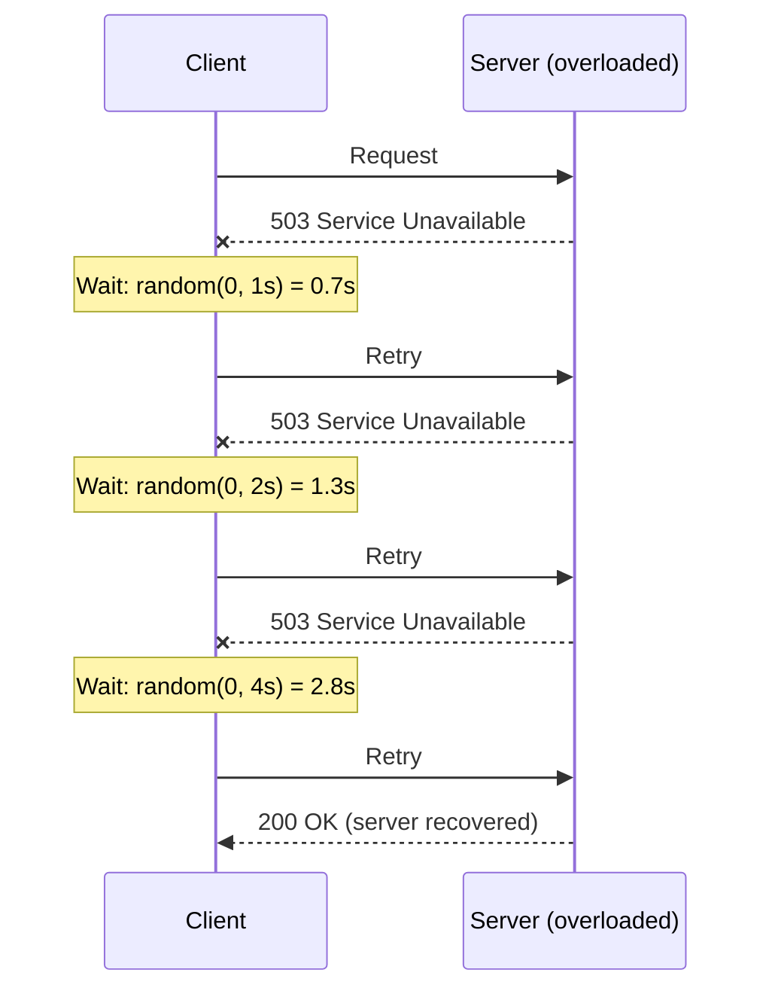
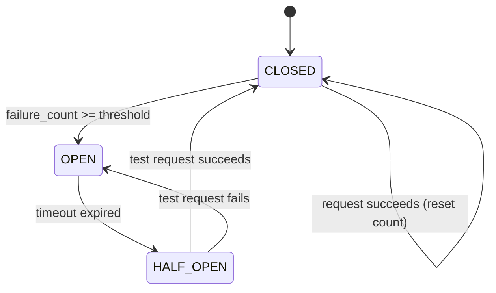

# Appendix D — Resilience Patterns (Retry, Circuit Breaker, Backoff)

## Why Resilience Matters

Every pattern in this repo assumes the happy path. But networks fail, servers crash, and services go down. In production, the difference between a 5-minute outage and a 5-hour cascading failure is resilience patterns. These patterns apply to EVERY communication pattern we've covered.

Consider FoodDash during a Friday dinner rush. The payment service is overloaded. Without resilience patterns, here's what happens:

```
Customer places order
  → Order service calls Payment service (timeout after 30s)
  → Payment service is slow, doesn't respond
  → Order service thread blocked for 30s
  → 100 customers place orders in those 30s
  → 100 threads blocked waiting for Payment
  → Order service runs out of threads
  → Order service stops responding
  → API gateway times out
  → Customer app shows errors
  → ALL services that depend on Order service start failing
  → Total system outage from ONE slow service
```

This is a **cascading failure**. One service drowning takes down everything upstream. Resilience patterns break this cascade.

---

## Exponential Backoff with Jitter

### The Base Concept

When a request fails, don't retry immediately. Wait, then retry. And wait *longer* each time:

```
Attempt 1: wait 1s
Attempt 2: wait 2s
Attempt 3: wait 4s
Attempt 4: wait 8s
Attempt 5: wait 16s
```

The wait time doubles each attempt: `delay = base * 2^attempt`, capped at some maximum.

### Why Exponential (Not Linear)?

Linear backoff (wait 1s, 2s, 3s, 4s, 5s...) doesn't reduce load fast enough. If a server is overloaded, it needs breathing room. Exponential backoff creates that room rapidly:

```
Linear backoff total wait (5 retries):   1 + 2 + 3 + 4 + 5 = 15s
Exponential backoff total wait (5 retries): 1 + 2 + 4 + 8 + 16 = 31s

Linear retry rate:    1 retry every ~3s average
Exponential retry rate: 1 retry every ~6s average (and increasing)
```

The server gets exponentially more time to recover between each retry wave.

### Why Jitter? The Thundering Herd Problem

Without jitter, every client that failed at the same time retries at the same time. This is the **thundering herd** problem (the same issue we saw in Ch02 Short Polling, where all clients poll simultaneously):

```
WITHOUT JITTER — Synchronized Retries (Thundering Herd)
═══════════════════════════════════════════════════════════

Time:  0s     1s      3s        7s           15s
       │      │       │         │             │
       ▼      ▼       ▼         ▼             ▼

  Client A: ✗─────retry─────retry─────────retry──────────────retry
  Client B: ✗─────retry─────retry─────────retry──────────────retry
  Client C: ✗─────retry─────retry─────────retry──────────────retry
  Client D: ✗─────retry─────retry─────────retry──────────────retry
  Client E: ✗─────retry─────retry─────────retry──────────────retry

  Server load:
     ████     ████    ████      ████          ████
     5 req    5 req   5 req     5 req         5 req
     SPIKE    SPIKE   SPIKE     SPIKE         SPIKE

  The server sees periodic spikes of ALL clients at once.
  It never gets a chance to recover — each spike re-overloads it.


WITH JITTER — Randomized Retries (Spread Load)
═══════════════════════════════════════════════════════════

Time:  0s     1s   2s   3s  4s  5s  6s  7s  8s  9s ...
       │      │    │    │   │   │   │   │   │   │
       ▼

  Client A: ✗───retry────────────retry──────────────────retry
  Client B: ✗──────retry──────────────retry────────────────retry
  Client C: ✗────retry──────────────retry──────────────────retry
  Client D: ✗─────────retry─────────────retry──────────────retry
  Client E: ✗───────retry────────────────retry──────────retry

  Server load:
     ████  █  █  █  █  █  █  █   █  █  █  █  █  █  █
     5req  1  1  1  1  1  1  1   1  1  1  1  1  1  1

  Retries are spread across time. Server handles 1-2 at a time.
  Much more likely to recover.
```

### The Math: Three Jitter Strategies

Given `base_delay = base * 2^attempt` (capped at `max_delay`):

**1. Full Jitter** (recommended by AWS):
```
delay = random(0, base_delay)
```
- Range: [0, base_delay]
- Mean: base_delay / 2
- Best for: maximum spread, lowest total load on server
- Downside: some retries happen very quickly (delay near 0)

**2. Equal Jitter**:
```
half = base_delay / 2
delay = half + random(0, half)
```
- Range: [base_delay/2, base_delay]
- Mean: 3/4 * base_delay
- Best for: guaranteed minimum wait, still some spread
- Downside: less spread than full jitter

**3. Decorrelated Jitter**:
```
delay = random(base, previous_delay * 3)
```
- Range: [base, 3 * previous_delay]
- Mean: depends on previous delay
- Best for: adapting to actual conditions (longer waits after longer waits)
- Downside: more complex, can grow unbounded without a cap

**AWS's analysis** (from their Architecture Blog): Full jitter produces the fewest total calls to the server and the lowest completion time across all clients. Equal jitter is a close second. Decorrelated jitter has the most variance. For most production systems, **full jitter is the right default**.

### Mermaid: Retry Timeline



---

## Circuit Breaker

### The State Machine

A circuit breaker wraps calls to an external service. It has three states:

```
                 failure_count >= threshold
    ┌────────┐  ──────────────────────────>  ┌────────┐
    │ CLOSED │                               │  OPEN  │
    │(normal)│  <─────────────────────────── │ (fail  │
    └────────┘    success in half-open        │  fast) │
        │              resets count           └────────┘
        │                                        │
        │                                        │ timeout expires
        │                                        ▼
        │                                   ┌──────────┐
        │                                   │HALF-OPEN │
        │           success                 │ (testing │
        └───────────────────────────────────│ recovery)│
                                            └──────────┘
                                                 │
                                    failure ─────┘──> back to OPEN
```

**CLOSED** (normal operation):
- All requests pass through to the downstream service
- Track failure count over a sliding window
- When failure count exceeds threshold (e.g., 5 failures in 60s) -> transition to OPEN

**OPEN** (circuit tripped):
- ALL requests are rejected immediately without calling downstream
- Return a fallback response or error (e.g., "Service temporarily unavailable")
- Start a timeout timer (e.g., 30s)
- When timeout expires -> transition to HALF-OPEN

**HALF-OPEN** (testing recovery):
- Allow ONE request through to test if the downstream service has recovered
- If it succeeds -> transition to CLOSED (reset failure count)
- If it fails -> transition back to OPEN (restart timeout)

### Why It Matters: Breaking the Cascade

Without a circuit breaker:
```
Order Service                     Payment Service (DOWN)
     │                                  │
     │──── request (wait 30s) ─────────>│ (no response)
     │──── request (wait 30s) ─────────>│ (no response)
     │──── request (wait 30s) ─────────>│ (no response)
     │ ... 100 threads blocked ...      │
     │                                  │
     │ Order Service is now OUT OF      │
     │ THREADS — it can't serve ANY     │
     │ requests, even ones that don't   │
     │ need Payment Service!            │
```

With a circuit breaker:
```
Order Service                     Payment Service (DOWN)
     │                                  │
     │──── request ───────────────────>│ FAIL
     │──── request ───────────────────>│ FAIL
     │──── request ───────────────────>│ FAIL
     │──── request ───────────────────>│ FAIL
     │──── request ───────────────────>│ FAIL (5th failure)
     │                                  │
     │ [CIRCUIT OPENS]                  │
     │                                  │
     │──── request ──> REJECTED (0ms)   │ (not even called)
     │──── request ──> REJECTED (0ms)   │ (not even called)
     │──── request ──> REJECTED (0ms)   │ (not even called)
     │                                  │
     │ Order Service threads are FREE.  │
     │ It can still serve requests      │
     │ that don't need Payment.         │
     │ Fallback: "Payment processing    │
     │ delayed, order will be charged   │
     │ shortly."                        │
```

The circuit breaker **fails fast** instead of failing slow. A 0ms rejection is infinitely better than a 30s timeout for system health.

### Mermaid: State Diagram



---

## Retry Budgets

### The Amplification Problem

If every service in a call chain retries 3 times, and the chain is 5 services deep, one failure at the bottom causes exponential amplification:

```
Service A ──> Service B ──> Service C ──> Service D ──> Service E (DOWN)

Without retry budget:
  A retries 3x → each retry calls B
  B retries 3x → each retry calls C
  C retries 3x → each retry calls D
  D retries 3x → each retry calls E

  Total requests hitting E: 3 * 3 * 3 * 3 = 81 requests
  Total requests in the SYSTEM: 3 + 9 + 27 + 81 = 120 requests
  From ONE original request!

With a 5-deep chain and 3 retries per hop:
  Worst case: 3^4 = 81 requests at the leaf
  Total system load: 3^1 + 3^2 + 3^3 + 3^4 = 3 + 9 + 27 + 81 = 120x amplification
```

This is **retry amplification** (sometimes called **retry storms**). It turns a partial outage into a complete overload.

### The Solution: Retry Budgets

A retry budget limits the **percentage** of total traffic that can be retries:

```
Rule: Retry requests must be < 10% of total traffic

If a service sends 1000 requests/second:
  - It can send at most 100 retries/second
  - Once the budget is exhausted, no more retries until the next window
  - Original requests still go through (just not retried on failure)
```

### How Envoy/Istio Implement It

At the service mesh level, the sidecar proxy (Envoy) tracks:
- Total outgoing requests per service per time window
- Number of those that are retries
- When retries exceed the budget percentage, the proxy stops retrying

```yaml
# Envoy retry budget configuration
retry_budget:
  budget_percent: 20.0      # Max 20% of active requests can be retries
  min_retry_concurrency: 3  # Always allow at least 3 concurrent retries
```

This is enforced **at the infrastructure level**, not in application code. Every service in the mesh gets the same protection automatically. This is one of the strongest arguments for a service mesh in microservice architectures.

---

## Idempotency Keys

### The Foundation of Safe Retries

A retry is only safe if repeating the operation produces the same result. This property is called **idempotency**.

```
Idempotent operations (safe to retry):
  GET  /orders/123          → Always returns the same order
  PUT  /orders/123          → Sets the order to the specified state
  DELETE /orders/123        → Deleting twice = deleting once

Non-idempotent operations (DANGEROUS to retry):
  POST /orders              → Creates a new order EACH TIME
  POST /payments            → Charges the customer EACH TIME
  POST /notifications       → Sends the message EACH TIME
```

If a `POST /orders` request times out, did the server process it? You don't know. If you retry, you might create a **duplicate order**. The customer gets charged twice. This is a real production problem.

### The Solution: Idempotency Keys

The client generates a unique key for each logical operation and sends it as a header:

```
POST /orders
Idempotency-Key: 019374a2-7c1f-7b3e-8d4a-1f2b3c4d5e6f
Content-Type: application/json

{"customer_id": "cust_01", "items": [...]}
```

The server:
1. Receives the request
2. Checks: "Have I seen this Idempotency-Key before?"
3. If NO: process the request, store `{key → response}`, return the response
4. If YES: return the **stored response** without re-processing

```
Client                              Server
  │                                    │
  │ POST /orders                       │
  │ Idempotency-Key: abc-123           │
  │───────────────────────────────────>│
  │                                    │── Check store: "abc-123" not found
  │                                    │── Process order, create ord_555
  │                                    │── Store: {"abc-123" → 201, ord_555}
  │          201 Created               │
  │<───────────────────────────────────│
  │                                    │
  │ (network timeout — client didn't   │
  │  receive the response)             │
  │                                    │
  │ POST /orders (RETRY)               │
  │ Idempotency-Key: abc-123           │
  │───────────────────────────────────>│
  │                                    │── Check store: "abc-123" FOUND
  │                                    │── Return stored response
  │          201 Created (same ord_555)│
  │<───────────────────────────────────│
  │                                    │
  │ No duplicate order!                │
```

### UUID v7 for Time-Sortable Keys

Use UUID v7 (RFC 9562) for idempotency keys. Unlike UUID v4 (random), v7 embeds a timestamp:

```
UUID v4: 550e8400-e29b-41d4-a716-446655440000  (random, no ordering)
UUID v7: 019374a2-7c1f-7b3e-8d4a-1f2b3c4d5e6f  (timestamp + random)
         ├────────────┤
         millisecond timestamp (sortable)
```

Benefits:
- Time-sortable: you can query "all idempotency keys from the last hour" efficiently
- Database-friendly: B-tree indexes work well with sequential keys (vs random UUID v4 causing page splits)
- Debugging: you can see *when* a key was generated from the key itself

### How Stripe Implements Idempotency Keys (The Gold Standard)

Stripe's API is the reference implementation:

1. **Client sends** `Idempotency-Key` header with every mutating request
2. **Server stores** the key, request params hash, and response for 24 hours
3. **On retry**: if the key exists AND the request params match, return stored response
4. **If key exists but params differ**: return 422 error (you can't reuse a key for a different operation)
5. **Keys expire after 24 hours**: prevents unbounded storage growth

Stripe also uses idempotency keys internally between their own microservices, ensuring that payment processing is safe even when internal services retry.

---

## Timeout Cascades

### The Triple Timeout Problem

In a typical web stack, you have three layers with independent timeouts:

```
Client (browser)          Load Balancer           Server
   timeout: 10s            timeout: 30s          timeout: 60s
     │                        │                      │
     │──── request ──────────>│                      │
     │                        │──── request ────────>│
     │                        │                      │
     │                        │                      │── processing...
     │                        │                      │── processing...
     │                        │                      │── processing...
     │  TIMEOUT (10s) ✗       │                      │── processing...
     │  Client gives up       │                      │── processing...
     │  and retries           │                      │── processing...
     │                        │                      │── processing...
     │──── retry ────────────>│                      │── processing... (STILL!)
     │                        │──── new request ────>│
     │                        │                      │── WASTED: original
     │                        │                      │   request still running
     │                        │                      │── now TWO requests
     │                        │                      │   consuming resources
```

**The problem**: If `client_timeout < server_timeout`, the client retries while the server is still processing the original request. Now the server has TWO requests consuming resources, making overload worse.

### Correct Timeout Ordering

```
Rule: client_timeout > LB_timeout > server_timeout

Client (browser)          Load Balancer           Server
   timeout: 60s            timeout: 30s          timeout: 10s
                                                  (fail fast!)
```

The server should timeout *first* (it knows best whether processing is taking too long). The load balancer should timeout second. The client should have the longest timeout, giving the entire chain time to complete.

### Deadline Propagation (gRPC's Approach)

gRPC solves this elegantly with **deadline propagation**: instead of each service having its own timeout, the originator sets a deadline and it propagates downstream, shrinking at each hop:

```
Customer App             Order Service          Kitchen Service        Inventory
  deadline: 5s
     │                       │                       │                    │
     │── PlaceOrder ────────>│                       │                    │
     │   deadline: 5s        │                       │                    │
     │                       │ (0.3s elapsed)        │                    │
     │                       │── ValidateOrder ─────>│                    │
     │                       │   deadline: 4.7s      │                    │
     │                       │                       │ (0.5s elapsed)     │
     │                       │                       │── CheckStock ─────>│
     │                       │                       │   deadline: 4.2s   │
     │                       │                       │                    │
     │                       │                       │                    │
     │                       │  If deadline expires at ANY point:         │
     │                       │  ALL downstream work is cancelled.        │
     │                       │  No wasted computation.                   │
```

The remaining time budget flows downstream automatically. If a downstream service can't complete within the remaining budget, it fails immediately instead of doing work that will be discarded.

---

## Systems Constraints Analysis

### CPU

- **Circuit breaker**: Near-zero cost. It's an in-memory state check (one `if` statement) before making a network call. The overhead is nanoseconds.
- **Retries**: Multiplied CPU cost. If a request costs X CPU to process, 3 retries cost 3X. With retry amplification across a chain, this compounds exponentially.
- **Jitter**: Trivial. One random number generation per retry attempt. Negligible compared to the network call it gates.
- **Idempotency check**: One hash table lookup per request. O(1) amortized. The cost of *not* having it (processing duplicate orders) is far higher.

### Memory

- **Circuit breaker state**: ~100 bytes per protected service. A counter, a state enum, and a timestamp. Even with 1000 circuit breakers (one per downstream endpoint), that's 100 KB.
- **Idempotency key store**: Grows unbounded without TTL. Each entry stores a key (36 bytes), a request hash, and a response (variable size). At 10,000 requests/minute with 24-hour TTL: ~14.4 million entries. This MUST be backed by a TTL-capable store (Redis with EXPIRE, DynamoDB with TTL) — not an in-memory dict.
- **Retry queue**: Bounded by retry budget. If your budget is 10% of traffic, the retry queue never exceeds 10% of your active request count.

### Network I/O

- **Retries**: Multiply network traffic. 3 retries = 3x the bandwidth for that request. With retry amplification: potentially 100x.
- **Circuit breaker**: REDUCES network traffic. In OPEN state, zero network calls — requests are rejected locally. This is the circuit breaker's primary value: it stops sending traffic to a service that can't handle it.
- **Backoff**: Spreads traffic over time. Total bytes are the same, but peak bandwidth is lower. The server sees steady trickle instead of periodic spikes.
- **Idempotency keys**: Tiny overhead. One extra header (~50 bytes) per request. The alternative (duplicate processing) is far more expensive.

### Latency

- **Retries add latency**: A successful retry after 2 attempts with exponential backoff adds `wait_1 + roundtrip + wait_2 + roundtrip` to the total latency. For time-sensitive operations, cap total retry time.
- **Circuit breaker in OPEN state**: Near-zero latency. The request is rejected in microseconds, not milliseconds. The caller gets an error instantly and can execute fallback logic.
- **The trade-off**: Retries optimize for *eventual success* at the cost of higher latency. Circuit breakers optimize for *fast failure* at the cost of rejected requests. In practice, you use both: retry a few times, then trip the circuit breaker if failures persist.

---

## Production Depth

### Bulkhead Pattern

Isolate failures to one pool. Don't let one failing downstream service consume all your threads/connections:

```
WITHOUT BULKHEAD:
┌─────────────────────────────────────────┐
│ Order Service — shared thread pool (100)│
│                                         │
│  Payment calls: 60 threads (blocked!)   │
│  Kitchen calls: 20 threads (blocked!)   │
│  Driver calls:  20 threads (working)    │
│                                         │
│  Payment is slow → uses 60/100 threads  │
│  Kitchen is slow → uses 20/100 threads  │
│  ONLY 20 threads left for everything!   │
└─────────────────────────────────────────┘

WITH BULKHEAD:
┌─────────────────────────────────────────┐
│ Order Service — isolated thread pools   │
│                                         │
│  ┌─────────────────┐ Payment pool: 30   │
│  │ ████████████████ │ (all blocked)     │
│  └─────────────────┘ Payment is slow,   │
│                       but contained!    │
│  ┌─────────────────┐ Kitchen pool: 30   │
│  │ ██████           │ (working fine)    │
│  └─────────────────┘                    │
│                                         │
│  ┌─────────────────┐ Driver pool: 30    │
│  │ ██████           │ (working fine)    │
│  └─────────────────┘                    │
│                                         │
│  Remaining: 10 threads for other work   │
│  Payment failure is ISOLATED            │
└─────────────────────────────────────────┘
```

Named after ship bulkheads — compartments that prevent a hull breach from flooding the entire vessel.

### Hedged Requests

Send the same request to multiple servers, take the first response:

```
Client ─┬──> Server A ──> response in 5ms  ← USE THIS ONE
        ├──> Server B ──> response in 50ms ← discard
        └──> Server C ──> response in 200ms ← discard
```

This optimizes **tail latency** (p99). Instead of occasionally waiting 200ms for a slow server, you consistently get ~5ms by racing multiple servers. The cost: 3x the network traffic and server load. Only use for read-only, idempotent operations where tail latency matters (e.g., serving search results).

Google uses hedged requests extensively in their storage systems (described in "The Tail at Scale" paper).

### Load Shedding

Server-side rejection when overloaded — return 503 immediately instead of accepting work you can't complete:

```
Server at 80% capacity:
  → Accept all requests, process normally

Server at 95% capacity:
  → Start rejecting lowest-priority requests with 503
  → Keep processing high-priority requests

Server at 100% capacity:
  → Reject all new requests with 503
  → Focus on completing in-flight requests
```

This is better than accepting requests you can't serve (which consumes resources queuing them) and far better than crashing under load. The 503 response tells the client's circuit breaker and retry logic to back off.

### Chaos Engineering

Netflix's approach: **inject failures deliberately** to test your resilience:

- **Chaos Monkey**: Randomly terminates production instances. If your service can't handle one instance dying, you'll find out on a Tuesday morning, not during a Friday traffic spike.
- **Chaos Kong**: Simulates an entire AWS region going down. Tests your multi-region failover.
- **Latency Monkey**: Injects artificial delays into network calls. Tests your timeout and circuit breaker configurations.

The philosophy: if you're going to fail (and you will), fail on your own terms, when you're watching, not at 3 AM during peak traffic.

### How Each Chapter's Pattern Handles Failure

| Chapter | Pattern | Primary Failure Mode | Resilience Strategy |
|---------|---------|---------------------|-------------------|
| Ch01 | Request-Response | Server timeout, 5xx errors | Retry with backoff + circuit breaker |
| Ch02 | Short Polling | Server overload from polling frequency | Adaptive polling interval + backoff |
| Ch03 | Long Polling | Held connections exhaust server resources | Connection timeout + reconnect with backoff |
| Ch04 | SSE | Stream disconnection | Auto-reconnect with Last-Event-ID + backoff |
| Ch05 | WebSockets | Connection drop, missed messages | Heartbeat/ping-pong + reconnect + message replay |
| Ch06 | Push Notifications | Delivery failure, token expiry | Platform retry (APNs/FCM) + fallback to pull |
| Ch07 | Pub/Sub | Broker down, consumer crash | Dead letter queues + at-least-once delivery + idempotency |
| Ch08 | Stateful/Stateless | State loss on crash | State replication + session affinity + graceful degradation |
| Ch09 | Multiplexing | Single stream failure blocks others | Per-stream error handling + stream-level circuit breakers |
| Ch10 | Sidecar | Sidecar crash, resource contention | Health checks + sidecar restart + bulkhead isolation |
| Ch11 | Synthesis | Any combination of the above | Defense in depth: layers of retry, circuit break, bulkhead, shed |

---

## FoodDash Application

Every resilience pattern maps to a specific point in the FoodDash architecture:

```
┌─────────────────────────────────────────────────────────────────────┐
│                        FoodDash Architecture                        │
│                    with Resilience Patterns                          │
│                                                                     │
│  Customer App                                                       │
│       │                                                             │
│       │  [Retry with backoff + jitter]                              │
│       │  [Idempotency-Key on POST /orders]                          │
│       ▼                                                             │
│  ┌──────────┐                                                       │
│  │   API    │  [Load shedding: 503 when overloaded]                 │
│  │ Gateway  │  [Rate limiting per customer]                         │
│  └────┬─────┘                                                       │
│       │  [Deadline propagation: 5s budget]                          │
│       ▼                                                             │
│  ┌──────────┐                                                       │
│  │  Order   │  [Circuit breaker on each downstream call]            │
│  │ Service  │  [Bulkhead: separate thread pools per dependency]     │
│  └──┬──┬──┬─┘  [Retry budget: max 10% retry traffic]               │
│     │  │  │                                                         │
│     │  │  └──────────────────────┐                                  │
│     │  │                         │                                  │
│     │  │  [CB: trip after 5      │  [CB: trip after 5               │
│     │  │   failures in 60s]      │   failures in 60s]               │
│     │  ▼                         ▼                                  │
│     │ ┌──────────┐         ┌──────────┐                             │
│     │ │ Kitchen  │         │  Driver   │                            │
│     │ │ Service  │         │ Matching  │                            │
│     │ └──────────┘         └──────────┘                             │
│     │                                                               │
│     │  [CB: trip after 3 failures in 30s — payments are critical]   │
│     │  [Idempotency key: prevent double charges]                    │
│     │  [Hedged requests to 2 payment processors]                    │
│     ▼                                                               │
│  ┌──────────┐                                                       │
│  │ Payment  │  [Load shedding at 95% capacity]                      │
│  │ Service  │  [Graceful degradation: queue charges for later]      │
│  └──────────┘                                                       │
│                                                                     │
└─────────────────────────────────────────────────────────────────────┘
```

**Key decisions for FoodDash:**

1. **Payment Service gets the tightest circuit breaker** (3 failures, 30s window). Payment failures are the most customer-visible and the most dangerous (double charges). Trip early, fall back to "charge later" queue.

2. **Order creation uses idempotency keys.** The customer app generates a UUID v7 key per order attempt. If the network drops after the server processes the order, the retry returns the same order — no duplicates.

3. **Kitchen and Driver services get standard circuit breakers** (5 failures, 60s). These are less critical — a delayed kitchen notification doesn't charge anyone money. Fallback: "order received, status updates coming soon."

4. **The API Gateway does load shedding.** During extreme traffic (Super Bowl Sunday), it returns 503 to excess requests rather than accepting them and failing slowly.

5. **Retry budgets are enforced at the service mesh level** (Envoy sidecar). No individual service can create a retry storm, regardless of how its application code is written.

---

## Running the Code

### Run the demo

```bash
# From the repo root
uv run python -m appendices.appendix_d_resilience.resilience_demo
```

This runs working implementations of:
1. Exponential backoff with full/equal/decorrelated jitter — 10 clients visualized
2. Circuit breaker protecting against cascading failure
3. Retry amplification: 5-service chain with and without budget
4. Idempotency keys preventing duplicate order creation

### Open the visual

Open `appendices/appendix_d_resilience/visual.html` in your browser. No server needed — it's a self-contained interactive visualization.

---

## Bridge to Other Appendices

Resilience patterns are cross-cutting — they apply everywhere:

- **gRPC has built-in resilience features**: deadline propagation, interceptors for retry logic, health checking. See [Appendix A — gRPC](../appendix_a_grpc/).
- **Message queues provide natural resilience**: dead letter queues, at-least-once delivery, consumer groups. See [Appendix B — Message Queues](../appendix_b_message_queues/).
- **GraphQL subscriptions need reconnection logic**: lost subscriptions, missed events, state reconciliation. See [Appendix C — GraphQL Subscriptions](../appendix_c_graphql_subscriptions/).
