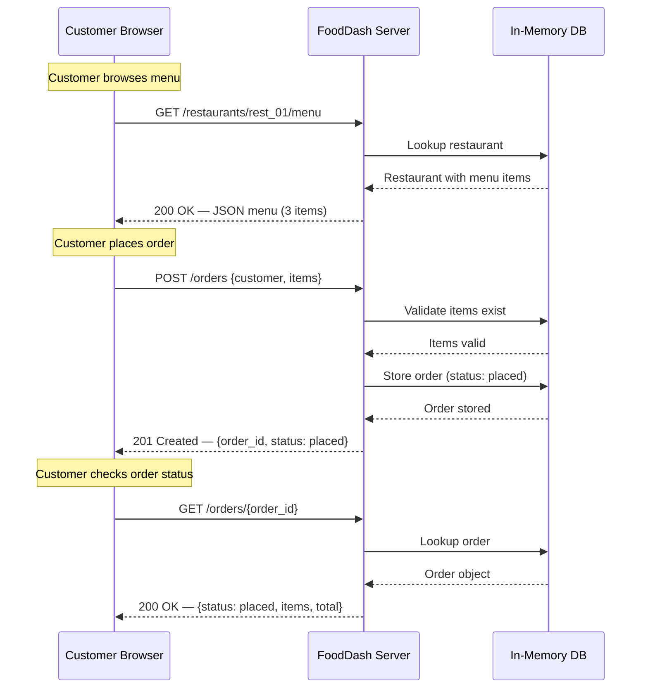

# Chapter 01 — Request-Response

## The Scene

It's Day 1 at FoodDash. You're the founding engineer. The product is simple: customers open a webpage, browse Burger Palace's menu, and place an order. You need one thing — a way for the customer's browser to say *"I want a Classic Burger and Fries"* and for your server to say *"Order confirmed, here's your order ID."*

This is the most fundamental communication pattern in computing: **request-response**.

One party asks a question. The other party answers. The asker waits until the answer arrives before doing anything else. This is how your browser loaded this page. This is how `curl` works. This is how every REST API you've ever built operates at its core.

## Why This Is the Starting Point

Every other pattern in this repo exists because request-response has a limitation that becomes intolerable at some scale or for some use case:

| Chapter | Pattern | Why Request-Response Wasn't Enough |
|---------|---------|-----------------------------------|
| Ch02 | Short Polling | Customer wants live updates; refreshing manually is wasteful |
| Ch03 | Long Polling | Short polling creates too many empty responses |
| Ch04 | SSE | Server needs to push updates without being asked |
| Ch05 | WebSockets | Both sides need to talk freely in real time |
| Ch06 | Push Notifications | User isn't even looking at the app |
| Ch07 | Pub/Sub | Multiple services need to react to the same event |

Understand request-response deeply — its mechanics, its resource profile, its failure modes — and you'll understand *why* everything else exists.

---

## The Pattern — Deep Dive

### The Mental Model

Request-response is a **synchronous, client-initiated, half-duplex** exchange:

1. **Synchronous**: The client sends a request and then *blocks* — it does nothing until the response arrives (or a timeout fires).
2. **Client-initiated**: The server cannot spontaneously send data. It can only speak when spoken to.
3. **Half-duplex**: At any given moment, data flows in one direction. Request goes out, then response comes back. Never simultaneously on the same exchange.

### The Full Flow



### HTTP Methods and Their Semantics

This chapter uses two HTTP methods. The choice isn't aesthetic — it's semantic and has real implications:

**`GET /restaurants/rest_01/menu`** — Read the menu.
- **Safe**: Calling it doesn't change server state. You can call it a million times and nothing happens.
- **Idempotent**: Every call returns the same result (given the same server state).
- **Cacheable**: Browsers and CDNs can cache GET responses. The `Cache-Control` header controls this.

**`POST /orders`** — Place an order.
- **Unsafe**: This *changes* server state. A new order is created.
- **Not idempotent by default**: Calling it twice creates two orders. This is a real problem (see below).
- **Not cacheable**: POST responses are never cached by default.

**`GET /orders/{order_id}`** — Read an order.
- Same properties as the menu GET. Safe, idempotent, cacheable.

### Content Negotiation

Every HTTP exchange includes metadata about the *format* of the data:

```
# Request
POST /orders HTTP/1.1
Content-Type: application/json     ← "I'm sending you JSON"
Accept: application/json           ← "Please respond with JSON"

# Response
HTTP/1.1 201 Created
Content-Type: application/json     ← "Here's JSON, as requested"
Content-Length: 247                 ← "It's 247 bytes"
```

In our simple FoodDash app, everything is JSON. In the real world, `Accept` header negotiation lets a single endpoint serve JSON to API clients and HTML to browsers. This is how REST was originally designed.

### Status Codes — What They Mean at the Protocol Level

Status codes are not arbitrary numbers. They're a *protocol-level contract*:

| Code | Meaning | Our Usage |
|------|---------|-----------|
| `200 OK` | Request succeeded, here's the data | GET order, GET menu |
| `201 Created` | Request succeeded, a new resource was created | POST order |
| `400 Bad Request` | Your request was malformed — fix it and retry | Invalid item IDs, missing fields |
| `404 Not Found` | The resource doesn't exist | Order ID or restaurant not found |
| `422 Unprocessable Entity` | Syntax is fine, but semantics are wrong | Valid JSON but item_id doesn't exist in the restaurant |

**Why this matters**: Status codes let clients implement *generic* error handling. A client library can retry on 503 (Service Unavailable) without knowing anything about your business logic. Middleware can log 5xx errors as critical and 4xx as user errors. This is protocol-level composability.

### Idempotency — The Double-Click Problem

The customer clicks "Place Order." The network is slow. They click again. What happens?

Without protection, you create **two orders**. The customer gets charged twice. This is not a theoretical concern — it's one of the most common bugs in payment systems.

**Solutions, from simplest to most robust:**

1. **Client-side button disable** — Prevent the second click in the UI. Fragile (what if the JS fails? what about curl?).

2. **Idempotency key** — The client generates a unique key (UUID) and sends it in a header:
   ```
   POST /orders
   Idempotency-Key: 550e8400-e29b-41d4-a716-446655440000
   ```
   The server stores the key with the response. If it sees the same key again, it returns the *stored response* instead of creating a new order. Stripe, PayPal, and every serious payment API does this.

3. **Database unique constraint** — Use a combination of (customer_id, item_ids, timestamp_window) as a natural deduplication key. This is the last line of defense.

Our server implements a simple version: it returns the order with a unique ID, and the client can check if an order already exists. In production, you'd implement option 2.

---

## Systems Constraints Analysis

Understanding the *resource profile* of a pattern is what separates a senior engineer from a principal. Here's what request-response costs:

### CPU

**Minimal.** For our order-placement flow:
- Serialize the request body to JSON: ~0.01ms
- Deserialize on the server: ~0.01ms
- Validate input (Pydantic): ~0.05ms
- Write to in-memory dict: ~0.001ms
- Serialize response: ~0.01ms

Total CPU work: **~0.08ms**. The CPU is *idle* during network transit. The thread is blocked waiting for I/O, not computing.

This matters enormously: CPU idle time during I/O is the fundamental reason async programming exists. If your thread is blocked for 50ms of network round-trip but only computes for 0.08ms, you're using 0.16% of your CPU's capacity on that thread. Multiply by 1000 concurrent requests and you need 1000 threads doing almost nothing. This is the [C10K problem](http://www.kegel.com/c10k.html) and it's why we moved to event loops (`asyncio`, Node.js, Go goroutines).

### Memory

**~2-5 KB per request.**
- HTTP headers: ~200-800 bytes
- Request body (our order JSON): ~150 bytes
- Response body: ~300 bytes
- Server-side processing buffers: ~1-2 KB

The connection is **short-lived** in classic HTTP/1.0: open socket, send request, receive response, close socket. No state is held between requests. This is the "stateless" in "stateless protocol."

With HTTP/1.1 keep-alive (default), the TCP connection persists for reuse, but the *application state* is still stateless. The server holds no memory of previous requests.

### Network I/O

**One round trip per operation.** This is the defining characteristic.

```
Request overhead breakdown:
  TCP + TLS handshake:     ~30-100ms  (first request only, amortized with keep-alive)
  HTTP headers:            ~200-800 bytes
  Request body (our JSON): ~150 bytes
  Response headers:        ~200-400 bytes
  Response body:           ~300 bytes

Total wire bytes:          ~850-1650 bytes per request-response cycle
```

For our small JSON payloads, **headers may be larger than the body**. This is a known inefficiency of HTTP/1.1 that HTTP/2 addresses with header compression (HPACK). In Ch05 (WebSockets), we'll see how a persistent connection eliminates per-message header overhead entirely.

### Latency Breakdown

Here's what happens when the customer clicks "Place Order," with approximate times for a typical cloud deployment:

```
Time (ms)  Event
─────────  ──────────────────────────────────────────────
  0        Client: serialize order to JSON              [~0.01ms CPU]
  0.01     Client: write to TCP socket
  0.01     ──── network transit (client → server) ────  [~15-30ms, varies]
 25        Server: read from socket, parse HTTP
 25.05     Server: deserialize JSON, validate           [~0.05ms CPU]
 25.10     Server: business logic, write to DB          [~0.01ms CPU]
 25.15     Server: serialize response JSON              [~0.01ms CPU]
 25.16     Server: write to TCP socket
 25.16     ──── network transit (server → client) ────  [~15-30ms]
 50        Client: read response, deserialize           [~0.01ms CPU]
 50.01     Client: render result to user
─────────  ──────────────────────────────────────────────
Total:     ~50ms  (dominated by network transit)
CPU work:  ~0.08ms total (0.16% of wall clock time)
```

**The insight**: In request-response, latency is dominated by network round-trip time, not computation. This is why CDNs matter (reduce distance), why keep-alive matters (eliminate handshake), and why batching matters (amortize overhead across multiple items).

### Where the Bottleneck Emerges

At low scale — say, 100 customers — request-response is perfect. Simple, debuggable, well-tooled.

The problem emerges in **Ch02**: *"Now the customer wants to know when their food is ready."*

Request-response can tell you the state **right now**, but it **cannot tell you when the state changes**. The only option is to ask again. And again. And again.

---

## Principal-Level Depth

### Connection Pooling and HTTP Keep-Alive

In HTTP/1.0, every request opens a new TCP connection:

```
Request 1: [TCP handshake] [TLS handshake] [HTTP request/response] [close]
Request 2: [TCP handshake] [TLS handshake] [HTTP request/response] [close]
Request 3: [TCP handshake] [TLS handshake] [HTTP request/response] [close]
```

Each TCP handshake is 1 round trip (~30ms). TLS adds 1-2 more (~30-60ms). For three requests, you pay 180-270ms just in handshakes.

HTTP/1.1 defaults to `Connection: keep-alive`:

```
[TCP handshake] [TLS handshake]
  Request 1: [HTTP request/response]
  Request 2: [HTTP request/response]
  Request 3: [HTTP request/response]
[close after idle timeout]
```

Same three requests, one handshake. Your browser maintains a **connection pool** — typically 6 connections per origin — and reuses them across requests. This is why your browser's DevTools shows "Connection: keep-alive" on every request.

`httpx` (our client library) also maintains a connection pool by default when you use `httpx.Client()` (sync) or `httpx.AsyncClient()` (async) as a context manager.

### Content-Length vs Transfer-Encoding: chunked

When the server knows the response size upfront:
```
Content-Length: 247
```
The client knows exactly how many bytes to expect. It can display a progress bar. It can detect truncation.

When the server *doesn't* know (e.g., streaming a large database query):
```
Transfer-Encoding: chunked
```
The body arrives in chunks, each prefixed with its size. The final chunk has size 0. The client reads until it sees the terminator.

For our small JSON responses, `Content-Length` is always used. Chunked encoding becomes relevant in Ch04 (Server-Sent Events), where the server streams data indefinitely — it *can't* know the length upfront.

### What "Stateless" Really Means

HTTP is stateless: **each request is independent**. The server holds no memory of previous requests from the same client.

This means:
- Request 1: `GET /menu` — server serves the menu, forgets you exist
- Request 2: `POST /orders` — server has no idea you just looked at the menu
- Request 3: `GET /orders/abc123` — server doesn't know you placed that order

**Why this matters for scaling**: If the server holds no per-client state, any server can handle any request. You can put 10 servers behind a load balancer, and it doesn't matter which one handles which request. This is **horizontal scaling** — add more boxes to handle more load.

The moment you add server-side state (sessions, sticky connections), you lose this property. A WebSocket connection (Ch05) is stateful — if the server holding your connection dies, your connection dies. This is the fundamental trade-off: statefulness enables richer patterns but complicates scaling.

### The Triple Timeout Problem

In a real deployment, three timeouts are in play:

```
Client ──── Load Balancer ──── Server
  T1              T2              T3

T1 = Client timeout (e.g., 30s — httpx default)
T2 = Load balancer timeout (e.g., 60s — AWS ALB default)
T3 = Server timeout (e.g., 120s — uvicorn default)
```

**The dangerous case**: T1 < T2 < T3 and a request takes 45 seconds.

1. Client gives up at 30s, shows error to user
2. User clicks "Place Order" again — a new request
3. Original request completes at 45s — order is created
4. Second request completes at 90s — *another* order is created
5. Customer is charged twice

**The rules**:
- T2 (load balancer) should be >= T1 (client), so the LB doesn't cut off a response the client is still waiting for
- T3 (server) should be >= T2, so the server doesn't kill a request the LB is still proxying
- But T1 should be *short enough* that users don't stare at a spinner forever
- And you need **idempotency keys** to handle the inevitable case where a timeout causes a retry

This is one of the most common sources of production incidents. It's not a bug in any single component — it's an emergent property of the system's timeout configuration.

### Idempotency Keys for Safe Retries

The robust solution to the double-click (and timeout-retry) problem:

```
Client generates: Idempotency-Key: 550e8400-e29b-41d4-a716-446655440000

Request 1: POST /orders + Idempotency-Key: 550e... → 201 Created, order_id: abc123
  Server stores: {key: 550e..., response: {201, order_id: abc123}}

Request 2: POST /orders + Idempotency-Key: 550e... → 201 Created, order_id: abc123
  Server finds stored response for key 550e..., returns it verbatim
```

No second order created. The key is typically stored for 24-48 hours and then garbage collected. This transforms a non-idempotent POST into an idempotent operation.

---

## Trade-offs at a Glance

| Dimension | Request-Response | Polling (Ch02-03) | SSE (Ch04) | WebSockets (Ch05) |
|-----------|-----------------|-------------------|------------|-------------------|
| **Latency to get data** | One round trip | One round trip (but may be stale) | Near-zero (server pushes) | Near-zero (bidirectional) |
| **Latency to detect change** | Must ask again | Polling interval | Instant | Instant |
| **Complexity** | Very low | Low | Medium | High |
| **Server resources** | Minimal, short-lived | Minimal per request, but high volume | One long-lived connection per client | One long-lived connection per client |
| **Browser support** | Universal | Universal | All modern browsers | All modern browsers |
| **Scalability model** | Stateless, any server | Stateless, any server | Stateful, sticky connections | Stateful, sticky connections |
| **Failure mode** | Simple — request fails, retry | Same | Connection drops, must reconnect | Connection drops, must reconnect |
| **Best for** | CRUD operations, one-time reads | Simple status checks | Live feeds, notifications | Chat, gaming, collaborative editing |

---

## Running the Code

### Start the server

```bash
# From the repo root
uv run uvicorn chapters.ch01_request_response.server:app --port 8001
```

### Run the client

In a second terminal:

```bash
uv run python -m chapters.ch01_request_response.client
```

### Open the visual

Open `chapters/ch01_request_response/visual.html` in your browser. No server needed — it's pure HTML/CSS/JS that simulates the request-response flow with animation.

---

## Bridge to Chapter 02

FoodDash is live. Orders are flowing. But customers keep asking: *"Where's my food?"*

They click refresh. And refresh. And refresh.

Each refresh is a full HTTP request-response cycle that usually returns `"status": "preparing"` — the same answer as 5 seconds ago. The customer doesn't know that. So they refresh again.

At 10,000 concurrent customers, that's roughly **2,000 requests per second** just for status checks, and **99% of them return unchanged data**. Each one carries ~800 bytes of HTTP headers, opens or reuses a connection, consumes a server thread for a few milliseconds, and returns the same JSON the client already has.

This is wasted work at every level of the stack. We need a better way to check for updates.

But before we invent something new, let's formalize what these customers are already doing intuitively: **asking the same question on a timer**. That's polling, and it's the subject of [Chapter 02 — Short Polling](../ch02_short_polling/).
