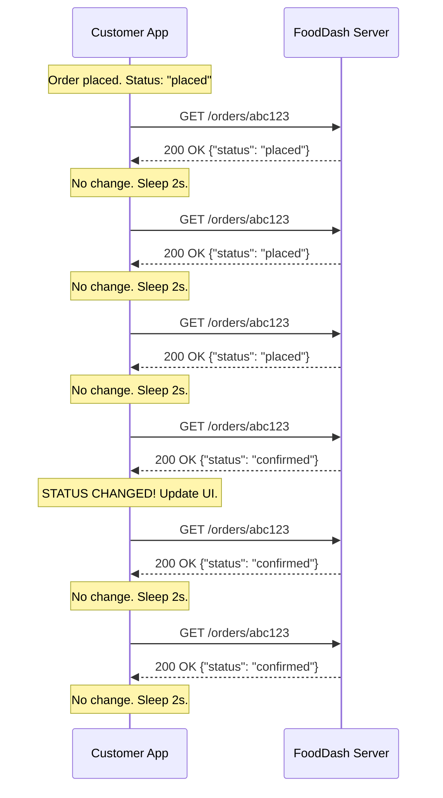

```mermaid
gantt
    title Order Lifecycle: Useful vs Wasted Polls (30 min order)
    dateFormat HH:mm
    axisFormat %H:%M

    section Wasted Polls
    placed (no change)         :active, w1, 00:00, 4min
    section Useful
    confirmed                  :crit,   u1, 00:04, 0min
    section Wasted Polls
    confirmed (no change)      :active, w2, 00:04, 6min
    section Useful
    preparing                  :crit,   u2, 00:10, 0min
    section Wasted Polls
    preparing (no change)      :active, w3, 00:10, 5min
    section Useful
    ready                      :crit,   u3, 00:15, 0min
    section Wasted Polls
    ready (no change)          :active, w4, 00:15, 5min
    section Useful
    picked_up                  :crit,   u4, 00:20, 0min
    section Wasted Polls
    picked_up (no change)      :active, w5, 00:20, 3min
    section Useful
    en_route                   :crit,   u5, 00:23, 0min
    section Wasted Polls
    en_route (no change)       :active, w6, 00:23, 5min
    section Useful
    delivered                  :crit,   u6, 00:28, 0min
```

# Chapter 02 — Short Polling: "Is It Ready Yet? Is It Ready Yet? Is It Ready Yet?"

## The Scene

FoodDash is live. Orders are flowing. Your Ch01 request-response API is working
beautifully — `POST /orders` creates orders, `GET /orders/{id}` returns their
current state. Ship it.

But within hours, your monitoring dashboard tells a story:

```
Top Endpoints by Request Volume (last hour):
  #1  GET /orders/{id}     — 847,293 requests    (94.2%)
  #2  POST /orders         —  38,410 requests     ( 4.3%)
  #3  GET /restaurants/menu —  13,502 requests     ( 1.5%)
```

Every customer has the same question: **"Where's my food?"** So they hit
refresh. Your analytics show that `GET /orders/{id}` is now your #1 endpoint by
a factor of 22x — but **99% of responses return the exact same status as 5
seconds ago**. You are burning server CPU, bandwidth, and money to tell
customers "nothing changed."

Welcome to the most natural — and most wasteful — pattern in distributed
systems: **short polling**.

---

## The Pattern — Short Polling

Short polling is the simplest conceivable approach to "I want to know when
something changes":

```
while True:
    response = GET /orders/{id}
    if response.status != last_known_status:
        handle_change(response)
        last_known_status = response.status
    sleep(POLL_INTERVAL)
```

That is it. Set a timer. Fire a request. Check if anything changed. Repeat.

### How It Works on the Wire

Every single poll cycle performs a **complete HTTP request-response exchange**,
even when there is nothing new:



Notice: 6 requests, but only 1 carried new information. The other 5 were pure
waste. And this is the *optimistic* scenario — in reality the ratio is far
worse.

### Poll Interval: The Impossible Trade-off

| Interval | Feels responsive? | Server load | The problem |
|----------|-------------------|-------------|-------------|
| 500ms    | Instant           | Crushing    | 2 req/s per user. 10K users = 20K req/s |
| 2s       | Pretty good       | Heavy       | 5K req/s for 10K users |
| 5s       | Noticeable lag     | Moderate    | 2K req/s for 10K users |
| 10s      | Frustrating        | Light       | Users see stale data for up to 10s |
| 30s      | Unacceptable       | Minimal     | Users think the app is broken |

There is no good answer. Fast polling wastes resources. Slow polling delivers a
bad user experience. Every interval is a compromise.

### The Thundering Herd

If 10,000 customers all place orders around the same time (say, the lunch rush
at 12:00 PM), and they all start their polling timers simultaneously with a 2-
second interval, you get this:

```
12:00:00.000  — 10,000 requests arrive simultaneously
12:00:02.000  — 10,000 requests arrive simultaneously
12:00:04.000  — 10,000 requests arrive simultaneously
```

The requests don't spread out — they **synchronize**. This is the thundering
herd problem. Your server sees periodic spikes of 10K concurrent requests
separated by 2 seconds of silence, rather than a smooth 5K/s stream. The spikes
are far harder to handle than the average load would suggest.

---

## The Math That Kills Short Polling

This is the section that should make you uncomfortable. Let us work through the
real numbers for FoodDash at modest scale.

### The Setup

```
Concurrent users tracking orders:  10,000
Poll interval:                     2 seconds
Average order duration:            30 minutes (1,800 seconds)
Status changes per order:          6 (placed -> confirmed -> preparing ->
                                      ready -> picked_up -> en_route -> delivered)
```

### Request Volume

```
Polls per order lifetime:  1,800s / 2s = 900 polls
Useful polls (status changed):     6
Wasted polls:                      894

Efficiency:  6 / 900 = 0.67%
```

**99.33% of all requests return information the client already has.**

### Aggregate Load

```
  10,000 users
x  0.5  requests per second per user (1 every 2s)
= 5,000 requests per second

  That is 5,000 req/s where only 0.67% carry new information.

  Useful requests:  ~33 per second
  Wasted requests:  ~4,967 per second
```

### Bandwidth

Each HTTP request/response carries overhead regardless of whether anything
changed:

```
┌─────────────── Request (client -> server) ────────────────┐
│ GET /orders/abc123 HTTP/1.1                                │
│ Host: api.fooddash.com                                     │
│ Accept: application/json                                   │
│ Authorization: Bearer eyJhbG...                            │
│ User-Agent: FoodDash-iOS/3.2.1                             │
│ Accept-Encoding: gzip, deflate                             │
│ Connection: keep-alive                                     │
│                                                            │
│ ~500 bytes of headers, 0 bytes body                        │
└────────────────────────────────────────────────────────────┘

┌─────────────── Response (server -> client) ───────────────┐
│ HTTP/1.1 200 OK                                            │
│ Content-Type: application/json                             │
│ Content-Length: 298                                         │
│ X-Request-Id: 7f3a...                                      │
│ Date: Sat, 26 Apr 2026 12:00:02 GMT                        │
│                                                            │
│ {"order_id":"abc123","status":"placed","items":[...],      │
│  "total_cents":1797,"created_at":...,"updated_at":...}     │
│                                                            │
│ ~300 bytes headers + ~300 bytes body = ~600 bytes          │
└────────────────────────────────────────────────────────────┘

Per round trip:  ~500 + ~600 = ~1,100 bytes
```

```
  5,000 req/s x 1,100 bytes = 5,500,000 bytes/s = 5.2 MB/s

  Per hour:  5.2 MB/s x 3,600 = 18.9 GB/hour
  Per day:   18.9 GB x 24     = 453 GB/day

  Useful data in that 453 GB:  ~3 GB  (0.67%)
  Wasted:                      ~450 GB
```

### The Waste Visualized

```
Useful vs Wasted Requests per Order (900 total polls)

  Useful (6):   ##
  Wasted (894): ##############################################################
                ##############################################################
                ##############################################################
                ##############################################################
                ##############################################################
                ##############################################################
                ##############################################################
                ##############################################################
                ##############################################################
                ##############################################################
                ##############################################################
                ##############################################################
                ##############################################################
                ##############################################################
                ##############################################

  Each # represents ~6 requests
  Efficiency: 0.67%
```



---

## Systems Constraints Analysis

### CPU

The server does **real work** on every poll, even when nothing changed:

1. Parse HTTP request headers (~0.1ms)
2. Authenticate/authorize the request (~0.2ms)
3. Deserialize request parameters (~0.05ms)
4. Look up the order in the database (~0.3ms)
5. Serialize the response to JSON (~0.15ms)
6. Write HTTP response headers + body (~0.1ms)

Total: roughly **1ms of CPU time per poll**.

```
  5,000 polls/s x 1ms CPU each = 5,000ms of CPU per second
                                = 5.0 CPU-seconds per wall-clock second
                                = 5 cores fully saturated

  Just for polling. Before you serve a single order creation,
  menu browse, or any other actual business logic.
```

At 100K users, that is **50 cores** just for answering "nothing changed." And
this is the optimistic estimate — real-world auth middleware, logging, metrics
collection, and ORM overhead push the per-request cost to 2-5ms easily.

### Memory

Short polling is **stateless per request**, so memory usage per connection is
low. The server does not need to remember anything between polls. This is
actually one of short polling's few genuine advantages.

However, there is a subtlety: **connection churn**. If clients are not using
HTTP keep-alive (or if the server closes connections aggressively), every poll
creates a new TCP connection. Each closed connection enters `TIME_WAIT` state
for 60 seconds (on Linux). At 5,000 connections/s, that is 300,000 sockets in
`TIME_WAIT` at any given time, each consuming a small amount of kernel memory
and a slot in the connection table.

```
  5,000 conn/s x 60s TIME_WAIT = 300,000 sockets in limbo
  Each TIME_WAIT socket: ~300 bytes kernel memory
  Total: ~90 MB of kernel memory just for dead connections
```

With keep-alive enabled, this is mitigated — but now you have 10,000 persistent
connections (one per client), which is its own memory concern.

### Network I/O

This is the **dominant cost** of short polling. Let us break down the
header-to-useful-data ratio:

```
  Per request:
    Request headers:   ~500 bytes
    Response headers:  ~300 bytes
    Response body:     ~300 bytes (the actual order JSON)
    ──────────────────────────────
    Total per round trip: ~1,100 bytes

  Of that 1,100 bytes:
    Protocol overhead (headers both ways):  800 bytes  (73%)
    Actual payload:                         300 bytes  (27%)

  But 99.33% of the time the payload is IDENTICAL to what we sent last time.

  True information content per poll: 300 bytes x 0.67% = ~2 bytes

  Effective overhead: 1,100 bytes to transmit ~2 bytes of information
  Ratio: 550:1
```

On a metered mobile connection, your customers are paying for 550 bytes of
overhead for every 1 byte of useful information. On a cellular data plan at
$10/GB, 10,000 users polling costs the collective user base **~$4.50 per hour**
in data charges for the wasted bytes alone.

### Latency (Detection Delay)

When a status change happens, how long until the client knows?

The change could happen at any point during the polling interval. If you poll
every `T` seconds, the change could happen:
- Right after a poll: client waits almost `T` seconds to discover it
- Right before a poll: client discovers it almost immediately

On average, the **detection latency** is:

```
  Detection Latency = T / 2

  Poll every 2s  ->  average 1.0s detection delay
  Poll every 5s  ->  average 2.5s detection delay
  Poll every 10s ->  average 5.0s detection delay
  Poll every 30s ->  average 15.0s detection delay
```

But this is the **average**. The **worst case** is the full interval `T`. A
customer whose order was just marked "delivered" might not see the update for
the full 10 seconds if they are polling every 10s. That feels broken.

```
  Time ─────────────────────────────────────────────>

  Status changes: ........X.............................

  Poll (2s):      P . P . P . P . P . P . P . P . P .
                          ^ Detected! Delay: 0-2s

  Poll (5s):      P . . . . P . . . . P . . . . P . .
                            ^ Detected! Delay: 0-5s

  Poll (10s):     P . . . . . . . . . P . . . . . . .
                                      ^ Detected! Delay: 0-10s
```

### Bottleneck Summary

```
  ┌─────────────┬─────────────┬──────────────────────────────────┐
  │ Resource    │ Severity    │ Why                              │
  ├─────────────┼─────────────┼──────────────────────────────────┤
  │ Network I/O │ CRITICAL    │ 5.2 MB/s, 99.3% is waste        │
  │ CPU         │ HIGH        │ 5 cores just for "nothing new"  │
  │ Bandwidth   │ HIGH        │ 450 GB/day of repeated data     │
  │ Latency     │ MODERATE    │ avg T/2 delay to detect changes │
  │ Memory      │ LOW         │ Stateless per-request           │
  └─────────────┴─────────────┴──────────────────────────────────┘
```

---

## Principal-Level Depth

Short polling is often dismissed as "the wrong way" — but understanding its
optimizations and valid use cases is what separates senior from principal
engineers.

### Optimization 1: Adaptive Polling (Exponential Backoff)

Instead of a fixed interval, start fast and slow down when nothing changes:

```python
interval = 1.0  # Start at 1 second
MAX_INTERVAL = 30.0
BACKOFF_FACTOR = 1.5
RESET_INTERVAL = 1.0

while True:
    response = get_order_status(order_id)
    if response.status != last_status:
        last_status = response.status
        interval = RESET_INTERVAL  # Something changed! Poll fast again.
    else:
        interval = min(interval * BACKOFF_FACTOR, MAX_INTERVAL)  # Slow down.
    sleep(interval)
```

**The trade-off**: You reduce waste during idle periods, but you might miss rapid
consecutive changes (e.g., an order that goes from "preparing" to "ready" to
"picked_up" in quick succession). Reset-on-change mitigates this.

**The math**: With backoff, a 30-minute order that changes 6 times uses roughly
150-200 polls instead of 900. That is a 4-6x improvement — significant, but
still fundamentally wasteful.

### Optimization 2: ETag / If-None-Match (Conditional Requests)

HTTP has a built-in mechanism for "only send the body if it changed":

```
Request:
  GET /orders/abc123
  If-None-Match: "etag-v3"

Response (nothing changed):
  304 Not Modified
  (no body — saves ~300 bytes per response)

Response (something changed):
  200 OK
  ETag: "etag-v4"
  {"status": "preparing", ...}
```

**The trade-off**: You save bandwidth (~27% per "no change" response) but you
still pay for the full round trip. The request headers, TCP overhead, server
lookup, and ETag comparison all still happen. CPU savings are minimal.

**When it matters**: On metered mobile connections where bandwidth is expensive,
304s can meaningfully reduce user data costs. On server-side, the savings are
marginal.

### Optimization 3: Jittered Polling (Anti-Thundering Herd)

Add a random offset to prevent synchronized polling:

```python
import random

BASE_INTERVAL = 2.0
JITTER = 0.5  # +/- 0.5 seconds

while True:
    response = get_order_status(order_id)
    process(response)
    jittered_interval = BASE_INTERVAL + random.uniform(-JITTER, JITTER)
    sleep(jittered_interval)
```

Over time, clients that started at the same moment drift apart, smoothing the
request distribution from sharp spikes into a flatter curve. This does not
reduce total load — the same number of requests still happen — but it
dramatically reduces peak load, which is what actually kills servers.

### When Short Polling IS the Right Choice

Short polling is not always wrong. It is the best pattern when:

1. **Low frequency, low stakes**: A CI/CD dashboard checking build status every
   30 seconds. The traffic is negligible and the simplicity wins.

2. **Stateless infrastructure requirement**: You need to go through a CDN, load
   balancer, or API gateway that does not support persistent connections.
   Short polling works with any HTTP infrastructure.

3. **Fire-and-forget monitoring**: A cron job that checks "is the service up?"
   every 60 seconds. The overhead is a single request per minute.

4. **Client simplicity is paramount**: The client is a bash script, an IoT
   device with minimal HTTP support, or an environment where WebSocket/SSE
   libraries are unavailable.

5. **The data changes frequently**: If the data changes on almost every poll
   (e.g., a stock ticker updating every second), the "waste ratio" approaches
   0% and short polling is efficient. The waste comes from polling for data
   that rarely changes.

6. **Regulatory/compliance constraints**: Some environments prohibit long-lived
   connections or require that all communication be stateless HTTP with full
   audit trails per request.

---

## Trade-offs: Ch01 vs Ch02 (and a Preview of Ch03)

```
┌──────────────────────┬─────────────────────┬─────────────────────┬─────────────────────┐
│                      │ Ch01: Req-Response   │ Ch02: Short Polling │ Ch03: Long Polling  │
├──────────────────────┼─────────────────────┼─────────────────────┼─────────────────────┤
│ Who initiates?       │ Client (one-shot)   │ Client (repeated)   │ Client (held open)  │
│ Server pushes data?  │ No                  │ No                  │ Sort of             │
│ Detects changes?     │ Only if you ask     │ Eventually (T/2)    │ Near-instantly       │
│ Requests per change  │ 1 (manual)          │ ~150 (with backoff) │ 1                   │
│ Server complexity    │ Trivial             │ Trivial             │ Moderate            │
│ Client complexity    │ Trivial             │ Simple (timer)      │ Moderate (reconnect)│
│ Infra requirements   │ Any HTTP            │ Any HTTP            │ Connection-aware LB │
│ CPU waste            │ None                │ HIGH                │ Low                 │
│ Bandwidth waste      │ None                │ CRITICAL            │ Low                 │
│ Memory (server)      │ None                │ Low                 │ HIGH (held conns)   │
│ Scalability ceiling  │ No limit (stateless)│ Network I/O bound   │ Memory bound        │
│ Works through CDN?   │ Yes                 │ Yes                 │ Usually not         │
└──────────────────────┴─────────────────────┴─────────────────────┴─────────────────────┘
```

---

## Running the Code

### Start the server

```bash
uv run uvicorn chapters.ch02_short_polling.server:app --port 8002
```

### Run the polling client

In a second terminal, run the client that demonstrates short polling's waste:

```bash
uv run python -m chapters.ch02_short_polling.client_poller
```

While the client is polling, advance the order status in a third terminal:

```bash
curl -X POST http://localhost:8002/orders/{ORDER_ID}/advance
```

### Run the metrics simulation

See the math come to life with a simulation of N clients polling at various
intervals:

```bash
uv run python -m chapters.ch02_short_polling.metrics
```

### Interactive visualization

Open `chapters/ch02_short_polling/visual.html` in a browser to see an animated
timeline of short polling in action, with real-time waste counters.

---

## Bridge to Chapter 03

Look at those numbers one more time: 5,000 requests per second, 99.33% waste,
5 cores burning, 450 GB/day of redundant data.

The root cause is simple: **the client has no way to know when something
changes, so it has to keep asking.**

What if we flipped that? What if, instead of the client asking "anything new?"
every 2 seconds, the server just **held the connection open** and answered
**only when something actually changed**?

The client sends one request. The server does not respond immediately. It waits.
Seconds pass. Minutes, even. Then the moment the order status changes, the
server sends the response down the already-open connection. The client gets
notified instantly with zero wasted requests.

That is **long polling**, and it is the subject of Chapter 03.
