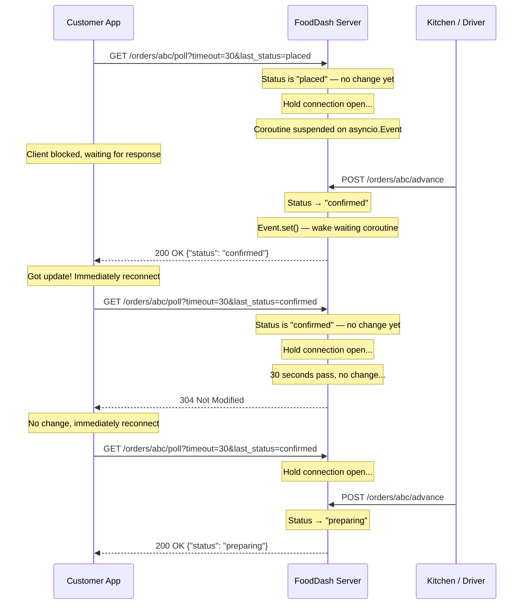

# Chapter 03 — Long Polling

## The Scene

Your short polling solution works but your infra team is panicking. The monitoring dashboard shows 5,000 requests/second to `GET /orders/{id}`, and 99% return identical data. Your AWS bill for load balancer requests alone is climbing. Your CTO asks: *"Can we make the server only respond when something actually changes?"* The answer is yes — and the technique is older than you think.

Long polling was formalized in the late 1990s (the "Comet" pattern) and powered Gmail's real-time notifications, Facebook's chat system, and Dropbox's file sync — all before WebSockets existed. It's the first pattern where the server gets a say in *when* it responds.

---

## The Pattern — Long Polling

The client sends a request, but the server **holds it open**. Instead of responding immediately, the server waits until either:

1. **The data changes** — respond immediately with the new data
2. **A timeout expires** — respond with "no change" (304 or empty body)

Then the client **immediately sends a new request**, re-establishing the held connection. This creates a nearly continuous channel: the server always has a pending request it can respond to when something happens.

```
Short polling:  ask → answer → wait → ask → answer → wait → ask → answer
                       (nothing)        (nothing)          (changed!)

Long polling:   ask ──────────────────────────── answer → ask ── answer
                       (server holds it open)    (changed!)      (changed again!)
```

The key insight: **we moved the waiting from the client side to the server side**. The client no longer burns cycles asking "anything yet?" every 3 seconds. Instead, the server holds the question and answers it exactly when it has something new to say.

---

## How It Works Mechanically

### The Request Lifecycle

1. Client sends `GET /orders/{id}/poll?timeout=30&last_status=placed`
2. Server checks: has status changed since `placed`? If yes, respond immediately
3. If no change, server **holds the request** — the TCP connection stays open, the HTTP response headers haven't been sent yet
4. The client's HTTP library is blocked in `await response` — from its perspective, the request is "in flight"
5. Meanwhile, on the server, the handler coroutine is **suspended** on an `asyncio.Event.wait()` — no CPU consumed
6. When another request advances the order status → the event is set → the waiting coroutine wakes up → responds with the new status
7. When the timeout expires → the server responds with 304 Not Modified (or an empty body indicating "no change")
8. Client receives the response → **immediately** sends a new long poll request
9. The cycle repeats until the order reaches a terminal state (delivered/cancelled)

### Sequence Diagram



### Comparison Timeline

```mermaid
sequenceDiagram
    participant SP as Short Poller
    participant S as Server
    participant LP as Long Poller

    Note over SP,LP: Same order, same status changes

    rect rgb(50, 30, 30)
    Note over SP: Short polling (3s interval)
    SP->>S: GET /orders/abc (poll 1)
    S-->>SP: 200 {status: placed} — NO CHANGE
    Note over SP: Wait 3s...
    SP->>S: GET /orders/abc (poll 2)
    S-->>SP: 200 {status: placed} — NO CHANGE
    Note over SP: Wait 3s...
    SP->>S: GET /orders/abc (poll 3)
    S-->>SP: 200 {status: placed} — NO CHANGE
    Note over SP: Wait 3s...
    SP->>S: GET /orders/abc (poll 4)
    S-->>SP: 200 {status: confirmed} — CHANGED! (detected 9s late)
    end

    rect rgb(30, 50, 30)
    Note over LP: Long polling (30s timeout)
    LP->>S: GET /orders/abc/poll?timeout=30
    Note over S: Holding connection...
    Note over S: Status changes to "confirmed"
    S-->>LP: 200 {status: confirmed} — INSTANT!
    LP->>S: GET /orders/abc/poll?timeout=30
    end
```



---

## The Async Implementation

### Why This MUST Be Async

Long polling's server-side "hold" is fundamentally an I/O wait. The server is waiting for a condition (status change) before it can send a response. How you implement that wait defines your scalability:

**Synchronous (threaded) server — DON'T DO THIS:**
```python
# Each waiting client holds a thread (1-8MB stack each)
def poll_order(order_id, timeout):
    deadline = time.time() + timeout
    while time.time() < deadline:
        order = db.get_order(order_id)
        if order.status != last_status:
            return order
        time.sleep(0.5)  # Busy-wait, burns CPU
    return None  # Timeout
```

At 10K waiting clients, this requires 10K threads = **10-80GB of stack memory** and massive context-switching overhead. The OS scheduler falls apart around 10K threads.

**Asynchronous (event loop) — THE RIGHT WAY:**
```python
# Each waiting client is a coroutine (~few KB each)
async def poll_order(order_id, timeout):
    event = get_or_create_event(order_id)
    try:
        await asyncio.wait_for(event.wait(), timeout=timeout)
        return await db.get_order(order_id)
    except asyncio.TimeoutError:
        return None  # Timeout — no change
```

At 10K waiting clients: 10K coroutines = **~50-100MB total**. The event loop is idle (no CPU consumed) until an event fires. The coroutine is *suspended*, not busy-waiting. When `event.set()` is called, only the relevant coroutines wake up — O(1) notification, not O(N) polling.

### The asyncio.Event Mechanism

`asyncio.Event` is the core primitive. Think of it as a flag that coroutines can wait on:

```python
event = asyncio.Event()

# Waiter (the long poll handler):
await event.wait()  # Suspends this coroutine until event is set

# Notifier (the status-advance handler):
event.set()         # Wakes ALL coroutines waiting on this event
```

The critical property: **`event.wait()` does not consume CPU**. The coroutine is removed from the event loop's run queue and only re-added when `event.set()` is called. This is fundamentally different from `time.sleep()` in a thread, which still occupies the thread.

---

## Systems Constraints Analysis

### CPU

**Near zero while waiting.** The coroutine is suspended — literally removed from the event loop's ready queue. No CPU cycles are consumed. The event loop sits in `epoll_wait()` (Linux) or `kqueue()` (macOS), which is a kernel-level sleep that consumes zero CPU.

When a status change arrives, the CPU cost is minimal:
- Wake the coroutine: ~0.001ms
- Serialize the response: ~0.01ms
- Write to socket: kernel handles the actual I/O

**Compare to short polling:** 5,000 req/s means 5,000 times per second the server must: parse HTTP headers, deserialize the request, look up the order, serialize the response, send HTTP headers + body. Even at 0.1ms per request, that's 0.5 CPU-seconds per wall-clock second — half a core just for status checks that return "no change."

Long polling: the same status checks happen only when statuses actually change. With 6 status transitions per order and 1,000 active orders, that's ~6,000 responses total instead of millions.

### Memory

Each waiting client costs:
- **Coroutine frame**: ~2-4 KB (Python coroutine object + local variables)
- **HTTP connection**: ~1-4 KB kernel socket buffer + ~2-4 KB application-level state (ASGI scope, headers)
- **Event reference**: ~0.1 KB (pointer to the asyncio.Event)

**Total per client: ~5-12 KB**

At 10K concurrent waiting clients: **~50-120 MB**. This is substantial but manageable. A single server with 4GB of RAM could handle 100K+ waiting connections from a memory perspective.

This is NOT free. Short polling holds zero state between requests — each request arrives, gets processed, and the connection is released. Long polling holds state (the connection + coroutine) for the entire wait duration. We traded CPU waste for memory pressure.

### Network I/O

**Dramatically reduced.** The math:

Short polling at 3-second intervals for a 30-minute order:
```
Requests = 30 min * 60 sec/min / 3 sec = 600 requests
Status changes = 6 (placed → confirmed → preparing → ready → picked_up → en_route → delivered)
Wasted requests = 594 (99% waste)
Bytes = 600 * ~1,200 bytes (headers + body) = ~720 KB
```

Long polling with 30-second timeout:
```
Useful responses = 6 (one per status change)
Timeout responses = 30 min * 60 sec/min / 30 sec = 60 timeout cycles
Total requests = 66
Bytes = 66 * ~1,200 bytes = ~79 KB
```

**That's ~9x fewer requests and ~9x less bandwidth.** If the timeout is longer (or status changes are more frequent), the ratio improves further. At the extreme where all 6 changes happen within one 30-second window, you get 6 instant responses + maybe 58 timeout cycles = 64 requests vs 600.

### Latency

**Near-instant notification.** When a status change occurs:

1. The advance handler calls `event.set()` — ~0.001ms
2. The waiting coroutine wakes up — ~0.001ms
3. The response is serialized and written to the socket — ~0.01ms
4. The response travels over the network — ~15-30ms (one-way)

**Total: ~15-30ms** from status change to client notification.

Compare to short polling: average detection latency = `poll_interval / 2`. At 3-second intervals, that's **1,500ms average**. Long polling is **50-100x faster** at detecting changes.

### Bottleneck Shift

We traded **network I/O waste** (thousands of empty responses) for **memory pressure** (thousands of held connections). The new bottleneck is connection-related:

- **File descriptors**: Each open TCP connection requires a file descriptor. Linux defaults to `ulimit -n 1024`. You must raise this (typically to 65535 or higher) for production long polling servers.
- **Socket buffer memory**: Each TCP socket has a send and receive buffer in kernel space (~4-16 KB each by default). At 10K connections: ~80-320 MB of kernel memory.
- **Ephemeral ports**: If a reverse proxy sits between client and server, each proxied connection uses an ephemeral port (range: 32768-60999 on Linux = ~28K ports). This caps connections per proxy-to-server pair at ~28K.

---

## Production Depth

### Connection Limits and OS Tuning

**File descriptor limits:**
```bash
# Check current limit
ulimit -n          # Typically 1024 (soft limit)
ulimit -Hn         # Hard limit (often 4096 or 65536)

# For production long polling, you need:
# /etc/security/limits.conf
*  soft  nofile  65535
*  hard  nofile  65535

# Or per-process via systemd:
# LimitNOFILE=65535
```

At extreme scale (100K+ connections), you may hit system-wide limits:
```bash
cat /proc/sys/fs/file-max   # System-wide maximum (typically ~100K-1M)
sysctl fs.file-max=1000000  # Raise if needed
```

**TCP socket buffer tuning:**
```bash
# Default socket buffer sizes
sysctl net.core.rmem_default  # Receive buffer (~212 KB)
sysctl net.core.wmem_default  # Send buffer (~212 KB)

# For long polling, connections are mostly idle — reduce buffers
sysctl net.ipv4.tcp_rmem="4096 4096 16384"
sysctl net.ipv4.tcp_wmem="4096 4096 16384"
```

### Load Balancer Timeouts

This is one of the most common production issues with long polling:

```
Client  ←→  Load Balancer  ←→  Server
             timeout=60s       timeout=30s (our poll timeout)
```

**AWS ALB**: Default idle timeout is 60 seconds. If your long poll takes longer than 60s without sending any data, the ALB closes the connection. Your server doesn't know — it's still holding the coroutine. The client gets a 504 Gateway Timeout.

**Rule**: Your long poll timeout MUST be less than your load balancer's idle timeout. We use 30 seconds, which gives comfortable headroom below ALB's 60-second default.

**AWS NLB**: No idle timeout for TCP connections (it uses flow tracking with a 350-second timeout). Better for long polling, but you lose ALB's HTTP-level features (path routing, health checks, WAF integration).

### Proxy Buffering

Nginx's `proxy_buffering` directive can break long polling:

```nginx
# Default: nginx buffers the entire upstream response before sending to client
# This defeats the purpose of long polling — the client doesn't get the response
# until nginx has buffered it all, adding latency

# Fix for long polling endpoints:
location /orders/ {
    proxy_buffering off;       # Send response bytes as they arrive
    proxy_read_timeout 35s;    # Must exceed your poll timeout
    proxy_send_timeout 35s;
}
```

Without `proxy_buffering off`, nginx may hold the response in memory while waiting for more data from the upstream, even though the upstream has finished sending.

### Reconnection Storms (Thundering Herd)

If your long polling server crashes or restarts, every connected client simultaneously:
1. Detects the connection was closed
2. Immediately tries to reconnect
3. All 10K clients hit the new/restarted server at the same instant

This is the **thundering herd problem**. The server, just starting up, gets slammed with 10K connection requests simultaneously.

**Mitigations:**
- **Jittered reconnect delay**: Client adds a random delay (0-5 seconds) before reconnecting: `await asyncio.sleep(random.uniform(0, 5))`
- **Exponential backoff**: On repeated failures, increase the delay: 1s, 2s, 4s, 8s, max 30s
- **Connection draining**: Before shutting down, respond to all waiting long polls with a "reconnect later" signal, staggered over a few seconds
- **Rolling restarts**: Never restart all server instances simultaneously

### The "Lost Update" Problem

There's a critical window between when a long poll response is received and when the next long poll request arrives:

```
Time →
Client:  [long poll waiting] → receives "confirmed" → [processing...] → sends new long poll
Server:                         status → "confirmed"    status → "preparing"
                                                        ↑ This change happened while
                                                          client was reconnecting!
```

If the status changes to "preparing" during the reconnection gap, the client's next long poll sends `last_status=confirmed`, the server sees that the current status is "preparing" (different from "confirmed"), and responds immediately. **No update is lost** — because we compare against the client's last-known status, not against "what changed since last check."

This is why the `last_status` parameter is essential. Without it, the server would need to track per-client state ("what have I already told this client?"), which is much more complex and fragile.

### HTTP/1.1 Connection Limits

Browsers enforce a limit of **6 concurrent connections per origin** (per the HTTP/1.1 spec, though some browsers allow 8). A long poll consumes one of those 6 slots for the entire duration.

If your page needs to long-poll for:
- Order status (1 connection)
- Driver location (1 connection)
- Chat messages (1 connection)

That's 3 of your 6 connections permanently occupied. Only 3 remain for loading images, scripts, API calls. Your page may appear to "hang" as resources queue behind the long polls.

**Solutions:**
- **Multiplex**: Use a single long poll that watches multiple resources and returns whichever changes first
- **HTTP/2**: Multiplexes all requests over a single TCP connection, so the 6-connection limit doesn't apply (but you're still holding server resources per stream)
- **Upgrade to SSE or WebSockets** (Ch04-05): Purpose-built for persistent connections, they integrate better with browser connection management

---

## Trade-offs at a Glance

| Dimension | Short Polling (Ch02) | Long Polling (Ch03) | SSE (Ch04 preview) |
|-----------|---------------------|--------------------|--------------------|
| **Requests per status change** | ~100 (at 3s interval over 5 min) | 1 | 0 (server pushes over open stream) |
| **Detection latency** | avg `interval/2` (1.5s at 3s interval) | Near-instant (~15-30ms) | Near-instant (~15-30ms) |
| **Server memory per client** | None between requests | ~5-12 KB (held connection + coroutine) | ~5-12 KB (held connection) |
| **CPU while waiting** | Burns CPU on every poll | Zero (coroutine suspended) | Zero (connection idle) |
| **Network efficiency** | ~1% useful responses | ~90%+ useful responses | 100% (only sends changes) |
| **Implementation complexity** | Very low | Medium (async events, timeouts) | Low (built into HTTP) |
| **Proxy/LB compatibility** | Perfect (standard HTTP) | Good (watch timeout settings) | Good (needs streaming support) |
| **Connection limits** | No issue (short-lived) | Uses 1 of 6 browser connections | Uses 1 of 6 browser connections |
| **Lost updates** | Possible between polls | Prevented via `last_status` param | Prevented via event stream |
| **Failure recovery** | Simple (next poll works) | Reconnection storms possible | Auto-reconnect built in |
| **Events per connection** | 1 response per request | 1 response per request | Multiple events per connection |

---

## Running the Code

### Start the server

```bash
# From the repo root
uv run uvicorn chapters.ch03_long_polling.server:app --port 8003
```

### Run the client

In a second terminal:

```bash
uv run python -m chapters.ch03_long_polling.client
```

### Run the comparison

With the server running:

```bash
uv run python -m chapters.ch03_long_polling.comparison
```

### Open the visual

Open `chapters/ch03_long_polling/visual.html` in your browser. No server needed — it's a self-contained simulation showing short polling vs long polling side by side.

---

## Bridge to Chapter 04

Long polling is a massive improvement: we went from 5,000 wasted requests per second to near-zero, and detection latency dropped from 1.5 seconds to ~30 milliseconds. The server only responds when something actually changes.

But long polling has a structural limitation: **one response per request**. Each request-response cycle delivers exactly one update, then the client must reconnect. This works well for "notify me when ONE thing changes" — like a customer tracking a single order.

But what about the **restaurant dashboard** that needs a continuous stream of ALL incoming orders? Or a **driver app** that needs real-time location pings every second? Long polling can only deliver one event per request cycle. If 10 orders come in within a second, the dashboard needs 10 reconnection cycles to see them all. Each reconnection has overhead: TCP setup (if keep-alive expired), HTTP headers, potential proxy buffering delays.

We need a way to keep a connection open and **stream multiple events** over it — without the reconnection overhead between events. HTTP actually has a built-in mechanism for this, and it's simpler than you'd think: [Chapter 04 — Server-Sent Events (SSE)](../ch04_sse/).
