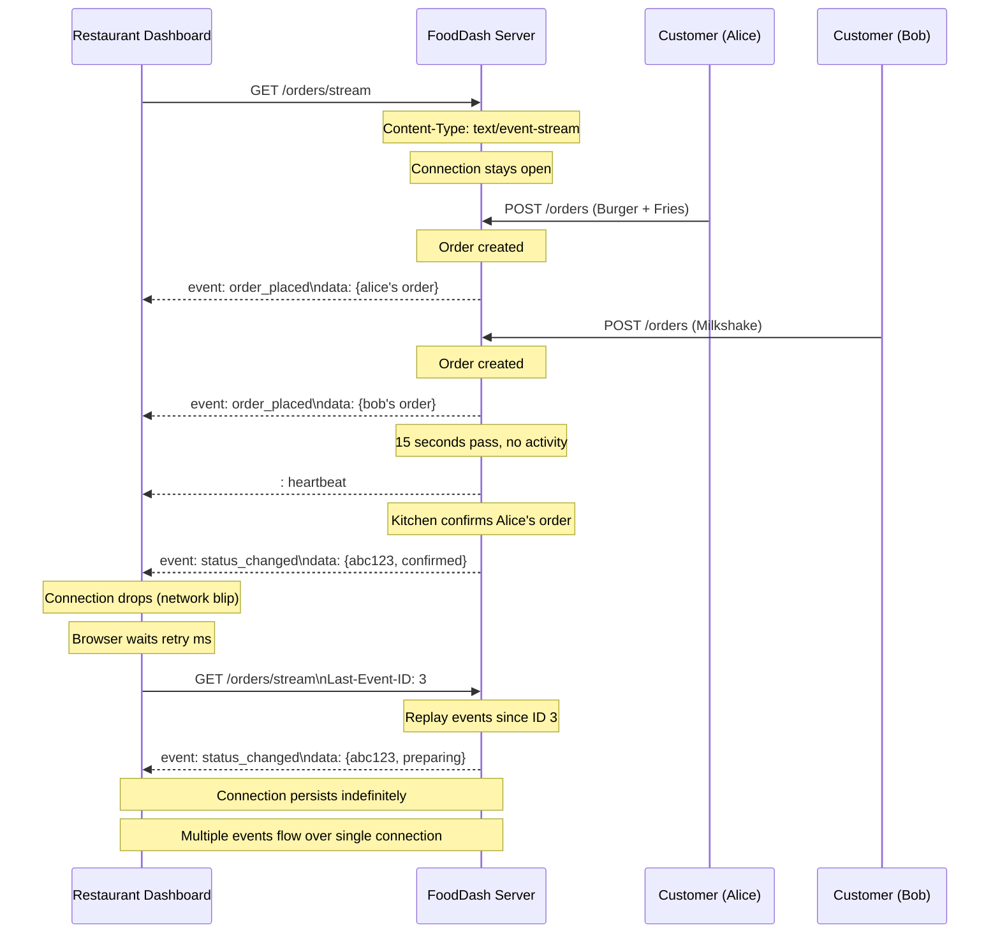

# Chapter 04 — Server-Sent Events (SSE)

## The Scene

FoodDash is growing. You now have 50 restaurants on the platform. Each restaurant has a dashboard showing incoming orders in real-time. With long polling, each dashboard holds one connection and gets ONE update per cycle, then must reconnect. But orders are pouring in -- 3 per minute per restaurant. The dashboard feels choppy. You need a way to keep one connection open and stream multiple events down it continuously.

Here is the problem in concrete terms. A restaurant gets 3 orders per minute. With long polling, each order triggers a response, the connection closes, the client reconnects. That reconnection takes ~50-150ms (TCP handshake if keep-alive expired, HTTP request headers, server-side handler setup). During that window, if a second order arrives, it is queued -- the restaurant does not see it until the next poll cycle completes. At 3 orders/minute this is manageable. At 30 orders/minute during dinner rush, the dashboard is perpetually reconnecting, and events stack up between cycles. The fundamental issue: **long polling delivers exactly ONE event per request-response cycle**.

What if we could keep the HTTP response open and just... keep writing to it?

---

## The Pattern -- Server-Sent Events (SSE)

SSE is disarmingly simple. It is a standard HTTP response that never ends. The server sets `Content-Type: text/event-stream` and keeps writing lines to the response body. The browser has a built-in `EventSource` API that handles parsing, reconnection, and event dispatch -- no library needed.

Here is what it looks like on the wire:

```
HTTP/1.1 200 OK
Content-Type: text/event-stream
Cache-Control: no-cache
Connection: keep-alive

event: order_placed
id: 1
data: {"order_id": "abc123", "customer": "Alice", "items": ["Burger", "Fries"]}

event: order_placed
id: 2
data: {"order_id": "def456", "customer": "Bob", "items": ["Milkshake"]}

event: status_changed
id: 3
data: {"order_id": "abc123", "new_status": "confirmed"}

: heartbeat

event: order_placed
id: 4
data: {"order_id": "ghi789", "customer": "Carol", "items": ["Burger", "Milkshake"]}

```

That is it. That is the entire protocol. Lines starting with `data:` carry the payload. Lines starting with `event:` name the event type. Lines starting with `id:` set the last event ID. Lines starting with `:` are comments (used as keep-alive heartbeats). A blank line (`\n\n`) terminates each event.

Compare this to the complexity of WebSockets (binary framing, upgrade handshake, ping/pong, masking). SSE is just text over HTTP.

```
Long polling:    [request] → [response: 1 event] → [request] → [response: 1 event] → ...
                  ↑ reconnect overhead each time

SSE:             [request] → [event] [event] [event] [event] [event] ...
                  ↑ one connection, many events, zero reconnection overhead
```

### The Browser API

```javascript
// This is the entire client-side implementation
const source = new EventSource('/orders/stream');

source.addEventListener('order_placed', (e) => {
    const order = JSON.parse(e.data);
    addOrderToBoard(order);
});

source.addEventListener('status_changed', (e) => {
    const update = JSON.parse(e.data);
    updateOrderCard(update.order_id, update.new_status);
});

// EventSource handles reconnection automatically.
// If the connection drops, the browser reconnects and sends
// the Last-Event-ID header so the server can resume from
// where the client left off. You write zero reconnection logic.
```

---

## SSE Protocol Deep Dive

### Event Format

Each SSE event is one or more field lines followed by a blank line:

```
event: <type>\n
id: <unique-id>\n
retry: <milliseconds>\n
data: <payload line 1>\n
data: <payload line 2>\n
\n
```

Field rules:
- **`data:`** -- The event payload. Multiple `data:` lines are joined with newlines. This is where your JSON goes.
- **`event:`** -- Optional event type. If omitted, the event fires on the `message` handler. If present, it fires on `addEventListener(type, ...)`.
- **`id:`** -- Optional event ID. The browser stores this as `lastEventId`. On reconnection, the browser sends it as the `Last-Event-ID` HTTP header.
- **`retry:`** -- Optional. Tells the browser how many milliseconds to wait before reconnecting after a disconnect. Default is browser-dependent (usually 3 seconds).
- **`:`** -- Comment line. Ignored by the browser but keeps the connection alive through proxies that would otherwise timeout an idle connection.

### Automatic Resumption via Last-Event-ID

This is one of SSE's most underappreciated features. The protocol has built-in exactly-once delivery semantics (or at-least-once, depending on your server implementation):

```
1. Server sends: id: 42\ndata: {...}\n\n
2. Server sends: id: 43\ndata: {...}\n\n
3. Connection drops (network blip, proxy restart, etc.)
4. Browser waits `retry` milliseconds
5. Browser reconnects with header: Last-Event-ID: 43
6. Server sees Last-Event-ID: 43, replays events 44, 45, ... from its buffer
7. Client seamlessly continues from where it left off
```

The server must implement the replay buffer -- SSE gives you the protocol, not the storage. But the browser side is completely automatic.

### Keep-Alive Heartbeats

Proxies, load balancers, and CDNs often kill idle connections after 30-60 seconds. SSE connections that are waiting for events can appear idle. The solution is periodic comment lines:

```
: heartbeat\n
\n
```

This is a zero-byte event from the application's perspective (the browser ignores comments), but it is real data on the TCP connection, resetting idle timers on every proxy in the path.

### Sequence Diagram



---

## Systems Constraints Analysis

### CPU

**Minimal per event -- proportional to EVENTS, not CLIENTS x POLL_RATE.**

With long polling at 50 restaurant dashboards, the server handles:
- 50 reconnections per status change (each dashboard reconnects after receiving one event)
- Each reconnection: parse HTTP headers, create ASGI scope, invoke handler, set up asyncio.Event, suspend coroutine
- At 3 orders/minute/restaurant = 150 orders/minute across all restaurants
- Each order triggers 50 reconnection cycles = 7,500 handler invocations per minute just for reconnections

With SSE, the server handles:
- 50 persistent connections (set up once)
- 150 order events/minute = 150 JSON serializations + 50 writes per event = 7,500 writes per minute
- But each write is just `f"data: {json}\n\n".encode()` -- no HTTP parsing, no handler setup, no coroutine creation

The CPU profile shifts from **per-request overhead** (parsing, routing, handler setup) to **per-event overhead** (serialize, write). The per-event cost is dramatically lower because you skip the entire HTTP request processing pipeline.

At scale: if you have 100K connected clients and 1,000 events/second, you are doing 100M write operations per second. At that point you need a fan-out architecture (pub/sub, not direct writes) -- but that is a Ch07 problem.

### Memory

Each SSE connection costs:
- **HTTP connection**: ~1-4 KB kernel socket buffer + ~2-4 KB application state (ASGI scope, headers)
- **asyncio.Queue reference**: ~0.5 KB per subscriber (pointer to the queue + a few buffered events)
- **Event replay buffer**: depends on implementation -- if you keep the last 100 events, that is ~50-100 KB shared across all clients

**Total per client: ~3-8 KB** (slightly less than long polling because there is no coroutine frame being suspended/resumed per event).

At 50 restaurant dashboards: **~150-400 KB**. Negligible.

At 100K customer connections (every customer tracking their order via SSE): **~300 MB - 800 MB** of connection state. This is where you start thinking about connection limits, file descriptors, and whether your single server can hold this many open connections.

The memory cost is almost identical to long polling per connection. The difference is that SSE connections are truly long-lived (minutes to hours) while long polling connections are recycled every few seconds to minutes. A long polling connection that times out and reconnects releases its memory briefly; an SSE connection holds it continuously.

### Network I/O

**Only sends data when something happens. No request overhead per event.**

With long polling, every event delivery costs:
```
Client request:  ~500 bytes (HTTP headers, URL, params)
Server response: ~200 bytes (HTTP headers) + ~200 bytes (JSON body)
Total per event: ~900 bytes
```

With SSE, the initial connection costs ~500 bytes (request) + ~200 bytes (response headers). After that, each event costs only:
```
event: order_placed\n
id: 42\n
data: {"order_id": "abc123", ...}\n
\n

Total per event: ~80-200 bytes (just the event data, no HTTP overhead)
```

That is a **4-5x reduction in per-event bandwidth** after the initial connection is established.

However, SSE has a constraint that long polling does not: **the TCP connection is permanently occupied**. With HTTP/1.1, browsers limit connections to 6 per origin. One SSE connection consumes 1 of those 6 slots for the entire session. If your page needs multiple SSE streams (orders + driver locations + chat notifications), you quickly exhaust the connection pool.

### Latency

**Server pushes immediately when event occurs. One-way latency, no round trip.**

```
Long polling event delivery:
  1. Event occurs on server
  2. Server responds to held request (~0.01ms)
  3. Network transit to client (~15-30ms)
  4. Client processes response (~1ms)
  5. Client sends new request (~15-30ms network + ~0.1ms server processing)
  Total: ~30-60ms per event + reconnection gap

SSE event delivery:
  1. Event occurs on server
  2. Server writes to open stream (~0.01ms)
  3. Network transit to client (~15-30ms)
  Total: ~15-30ms per event, no reconnection gap
```

For rapid-fire events (3 orders arriving within 1 second), long polling delivers the first one instantly but the second and third are delayed by reconnection overhead. SSE delivers all three within milliseconds of each other because the connection is already open.

### Bottleneck Shift

From **network waste** (polling) and **reconnection overhead** (long polling) to **connection count**.

The server must now manage persistent connections. Each connection is a file descriptor, a socket buffer, and an application-level subscriber. The new concerns:

1. **File descriptor limits**: Same as long polling, but connections live longer. `ulimit -n` must be raised for production.

2. **Connection-per-origin limit**: Browsers allow only 6 HTTP/1.1 connections per origin. One SSE stream uses one permanently. This is the single biggest practical limitation of SSE with HTTP/1.1.

3. **Unidirectional**: SSE is server-to-client only. The client cannot send data back on the same connection. For the restaurant dashboard (read-only stream of orders), this is perfect. For anything bidirectional (chat, collaborative editing), you need a separate mechanism for the client-to-server direction.

4. **Text-only**: SSE is a text protocol. Binary data must be Base64-encoded, adding ~33% overhead. For JSON payloads this is irrelevant, but for binary streams (video, audio), SSE is the wrong tool.

---

## Principal-Level Depth

### HTTP/1.1 vs HTTP/2 for SSE

**HTTP/1.1**: Each SSE connection occupies an entire TCP connection. Browsers enforce a 6-connection-per-origin limit. If you open 2 SSE streams, only 4 connections remain for everything else (XHR, images, scripts). This is a real problem in production.

**HTTP/2**: All requests to an origin are multiplexed over a single TCP connection as independent streams. An SSE connection is just another stream -- it does not block other requests. The 6-connection limit disappears because there is only one connection with many streams.

This is why HTTP/2 adoption matters enormously for SSE. With HTTP/1.1, SSE has a hard practical limit. With HTTP/2, you can open dozens of SSE streams without impacting other page resources.

```
HTTP/1.1:
  TCP conn 1: SSE stream (occupied permanently)
  TCP conn 2: SSE stream (occupied permanently)
  TCP conn 3: XHR request
  TCP conn 4: Image load
  TCP conn 5: Script load
  TCP conn 6: XHR request
  TCP conn 7: BLOCKED -- browser won't open a 7th connection

HTTP/2:
  TCP conn 1:
    Stream 1: SSE (permanent)
    Stream 2: SSE (permanent)
    Stream 3: XHR (completes, stream freed)
    Stream 4: Image (completes, stream freed)
    Stream 5: XHR (completes, stream freed)
    ... hundreds of streams, one TCP connection
```

### Proxy and CDN Challenges

Many reverse proxies and CDNs **buffer response bodies** before forwarding them to the client. This is normally a performance optimization (send the complete response in one shot), but for SSE it is catastrophic -- events are held in the proxy's buffer instead of being forwarded immediately.

**Nginx**:
```nginx
location /orders/stream {
    proxy_pass http://backend;
    proxy_buffering off;           # Critical: disable response buffering
    proxy_cache off;               # No caching for event streams
    proxy_read_timeout 3600s;      # Allow long-lived connections (1 hour)
    proxy_set_header Connection ''; # Clear Connection header for HTTP/2
    add_header X-Accel-Buffering no; # Tell nginx worker to not buffer
}
```

Without `proxy_buffering off`, nginx accumulates SSE events in a buffer and only forwards them when the buffer fills up (default 4-8 KB) or the connection closes. Your real-time dashboard gets events in batches every few seconds instead of instantly.

**AWS ALB/CloudFront**: ALB supports streaming responses and works well with SSE. CloudFront, however, buffers responses by default. You need to configure origin response timeout and use chunked transfer encoding.

**Cloudflare**: Generally handles SSE well, but Workers have execution time limits. If using Cloudflare as a CDN, streaming responses pass through correctly.

### Load Balancer Considerations

SSE connections are long-lived. This interacts poorly with some load balancing strategies:

**Round-robin**: A new connection goes to the next server in the rotation. Since SSE connections persist for minutes/hours, servers that started first accumulate more connections. New servers added to the pool get no traffic until new connections are established. The load becomes increasingly unbalanced over time.

**Least-connections**: Better for SSE -- new connections go to the server with the fewest active connections. But if all connections are SSE (long-lived), the "least connections" server is always the one that just restarted (it has zero connections), leading to thundering herd on restart.

**Sticky sessions / consistent hashing**: The client always goes to the same server. This is important if your server maintains per-connection state (like an event replay buffer). But it makes scaling down harder -- you cannot remove a server without disconnecting all its clients.

**Best practice**: Use least-connections with connection draining. When removing a server, stop accepting new connections but let existing SSE streams complete (or send a `retry: 1000` event and close the stream gracefully so clients reconnect to other servers).

### EventSource API Limitations

The browser's `EventSource` API is intentionally simple, but that simplicity has costs:

1. **No custom headers**: You cannot send `Authorization: Bearer <token>` with EventSource. The connection is a plain GET request. Workarounds:
   - Pass the token as a URL query parameter: `/orders/stream?token=abc123` (exposes token in server logs and browser history)
   - Use cookie-based authentication (works but requires same-origin or CORS credentials)
   - Use a library like `eventsource-polyfill` that supports custom headers (loses the "no library needed" advantage)

2. **GET only**: EventSource always uses GET. You cannot POST a filter body like "only send me orders for restaurant X." Workarounds:
   - Query parameters: `/orders/stream?restaurant_id=rest_01`
   - Establish the filter via a separate POST, get a stream token, connect with that token

3. **No binary data**: EventSource is text-only. Binary payloads must be Base64-encoded.

4. **No explicit close from server**: The server cannot send a "this stream is done" signal. It can only close the connection, which triggers the browser's auto-reconnect. To signal completion, send a custom event like `event: done` and have the client call `source.close()`.

### Backpressure

What happens when the server produces events faster than the client can consume them?

TCP flow control handles this automatically. When the client's receive buffer fills up, the TCP window shrinks to zero, and the server's `write()` calls block (or return `EAGAIN` for non-blocking sockets). In an async Python server, this means the `await response.write()` coroutine suspends until the client catches up.

This is mostly fine, but there are edge cases:
- If the server has 10K connected clients and one is on a slow connection, writing to that one client blocks the coroutine. If you are iterating over clients sequentially, that one slow client delays everyone. **Solution**: write to each client in a separate task, or use `asyncio.wait_for` with a timeout and disconnect slow clients.
- If the server queues events in memory for each client (using `asyncio.Queue`), a slow client's queue grows unbounded. **Solution**: use a bounded queue (`asyncio.Queue(maxsize=100)`) and drop events or disconnect when the queue is full.

### Comparison: SSE vs WebSockets

| Dimension | SSE | WebSockets |
|-----------|-----|------------|
| **Direction** | Server to client only | Bidirectional |
| **Protocol** | HTTP (text/event-stream) | WebSocket protocol (ws:// or wss://) |
| **Connection setup** | Standard HTTP request | HTTP upgrade handshake |
| **Auto-reconnect** | Built-in (EventSource handles it) | Must implement manually |
| **Resumption** | Built-in (Last-Event-ID) | Must implement manually |
| **Browser API** | EventSource (simple) | WebSocket (more complex) |
| **Binary support** | Text only (Base64 for binary) | Native binary frames |
| **HTTP/2 multiplexing** | Yes (just another stream) | No (requires dedicated TCP connection) |
| **Proxy compatibility** | Good (it is HTTP) | Varies (some proxies break WebSocket upgrades) |
| **Custom headers** | No (EventSource limitation) | Yes (during handshake) |
| **Library needed** | No | No (but reconnection logic is manual) |
| **Best for** | Server push, live feeds, notifications | Chat, gaming, collaborative editing |

**Rule of thumb**: If data flows in one direction (server to client), use SSE. If both sides need to send data, use WebSockets. SSE is simpler, more compatible with existing HTTP infrastructure, and has better built-in resilience (auto-reconnect, resumption).

---

## Trade-offs at a Glance

| Dimension | Short Polling (Ch02) | Long Polling (Ch03) | SSE (Ch04) | WebSockets (Ch05 preview) |
|-----------|---------------------|--------------------|-----------|----|
| **Events per connection** | 1 response per request | 1 response per request | Many events per connection | Many messages both ways |
| **Requests per N events** | N (plus wasted polls) | N (plus timeout cycles) | 1 (initial connection) | 1 (initial upgrade) |
| **Detection latency** | avg `interval/2` | Near-instant (~30ms) | Near-instant (~15-30ms) | Near-instant (~15-30ms) |
| **Server memory per client** | None between requests | ~5-12 KB (held connection) | ~3-8 KB (persistent connection) | ~5-15 KB (persistent connection) |
| **CPU while idle** | Burns CPU every poll | Zero (coroutine suspended) | Zero (connection idle) | Zero (connection idle) |
| **Network overhead per event** | ~900 bytes (full HTTP cycle) | ~900 bytes (full HTTP cycle) | ~80-200 bytes (event data only) | ~10-50 bytes (frame header + data) |
| **Direction** | Client-initiated | Client-initiated | Server push only | Bidirectional |
| **Auto-reconnect** | N/A (client controls) | Manual (client reconnects) | Built-in (EventSource) | Manual |
| **Resumption** | N/A | Via `last_status` param | Built-in (Last-Event-ID) | Manual |
| **HTTP/2 friendly** | Yes | Yes | Yes (multiplexed) | No (separate TCP) |
| **Proxy compatibility** | Perfect | Good | Good (needs buffering off) | Varies |
| **Implementation complexity** | Very low | Medium | Low | Medium-High |

---

## Running the Code

### Start the server

```bash
# From the repo root
uv run uvicorn chapters.ch04_server_sent_events.server:app --port 8004
```

### Run the Python client

In a second terminal:

```bash
uv run python -m chapters.ch04_server_sent_events.client
```

### Open the restaurant dashboard

Open `chapters/ch04_server_sent_events/dashboard.html` in your browser, or with the server running, navigate to `http://localhost:8004/dashboard` (the server serves the HTML directly).

### Open the visual

Open `chapters/ch04_server_sent_events/visual.html` in your browser. This is a self-contained simulation -- no server needed.

---

## Bridge to Chapter 05

SSE is perfect for the restaurant dashboard -- it is a one-way stream of orders. The server pushes events, the dashboard displays them. No data flows back from the dashboard to the server on the same connection. Orders come in, status updates flow out. Unidirectional.

But now FoodDash has a new feature request: **driver-customer chat**. The customer wants to message the driver ("I'm at the back entrance"), and the driver needs to reply ("On my way, 2 minutes"). Chat is fundamentally **bidirectional** -- both sides send messages, both sides receive messages, and messages can arrive at any time from either direction.

SSE can only push FROM the server. To send a chat message, the customer would need to make a separate POST request, and then receive the driver's reply via the SSE stream. That works, but it means two separate channels: POST for sending, SSE for receiving. The server must correlate these. The client must manage two connections. Error handling gets complex (what if the POST succeeds but the SSE stream drops?).

We need something that lets both sides talk freely over a single connection -- a true bidirectional channel: [Chapter 05 -- WebSockets](../ch05_websockets/).
