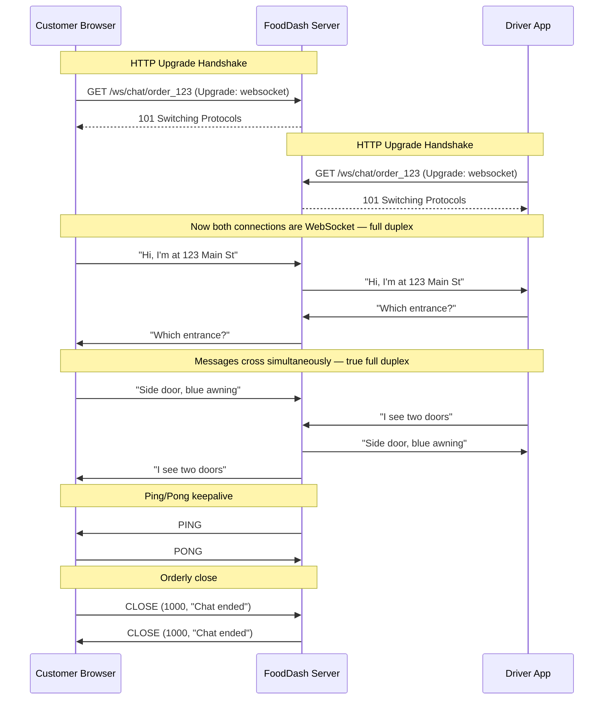

# Chapter 05 — WebSockets

## The Scene

FoodDash customers love tracking their orders via SSE (Ch04). But now Product wants driver-customer chat. *"The driver is 2 minutes away and can't find the building — let them message the customer directly."*

SSE won't work here: it's server-to-client only. You could hack around it — use two SSE connections (one for each direction) or bolt on a POST endpoint for client-to-server messages — but that's awkward. You'd have two separate channels for what is conceptually one conversation, with no guarantee of message ordering across them.

What you want is a **single connection where both sides can send messages at any time, independently**. The driver types "Which entrance?" while the customer simultaneously sends "I'm at the side door." Neither message blocks the other. True full-duplex.

Welcome to WebSockets.

---

## The Pattern — WebSockets

### The Key Insight

WebSockets start life as HTTP, then **upgrade** to a completely different protocol. After the upgrade handshake, the connection is no longer HTTP. It's a persistent, full-duplex TCP channel with its own binary frame format. Both sides can send data at any time without waiting for the other.

### The Upgrade Handshake

Every WebSocket connection begins as a regular HTTP request. The client asks to switch protocols:

```
GET /ws/chat/order_abc123 HTTP/1.1
Host: localhost:8005
Connection: Upgrade
Upgrade: websocket
Sec-WebSocket-Key: dGhlIHNhbXBsZSBub25jZQ==
Sec-WebSocket-Version: 13
Origin: http://localhost:8005
```

The server agrees:

```
HTTP/1.1 101 Switching Protocols
Upgrade: websocket
Connection: Upgrade
Sec-WebSocket-Accept: s3pPLMBiTxaQ9kYGzzhZRbK+xOo=
```

**After this exchange: NO MORE HTTP.** The TCP socket is now speaking the WebSocket frame protocol. HTTP headers are gone. Request/response semantics are gone. It's raw bidirectional frames from here on out.

The `Sec-WebSocket-Accept` value is computed as:

```
SHA1(Sec-WebSocket-Key + "258EAFA5-E914-47DA-95CA-5AB0DC85B11B")  →  base64
```

The magic GUID `258EAFA5-E914-47DA-95CA-5AB0DC85B11B` is defined in RFC 6455. It proves the server understands the WebSocket protocol (not just blindly proxying).



### The WebSocket Frame Format

After the handshake, all data flows as **frames**. Here's the binary layout:

```
 0                   1                   2                   3
 0 1 2 3 4 5 6 7 8 9 0 1 2 3 4 5 6 7 8 9 0 1 2 3 4 5 6 7 8 9 0 1
+-+-+-+-+-------+-+-------------+-------------------------------+
|F|R|R|R| opcode|M| Payload len |    Extended payload length    |
|I|S|S|S|  (4)  |A|     (7)     |             (16/64)           |
|N|V|V|V|       |S|             |   (if payload len==126/127)   |
| |1|2|3|       |K|             |                               |
+-+-+-+-+-------+-+-------------+ - - - - - - - - - - - - - - - +
|     Extended payload length continued, if payload len == 127  |
+ - - - - - - - - - - - - - - - +-------------------------------+
|                               |Masking-key, if MASK set to 1  |
+-------------------------------+-------------------------------+
| Masking-key (continued)       |          Payload Data         |
+-------------------------------- - - - - - - - - - - - - - - - +
:                     Payload Data continued ...                :
+ - - - - - - - - - - - - - - - - - - - - - - - - - - - - - - - +
|                     Payload Data (continued)                  |
+---------------------------------------------------------------+
```

**Field breakdown:**

| Field | Bits | Purpose |
|-------|------|---------|
| **FIN** | 1 | 1 = this is the final fragment of a message. 0 = more fragments follow. |
| **RSV1-3** | 3 | Reserved for extensions (e.g., RSV1 = 1 when using permessage-deflate compression). |
| **Opcode** | 4 | Frame type: `0x1` = text, `0x2` = binary, `0x8` = close, `0x9` = ping, `0xA` = pong, `0x0` = continuation. |
| **MASK** | 1 | 1 = payload is masked. **Client-to-server frames MUST be masked. Server-to-client frames MUST NOT be masked.** |
| **Payload length** | 7 | 0-125 = actual length. 126 = next 2 bytes are the length. 127 = next 8 bytes are the length. |
| **Masking key** | 32 | 4-byte XOR key applied to every byte of the payload. Only present when MASK=1. |
| **Payload** | variable | The actual message data. For text frames, this MUST be valid UTF-8. |

**Why masking?** It prevents cache poisoning attacks against intermediary proxies. Without masking, a malicious client could craft WebSocket frames that look like valid HTTP responses to a confused proxy. The 4-byte XOR mask ensures the wire bytes don't accidentally match HTTP patterns.

**Frame overhead is tiny:**
- Unmasked (server→client): 2 bytes for payloads <= 125 bytes, 4 bytes for <= 65535, 10 bytes for larger
- Masked (client→server): add 4 bytes for the masking key
- Compare to HTTP: ~200-800 bytes of headers on **every single request**

For a chat message like "I'm downstairs" (14 bytes), the WebSocket frame is 2+14 = **16 bytes** server→client, or 2+4+14 = **20 bytes** client→server. The equivalent HTTP POST would be **~400 bytes minimum** — 20x more overhead.

---

## Systems Constraints Analysis

### CPU

Frame encode/decode adds measurable CPU overhead compared to raw TCP:

- **Masking (client→server)**: XOR each payload byte with a rotating 4-byte key. For a 1KB message: 1024 XOR operations. Trivial for one message, but at 100K messages/sec the cost is real (~0.1ms/batch).
- **UTF-8 validation (text frames)**: The server MUST validate that text frame payloads are valid UTF-8. This is O(n) on payload size.
- **Per-message compression** (`permessage-deflate`): When enabled, every message is compressed/decompressed using zlib. This is **significant** CPU — potentially 10-100x more than uncompressed frame handling. It trades CPU for bandwidth.
- **Frame parsing**: Reading the variable-length header (2-14 bytes), extracting fields, computing payload boundaries. Fast, but nonzero.

**Comparison**: A simple HTTP JSON API doing the same chat would spend CPU on HTTP parsing, header processing, JSON serialization, and content negotiation — arguably more total work per message, but amortized differently.

### Memory

Each WebSocket connection is a **persistent TCP connection plus application state**:

- **TCP socket buffers**: ~4-8 KB per connection (OS-dependent, configurable via `SO_RCVBUF`/`SO_SNDBUF`)
- **TLS state** (if using wss://): ~20-50 KB per connection for the TLS session
- **Application state**: In our chat app, each connection holds room membership, user identity, message history pointer. ~1-2 KB per connection.
- **Library overhead**: Python's `asyncio` event loop, the WebSocket library's per-connection objects. ~2-5 KB per connection.

**At scale:**
| Connections | Memory (no TLS) | Memory (with TLS) |
|-------------|----------------|--------------------|
| 1,000 | ~8-15 MB | ~30-60 MB |
| 10,000 | ~80-150 MB | ~300-600 MB |
| 100,000 | ~800 MB - 1.5 GB | ~3-6 GB |

This is fundamentally different from HTTP request-response, where connections are short-lived and memory is freed after each response. WebSocket connections persist for the duration of the chat session — minutes, hours, or longer.

### Network I/O

**Extremely efficient for frequent small messages.** This is where WebSockets shine:

```
Chat message "I'm downstairs" (14 bytes):
  HTTP POST:  ~400 bytes headers + 14 bytes body = ~414 bytes
  WebSocket:  6 bytes frame header + 14 bytes payload = 20 bytes

That's 20x less overhead per message.
```

For a chat session with 50 messages:
- HTTP: 50 requests x ~414 bytes + 50 responses x ~300 bytes = **~35,700 bytes**
- WebSocket: 1 handshake (~400 bytes) + 50 frames x ~20 bytes = **~1,400 bytes**

**But**: each WebSocket connection occupies one file descriptor and consumes kernel socket buffer space for its entire lifetime. On Linux, the default file descriptor limit is 1024 (soft) — you'll hit this before you hit memory limits. Production servers set `ulimit -n 65536` or higher.

### Latency

**Best achievable for web communication.** Once the connection is established:

```
Message path:
  Application → WebSocket frame encode → TCP send buffer → wire → 
  TCP receive buffer → WebSocket frame decode → Application

Server-side processing: < 0.1ms (frame decode + broadcast)
Network transit: same as any TCP packet (~1-50ms depending on distance)
No HTTP parsing. No header processing. No content negotiation.
```

For chat, this means sub-millisecond server processing + network transit. The user perceives messages as instant.

### Bottleneck Shift

With HTTP, the bottleneck is network overhead — headers, connection setup, parsing. With WebSockets, the bottleneck shifts to **connection management and statefulness**:

- The server must maintain **stateful connections** — each one knows who the user is, which chat room they're in
- If the server process crashes, all connected clients lose their connections and chat state
- You can't horizontally scale by adding more servers behind a load balancer (unless they share state)
- A client connected to Server A can't have their messages delivered by Server B

This statefulness problem is the core tension of WebSocket architecture and the reason Ch08 (Stateful vs Stateless) exists.

---

## Principal-Level Depth

### Ping/Pong: WebSocket-Level Keepalive

TCP has its own keepalive mechanism, but it operates at the OS level (default: 2 hours before first probe on Linux). WebSocket defines its own:

- **Ping frame** (opcode `0x9`): Either side can send. The payload is arbitrary (up to 125 bytes).
- **Pong frame** (opcode `0xA`): The receiver MUST respond with a pong containing the same payload.

Why not rely on TCP keepalive?
1. TCP keepalive intervals are too long for interactive applications
2. Intermediary proxies (Nginx, AWS ALB, Cloudflare) have their own idle timeouts (typically 60-120 seconds). A WebSocket connection that's silent for 90 seconds may be terminated by a proxy even though the TCP connection is alive.
3. Application-level pings let you measure **round-trip latency** and detect dead connections faster.

Typical ping interval: 20-30 seconds. If no pong arrives within 10 seconds, consider the connection dead.

### Close Handshake: Orderly Shutdown

WebSocket connections close with a two-way handshake:

1. One side sends a **Close frame** (opcode `0x8`) with an optional status code and reason
2. The other side responds with its own Close frame
3. The TCP connection is then terminated

**Status codes** (RFC 6455, Section 7.4):

| Code | Meaning |
|------|---------|
| 1000 | Normal closure |
| 1001 | Going away (e.g., server shutdown, page navigation) |
| 1002 | Protocol error |
| 1003 | Unsupported data (e.g., binary when only text is expected) |
| 1006 | Abnormal closure (no close frame — connection dropped) |
| 1007 | Invalid payload data (e.g., non-UTF-8 in a text frame) |
| 1008 | Policy violation |
| 1009 | Message too big |
| 1011 | Unexpected condition (server error) |
| 4000-4999 | Available for application use |

FoodDash uses `4001` for "order completed" and `4002` for "kicked from room."

### Subprotocols

The handshake can negotiate application-level protocols:

```
Client: Sec-WebSocket-Protocol: chat-v1, chat-v2
Server: Sec-WebSocket-Protocol: chat-v2
```

This lets you version your message format. The server picks the highest version it supports. If it doesn't support any, it rejects the connection (or accepts without the header, meaning no subprotocol).

### Per-Message Compression (permessage-deflate)

Negotiated during the handshake:

```
Client: Sec-WebSocket-Extensions: permessage-deflate; client_max_window_bits
Server: Sec-WebSocket-Extensions: permessage-deflate; server_max_window_bits=15
```

When enabled, RSV1 bit is set on compressed frames. Each message payload is compressed using the DEFLATE algorithm (same as gzip, without the gzip header).

**Trade-off**: For short chat messages (< 100 bytes), compression often **increases** size due to the zlib header overhead. It only pays off for larger payloads (> 200 bytes). Some implementations use a sliding window to share compression context across messages, which improves compression ratio but uses more memory.

**Recommendation for chat**: Disable `permessage-deflate`. The messages are too small to benefit, and the CPU cost is disproportionate.

### Scaling WebSockets: The Statefulness Problem

This is the hard part. Consider three servers behind a load balancer:

```
              ┌─── Server A ←──── Customer (ws connected)
Load         │
Balancer ────┼─── Server B ←──── Driver (ws connected)
              │
              └─── Server C      (idle)
```

The customer is connected to Server A. The driver is connected to Server B. When the driver sends "I'm downstairs," Server B receives it. But the customer's WebSocket is on Server A. **Server B cannot deliver the message to the customer.**

**Solutions, in order of complexity:**

1. **Sticky sessions**: The load balancer routes all connections for the same order to the same server. Simple but creates hotspots and doesn't survive server crashes.

2. **External pub/sub (Redis)**: All servers subscribe to a Redis Pub/Sub channel per chat room. When Server B gets a message, it publishes to Redis. Server A receives the publish and delivers to the customer. This is the most common production approach.

3. **Distributed state store**: Use a shared data store (Redis, DynamoDB) for connection registry. Each server knows which other servers hold which connections and forwards messages directly. More complex but lower latency than pub/sub.

4. **Dedicated WebSocket service**: Separate the WebSocket termination layer from the application logic. Use a service like Socket.IO with a Redis adapter, or a managed service like AWS API Gateway WebSocket APIs. This is the "let someone else deal with it" approach.

Our single-server example avoids this problem entirely. Ch08 revisits it.

### WebSocket vs SSE: Decision Matrix

| Criterion | SSE (Ch04) | WebSocket (Ch05) |
|-----------|-----------|-----------------|
| **Direction** | Server → client only | Bidirectional |
| **Protocol** | HTTP (text/event-stream) | WebSocket (custom binary frames) |
| **Data format** | Text only (UTF-8) | Text or binary |
| **Auto-reconnect** | Built into the EventSource API | Must implement yourself |
| **Last-Event-ID** | Built-in resume mechanism | Must implement yourself |
| **HTTP/2 multiplexing** | Yes — shares a single TCP connection | No — each WebSocket is its own TCP connection |
| **Proxy friendliness** | Excellent (it's just HTTP) | Sometimes problematic (upgrade can confuse proxies) |
| **Browser connection limit** | Shares the HTTP connection pool (6 per origin) | Separate from HTTP pool, but still limited by OS |
| **Complexity** | Low | Medium-High |
| **Best for** | Live feeds, notifications, order tracking | Chat, gaming, collaborative editing |

**Rule of thumb**: If you only need server-to-client, use SSE. It's simpler, auto-reconnects, works with HTTP/2 multiplexing, and plays nicely with every proxy on the internet. Use WebSockets when you genuinely need bidirectional communication or binary data.

### Browser Connection Limits

HTTP/1.1 browsers limit connections to ~6 per origin. SSE connections count against this limit. WebSocket connections are promoted out of the HTTP connection pool after the upgrade, so they don't count against the 6-connection limit.

However, WebSocket connections are still limited by:
- OS file descriptor limits
- Browser-level limits (varies by browser, typically much higher than 6)
- Proxy and firewall timeouts that may kill idle WebSocket connections

---

## Trade-offs at a Glance

| Dimension | SSE (Ch04) | WebSocket (Ch05) | HTTP/2 Server Push |
|-----------|-----------|------------------|--------------------|
| **Direction** | Server → client | Bidirectional | Server → client (pre-emptive) |
| **Connection** | HTTP, long-lived | Upgraded, persistent | HTTP/2 stream |
| **Frame overhead** | ~50-100 bytes (SSE format) | 2-14 bytes | HTTP/2 frame header (9 bytes) |
| **Binary data** | No (text only) | Yes | Yes |
| **Auto-reconnect** | Yes (EventSource API) | No (manual) | N/A (tied to page load) |
| **Multiplexing** | Yes (HTTP/2) | No (1 TCP per WS) | Yes (HTTP/2) |
| **Proxy support** | Excellent | Can be problematic | Requires HTTP/2 end-to-end |
| **Scaling** | Stateful | Stateful | Stateless (per-request) |
| **Use case** | Notifications, live feeds | Chat, gaming, collab edit | Pre-loading resources |
| **Status** | Widely used | Widely used | **Deprecated** — removed from Chrome (2022) |

Note: HTTP/2 Server Push was deprecated because it was hard to use correctly and CDNs/browsers developed better alternatives (103 Early Hints, preload links). It's included here for completeness but should not be used in new projects.

---

## Running the Code

### Start the server

```bash
# From the repo root
uv run uvicorn chapters.ch05_websockets.server:app --port 8005
```

### Run the client

In a second terminal:

```bash
uv run python -m chapters.ch05_websockets.client
```

The client will prompt you for an order ID and a role (customer or driver). It connects via WebSocket and enters an interactive chat loop.

### Open the visual

Open `chapters/ch05_websockets/visual.html` in your browser. No server needed — it simulates the WebSocket handshake, frame format, and bidirectional chat with animations.

---

## Bridge to Chapter 06

Driver-customer chat is live and buttery smooth. Messages fly back and forth over a single persistent connection with almost zero overhead. The WebSocket frame format delivers 20x less wire bytes than HTTP for small messages. Product is thrilled.

But what happens when the customer closes the app? The WebSocket dies. The TCP connection is torn down. The driver sends "I'm downstairs" but the customer never sees it.

For critical notifications like "your food has arrived," we need a pattern that reaches users **even when they're not connected to our servers**. The message has to survive the death of the WebSocket connection, travel through a push notification service (APNs, FCM), and appear on the customer's lock screen.

That's a fundamentally different communication model — one where the server doesn't even know if the client is listening. Welcome to [Chapter 06 — Push Notifications](../ch06_push_notifications/).
