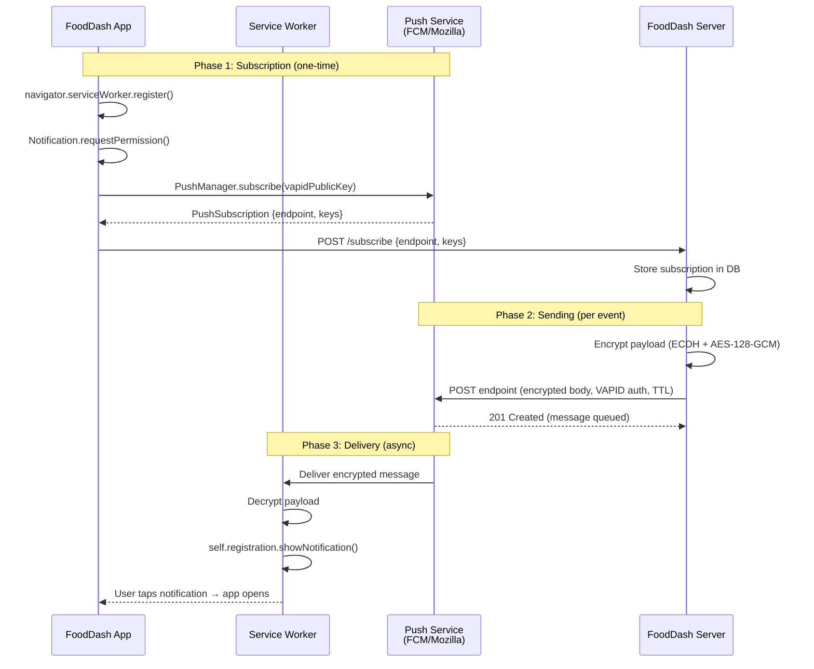

# Chapter 06 — Push Notifications

## The Scene

The chat feature is a hit. Drivers and customers are coordinating seamlessly over WebSocket — "Which entrance?", "Side door with the blue awning", "Got it, coming up!" Messages fly back and forth with negligible overhead.

But then a driver reports: *"I messaged the customer that I'm at their door, but they never responded. Their app was closed."*

WebSockets die when the app closes. SSE dies when the tab closes. Every pattern we've built so far — request-response, polling, SSE, WebSockets — requires the client to have an **active connection** to our server. The client must be running, connected, and listening.

But real users close apps. They switch to Instagram. They put their phone in their pocket. They close the browser tab and go make coffee. When the driver sends "I'm downstairs with your food," the customer's WebSocket is already torn down. The TCP connection is gone. Our server has no way to deliver that message.

We need a way to reach users who **aren't connected to us**.

---

## The Pattern — Push Notifications

### The Fundamental Shift

Push notifications are fundamentally different from everything we've built so far. In every previous chapter, communication required the client to maintain some kind of connection:

| Chapter | Pattern | Connection Required? |
|---------|---------|---------------------|
| Ch01 | Request-Response | Yes (per request) |
| Ch02 | Short Polling | Yes (repeated requests) |
| Ch03 | Long Polling | Yes (held-open request) |
| Ch04 | SSE | Yes (persistent HTTP stream) |
| Ch05 | WebSocket | Yes (persistent TCP connection) |
| **Ch06** | **Push Notification** | **No** |

With push notifications, we **delegate delivery to a platform**. We don't maintain a connection to the user's device. Instead:

1. The **platform** (Apple APNs, Google FCM, or the Web Push service) maintains its own persistent connection to the device
2. Our server sends a message to the **platform**
3. The platform delivers it to the **device**
4. The OS wakes the app (or shows a notification) even if the app is closed

We've traded direct control for reach. We can no longer guarantee instant delivery, message ordering, or even delivery at all. But we can reach users who are completely disconnected from our servers.

### Web Push Protocol

For web applications, the standard is the **Web Push Protocol** (RFC 8030), combined with **VAPID** (Voluntary Application Server Identification, RFC 8292) for server authentication. Here's what makes it work:

- **VAPID keys**: A public/private key pair that identifies your application server. The push service uses the public key to verify that push messages actually come from you.
- **Subscription object**: When a user grants notification permission, the browser generates a subscription containing an endpoint URL and cryptographic keys.
- **Encrypted payloads**: Push message content is encrypted end-to-end. The push service (Google, Mozilla, etc.) cannot read your notification content.

---

## How Web Push Works (The Full Chain)

### Step-by-Step Flow

**Phase 1: Subscription (happens once)**

1. Your web app asks the user for notification permission
2. User clicks "Allow" (this is the hard part — see UX section below)
3. Browser contacts the push service and generates a **subscription**:
   - `endpoint`: A unique URL on the push service (e.g., `https://fcm.googleapis.com/fcm/send/...`)
   - `keys.p256dh`: The client's public key (for ECDH key agreement)
   - `keys.auth`: A shared authentication secret
4. Browser returns the subscription object to your app
5. Your app sends the subscription to your server
6. Server stores the subscription (associated with the user)

**Phase 2: Sending a Push (happens per event)**

1. An event occurs (e.g., driver sends "I'm at the door")
2. Your server loads the user's subscription from the database
3. Server encrypts the payload:
   - Generate an ephemeral ECDH key pair
   - Derive a shared secret using ECDH with the subscription's `p256dh` key
   - Use HKDF to derive encryption and nonce keys
   - Encrypt the payload with AES-128-GCM
4. Server constructs an HTTP POST to the subscription's `endpoint`:
   - Body: the encrypted payload
   - Headers: `Authorization` (VAPID JWT), `TTL`, `Urgency`, `Topic`
5. Push service receives the message and holds it

**Phase 3: Delivery (happens asynchronously)**

1. Push service checks if the browser/device is online
2. If online: delivers immediately via its persistent connection to the device
3. If offline: holds the message until TTL expires or device comes online
4. Browser receives the encrypted message
5. Browser dispatches it to the **Service Worker** (which runs even when the page is closed)
6. Service Worker decrypts the payload and shows a notification
7. User taps the notification, app opens (or focuses)



### The Encryption Chain in Detail

Why is push encryption so complex? Because the **push service is untrusted**. Google/Mozilla route your messages, but they shouldn't be able to read "Your order from Burger Palace is arriving." The encryption ensures only the user's browser can decrypt the payload.

```
Server side:
  1. Generate ephemeral ECDH key pair (serverKey)
  2. ECDH(serverKey.private, subscription.p256dh) → shared_secret
  3. HKDF(shared_secret, subscription.auth) → content_encryption_key + nonce
  4. AES-128-GCM(content_encryption_key, nonce, payload) → encrypted_payload

Browser side (Service Worker):
  1. Extract serverKey.public from message header
  2. ECDH(subscription.private, serverKey.public) → shared_secret  (same value!)
  3. HKDF(shared_secret, subscription.auth) → content_encryption_key + nonce
  4. AES-128-GCM-decrypt(content_encryption_key, nonce, encrypted_payload) → payload
```

The beauty: the push service never sees `subscription.private` (it stays in the browser) or `subscription.auth` (only shared between browser and your server). It routes the opaque encrypted blob.

---

## Systems Constraints Analysis

### CPU

Encryption (ECDH + HKDF + AES-128-GCM) per push message. This is not free:

- **ECDH key agreement**: ~0.5ms on modern hardware (P-256 curve). Requires generating an ephemeral key pair per message.
- **HKDF derivation**: Negligible (~microseconds).
- **AES-128-GCM encryption**: Fast for small payloads (~microseconds for typical notification payloads of <4KB).
- **VAPID JWT signing**: ES256 signature per request (~0.5ms).

For a single notification, the total encryption cost is ~1-2ms. Barely noticeable. But batch 10,000 driver-arrival pushes at dinner rush, and that's 10-20 seconds of CPU time just for encryption. You'll want to parallelize across cores or use a dedicated worker pool.

The saving grace: push notifications are **event-driven, not periodic**. Unlike polling (which fires continuously), you only encrypt when something important happens. The CPU cost is amortized over meaningful events.

### Memory

Server-side memory is minimal. Each push subscription is ~200 bytes:

```json
{
  "endpoint": "https://fcm.googleapis.com/fcm/send/abc123...",  // ~120 bytes
  "keys": {
    "p256dh": "BLc4xRb...",   // ~88 bytes (base64url-encoded)
    "auth": "aGVsbG8..."       // ~24 bytes (base64url-encoded)
  }
}
```

For 1 million users: ~200 MB of subscription storage. Compare this to WebSockets, where 1 million concurrent connections would require 3-6 GB of RAM just for the connection state. Push subscriptions are passive data — they sit in the database consuming zero server memory until you need to send a notification.

No persistent connections to maintain. No per-connection buffers. The platform (APNs/FCM/Web Push service) holds the millions of device connections, not you.

### Network I/O

Minimal from our server's perspective. Each push notification is **one HTTPS POST** to the push service endpoint. The heavy lifting — maintaining persistent connections to millions of devices, handling device sleep/wake cycles, retrying delivery — is entirely offloaded to Apple/Google/Mozilla.

Payload size is limited:
- Web Push: **4096 bytes** maximum (after encryption overhead, ~3993 bytes of actual content)
- APNs: **4096 bytes** (increased from 256 bytes in iOS 8)
- FCM: **4096 bytes** for data messages

This is intentionally small. Push notifications are for **alerts**, not data transfer. "Your food is arriving" fits. The full order history does not.

### Latency

Variable and **unpredictable**. This is the key trade-off:

| Scenario | Typical Latency |
|----------|----------------|
| Device online, app backgrounded | 1-5 seconds |
| Device online, screen off | 2-10 seconds |
| Device in Doze mode (Android) | Up to 15 minutes (batched) |
| Device offline | Held until online (up to TTL) |
| Push service throttling | Additional seconds to minutes |

Push notifications are **NOT suitable for real-time messaging**. They are for "eventually delivered" notifications. If the driver is at the door, the customer will get the push within seconds *usually* — but there's no guarantee. The push service may batch it, the OS may defer it for battery optimization, the device may be in a tunnel.

For real-time: use WebSocket (Ch05). For "reach the user eventually": use push.

### Bottleneck Shift

We've traded **direct control for reliability across disconnection**:

| What We Lost | What We Gained |
|-------------|---------------|
| Guaranteed delivery timing | Delivery when device is offline |
| Message ordering guarantees | No persistent connection required |
| Direct connection to client | Massive scale (platform handles connections) |
| Payload flexibility (size/format) | Battery-efficient delivery |
| Full duplex communication | Works when app is closed |

The bottleneck is no longer our server's connection capacity. It's the **platform's delivery pipeline** — and we have zero control over it. Push services may throttle aggressive senders, batch notifications for battery optimization, or silently drop messages if the device has been offline longer than the TTL.

---

## Principal-Level Depth

### VAPID Authentication

VAPID (Voluntary Application Server Identification, RFC 8292) solves the question: *"How does the push service know this push message actually comes from FoodDash's server?"*

Your server generates an ECDSA key pair (P-256 curve):
- **Public key**: Shared with the browser during subscription (so the push service can associate the subscription with your server)
- **Private key**: Kept secret on your server, used to sign JWT tokens

Each push request includes an `Authorization` header with a JWT signed by your private key:

```
Authorization: vapid t=eyJhbGciOiJFUzI1NiJ9.eyJhdWQiOiJodHRwczovL2ZjbS5nb29nbGVhcGlzLmNvbSIsImV4cCI6MTcxMDAwMDAwMCwic3ViIjoibWFpbHRvOmRldkBmb29kZGFzaC5jb20ifQ.SIGNATURE, k=PUBLIC_KEY
```

The JWT contains:
- `aud`: The push service origin (e.g., `https://fcm.googleapis.com`)
- `exp`: Expiration time (max 24 hours from now)
- `sub`: Contact info (mailto: or https: URL) so the push service can reach you if there's a problem

### Payload Encryption (RFC 8291)

Why encrypt? Because the push service is a **relay**. Google/Mozilla shouldn't read "Your Burger Palace order #4521 is being prepared." The encryption is end-to-end between your server and the user's browser.

The encryption uses **ECDH** (Elliptic Curve Diffie-Hellman) for key agreement and **AES-128-GCM** for symmetric encryption:

1. The browser generates a P-256 key pair during subscription. The public key is `p256dh`.
2. The browser also generates a 16-byte random `auth` secret.
3. When your server encrypts, it creates an **ephemeral** P-256 key pair (new one per message).
4. ECDH between the ephemeral private key and the subscription's `p256dh` produces a shared secret.
5. HKDF expands the shared secret (using `auth` as additional input) into an encryption key and nonce.
6. AES-128-GCM encrypts the payload.
7. The ephemeral public key is included in the encrypted message so the browser can reverse the process.

Why an ephemeral key per message? **Forward secrecy**. If a message's ephemeral key is compromised, it doesn't help decrypt any other message.

### TTL (Time To Live)

The `TTL` header tells the push service how long to hold an undelivered message:

```
TTL: 3600    (hold for 1 hour)
TTL: 86400   (hold for 24 hours)
TTL: 0       (deliver now or discard — "fire and forget")
```

Choosing TTL is a product decision:
- **"Your food is at the door"**: TTL=300 (5 minutes). If they don't see it in 5 minutes, the driver has moved on.
- **"Your order has been placed"**: TTL=86400 (24 hours). Confirmation is always relevant.
- **"Driver is 2 minutes away"**: TTL=120 (2 minutes). After that, the information is stale.
- **"Rate your delivery"**: TTL=604800 (7 days). No urgency.

If TTL expires before delivery, the push service **silently discards** the message. No error callback. You never know if it was delivered.

### Urgency

The `Urgency` header hints to the device OS how aggressively to deliver:

| Value | Meaning | Example |
|-------|---------|---------|
| `very-low` | Can wait, don't wake the device | "Weekly summary available" |
| `low` | Deliver when convenient | "Your review was helpful" |
| `normal` | Deliver reasonably soon | "Your order is being prepared" |
| `high` | Deliver immediately, wake the device | "Your food is at the door" |

On Android, `very-low` and `low` urgency messages may be deferred until the device exits Doze mode — potentially 15+ minutes. `high` urgency bypasses Doze mode and wakes the device immediately, but abusing it will get your app flagged by the OS and notifications may be silently suppressed.

### Topic (Replacing Stale Notifications)

The `Topic` header lets you **replace** a previous notification instead of stacking a new one:

```
# First push:
Topic: order-status-4521
Payload: "Your order is being prepared"

# Second push (replaces the first):
Topic: order-status-4521
Payload: "Your order is ready for pickup"
```

Without `Topic`, the user would see two separate notifications. With it, the second replaces the first — the user only sees the latest status. This is critical for order tracking: you don't want 7 stacked notifications for each status transition.

### Rate Limits

Push services throttle aggressive senders:
- **FCM**: No published hard limits, but sending more than ~1000 messages/second per project will result in throttling. Batch API available for up to 500 messages per request.
- **APNs**: Will return HTTP 429 (Too Many Requests) with a `Retry-After` header. Persistent connections are expected (HTTP/2 multiplexing).
- **Web Push**: Varies by provider. Mozilla's push service is more lenient than some. Generally, stay under a few hundred per second per subscriber.

If you're sending a push to every user simultaneously (e.g., "Cyber Monday deals!"), you need to **fan out** through a queue and rate-limit your sends. Trying to blast 1 million pushes in a tight loop will get you throttled or temporarily blocked.

### Mobile Platform Differences

While the Web Push Protocol standardizes things for browsers, native mobile is a different world:

| Aspect | APNs (Apple) | FCM (Google) | Web Push |
|--------|-------------|-------------|----------|
| **Connection** | HTTP/2, persistent | HTTP/2 or XMPP (legacy) | HTTPS POST per message |
| **Auth** | JWT or TLS client cert | OAuth 2.0 or server key | VAPID (JWT + ECDSA) |
| **Payload encryption** | TLS only (Apple reads payloads) | TLS only (Google reads payloads) | End-to-end encrypted |
| **Max payload** | 4096 bytes | 4096 bytes | 4096 bytes |
| **Silent push** | Yes (`content-available`) | Yes (data-only message) | No (must show notification) |
| **Priority** | 5 (send immediately) or 10 (power-optimized) | High or Normal | very-low/low/normal/high |
| **Feedback** | HTTP/2 response codes | HTTP response codes + Callback | HTTP response codes |
| **Token management** | Device token, can change | Registration token, can change | Subscription object, can change |

**Key difference**: APNs and FCM have access to unencrypted payloads (they decrypt TLS). Web Push encrypts end-to-end — the push service can't read your content. This is why Web Push encryption is more complex.

**Silent pushes** (APNs/FCM): You can send a data-only push that wakes the app in the background without showing a notification. Useful for syncing data. Web Push doesn't support this — the Service Worker **must** show a notification or the browser will show a generic "This site has been updated in the background" message (and may revoke permission after repeated violations).

### The Permission UX Problem

The hardest part of push notifications isn't the encryption or the protocol. It's getting the user to click "Allow."

Browser notification permission is a **one-shot opportunity**. If the user clicks "Block," you cannot ask again (the browser remembers). The browser's built-in permission prompt is generic and unhelpful:

```
"localhost wants to send you notifications"
[Allow]  [Block]
```

The user has no context about *what* notifications they'll receive or *why* they should allow them. Best practices:

1. **Never ask on page load**. Wait until the user has engaged with your app.
2. **Use a pre-permission prompt** (your own UI) that explains the value: "Get notified when your driver arrives so you don't miss your food."
3. **Only trigger the browser prompt after the user indicates interest** (e.g., clicks "Yes, notify me").
4. **If declined, respect it.** Don't nag. Show a "You can enable notifications in Settings" link if they later want them.

Studies show that pre-permission prompts increase opt-in rates from ~5% (cold prompt on page load) to ~15-25% (contextual prompt after engagement).

---

## Trade-offs at a Glance

| Dimension | WebSocket (Ch05) | Push Notification (Ch06) | SMS/Email |
|-----------|-----------------|------------------------|-----------|
| **Requires active connection** | Yes | No | No |
| **Delivery when offline** | No | Yes (with TTL) | Yes |
| **Latency** | Sub-millisecond | 1-10+ seconds | Seconds to minutes |
| **Bidirectional** | Yes | No (server-to-device only) | No (separate channels) |
| **Payload size** | Unlimited (fragmented) | 4 KB | SMS: 160 chars, Email: ~25 MB |
| **Encryption** | TLS (transport) | End-to-end (Web Push) | Varies |
| **Server memory** | High (per-connection state) | Low (subscription storage) | None |
| **Delivery guarantee** | While connected | Best-effort (TTL-bounded) | Best-effort |
| **User permission** | None (WebSocket is same-origin) | Required (explicit opt-in) | Phone number/email required |
| **Cost** | Server infrastructure | Free (Web Push) or per-message (SMS) | Per-message (SMS) or free (email) |
| **Works when app closed** | No | Yes | Yes |
| **Platform dependency** | None | Apple/Google/Browser vendor | Carrier/Email provider |

**When to use which:**
- **WebSocket**: Real-time, bidirectional — chat, live collaboration, gaming
- **Push Notification**: Important alerts when user may be away — delivery updates, messages received, price drops
- **SMS**: Critical, must-reach — 2FA codes, fraud alerts, time-sensitive actions
- **Email**: Non-urgent, detailed — receipts, weekly summaries, marketing

In practice, FoodDash uses **all of them**:
- WebSocket for live driver-customer chat (Ch05)
- Push for "your driver is arriving" when the app is closed (this chapter)
- SMS for two-factor authentication
- Email for order receipts and promotions

---

## Running the Code

### Start the server

```bash
# From the repo root
uv run uvicorn chapters.ch06_push_notifications.server:app --port 8006
```

### Run the subscriber

In a second terminal:

```bash
uv run python -m chapters.ch06_push_notifications.subscriber
```

The subscriber simulates the browser-side subscription flow: generates VAPID keys, creates a subscription, registers with the server, and listens for push notifications.

### Open the visual

Open `chapters/ch06_push_notifications/visual.html` in your browser. It demonstrates the push notification flow, offline delivery, and comparison with WebSocket. No server needed.

---

## Bridge to Chapter 07

Push notifications solve the "reach the user" problem. The driver sends "I'm downstairs" and even though the customer's app is closed, the message travels through the push service and appears on their lock screen. Problem solved.

But now look at the **server side**. When a customer places an order, five things need to happen:

1. The kitchen needs to know (send to restaurant)
2. Billing needs to charge the card
3. A driver needs to be matched
4. Analytics needs to log the event
5. The customer needs a confirmation push notification

Currently, our order endpoint does all five **in sequence**. If billing is slow (credit card processor taking 3 seconds), the customer waits. If driver matching fails, does the order fail too? If analytics is down, should the customer see an error?

These are all **reactions to the same event** ("order placed"), but they have different latency requirements, failure modes, and criticality. The order endpoint shouldn't know or care about all of them.

We need a way to **decouple these reactions** — to say "an order was placed" and let interested services independently decide what to do about it.

That's publish-subscribe. Welcome to [Chapter 07 — Pub/Sub](../ch07_pub_sub/).
