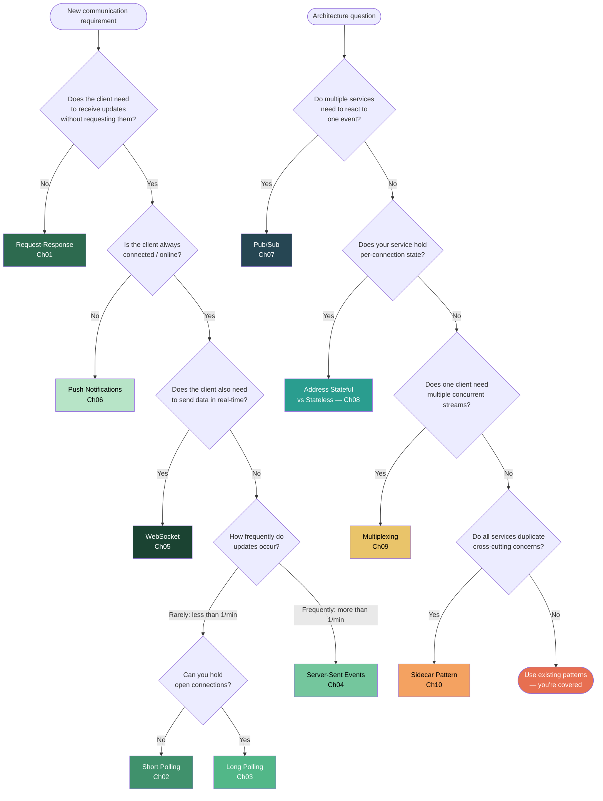

# Chapter 11 -- Synthesis / Decision Framework

You now know 10 communication patterns. The real skill isn't knowing what each one does -- it's knowing which one to reach for when a new requirement lands on your desk. This chapter gives you the framework.

We'll tie everything together: a full architecture diagram of FoodDash with every pattern labeled, a decision flowchart you can follow mechanically, a constraint heatmap that reveals the true cost of each choice, and the anti-patterns that trip up even experienced engineers.

---

## The Full FoodDash Architecture

Here is the complete FoodDash system. Every arrow is a communication pattern you've studied:

```
                                    ┌─────────────────────────────────────────────────────────┐
                                    │                   EVENT BUS (Pub/Sub - Ch07)             │
                                    │                                                         │
                                    │   Topics: order.placed, order.confirmed, order.ready,    │
                                    │           driver.assigned, driver.location, order.delivered│
                                    └──┬──────────┬──────────┬──────────┬──────────┬──────────┘
                                       │          │          │          │          │
                                       ▼          ▼          ▼          ▼          ▼
                                  ┌────────┐ ┌────────┐ ┌─────────┐ ┌────────┐ ┌──────────┐
                                  │Kitchen │ │Billing │ │ Driver  │ │Notific-│ │Analytics │
                                  │Service │ │Service │ │ Match   │ │ation   │ │Service   │
                                  │        │ │        │ │ Service │ │Service │ │          │
                                  └───┬────┘ └───┬────┘ └────┬────┘ └───┬────┘ └──────────┘
                                      │          │           │          │
                                      └──────────┴─────┬─────┴──────────┘
                                                       │
                                            All wrapped in Sidecars (Ch10)
                                           ┌───────────┴───────────────┐
                                           │  Sidecar per service:     │
                                           │  - JWT auth verification  │
                                           │  - Request logging        │
                                           │  - Rate limiting          │
                                           │  - Circuit breaking       │
                                           └───────────────────────────┘

    ┌──────────────┐                    ┌──────────────────────────────┐
    │              │ ── HTTP POST ────> │                              │
    │   Customer   │   (Request-       │       API Gateway            │
    │   Mobile App │    Response       │    (Stateless - Ch08)        │
    │              │    Ch01)          │                              │
    │              │ <── SSE stream ── │    ┌──────────────────┐      │──── HTTP ────> Order Service
    │              │   (Ch04: order    │    │  Multiplexed     │      │               (Request-Response
    │              │    status updates)│    │  Connection      │      │                Ch01)
    │              │                   │    │  (Ch09: single   │      │
    │              │ <── Push ──────── │    │   TCP conn for   │      │──── Publish ──> Event Bus
    │              │   (Ch06: offline  │    │   all streams)   │      │               (Pub/Sub Ch07)
    │              │    "order ready") │    └──────────────────┘      │
    │              │                   └──────────────────────────────┘
    │              │
    │              │ ◄──── WebSocket ────► Driver App
    │              │   (Ch05: real-time    (also receives Push
    │              │    chat with driver)   notifications Ch06)
    └──────────────┘
```

**Every pattern has a job:**

| Arrow / Component | Pattern | Chapter | Why This Pattern? |
|---|---|---|---|
| Customer places order | Request-Response | Ch01 | Simple command: send order, get confirmation |
| Customer sees "order confirmed" | SSE | Ch04 | Server pushes status changes; client doesn't need to send data |
| Customer chats with driver | WebSocket | Ch05 | Bidirectional real-time text |
| "Your food is arriving!" (phone locked) | Push Notification | Ch06 | User isn't in the app |
| Order service tells kitchen, billing, driver | Pub/Sub | Ch07 | One event, many reactors -- decoupled |
| API Gateway design | Stateless | Ch08 | Any gateway instance can handle any request |
| Single TCP connection per client | Multiplexing | Ch09 | HTTP/2: one connection carries API calls + SSE stream |
| Auth, logging, rate-limiting | Sidecar | Ch10 | Same cross-cutting logic, deployed once |

---

## The Decision Flowchart

This is the key deliverable of the entire repository. Follow this flowchart when a new requirement arrives:



### How to read this flowchart

1. **Start with the client's need.** If the client only needs to send a request and get a response, stop at Ch01. Most endpoints in any system are request-response.

2. **Then ask about direction.** If the server needs to push data, you're in the SSE/WebSocket/Push territory. The deciding factor is whether the client also sends real-time data (WebSocket) or just receives (SSE), and whether the client is online (SSE/WebSocket) or offline (Push).

3. **Then ask about architecture.** Pub/Sub, stateful/stateless, multiplexing, and sidecar are architectural decisions that layer on top of the client-facing patterns.

---

## The Constraint Heatmap

This is the signature visual of this project. Every pattern has a resource profile. Understanding these profiles is what separates a senior engineer from a principal engineer.

### Resource Costs

| Pattern | CPU | Memory | Network I/O | Latency | Complexity | Scalability |
|---|---|---|---|---|---|---|
| **Ch01 Request-Response** | `[*----]` LOW | `[*----]` LOW | `[*----]` LOW | `[**---]` MED | `[*----]` LOW | `[*****]` HIGH |
| **Ch02 Short Polling** | `[**---]` MED | `[*----]` LOW | `[****-]` HIGH | `[****-]` HIGH | `[*----]` LOW | `[****-]` HIGH |
| **Ch03 Long Polling** | `[*----]` LOW | `[**---]` MED | `[*----]` LOW | `[*----]` LOW | `[**---]` MED | `[**---]` MED |
| **Ch04 SSE** | `[*----]` LOW | `[**---]` MED | `[*----]` LOW | `[*----]` LOW | `[**---]` MED | `[**---]` MED |
| **Ch05 WebSocket** | `[**---]` MED | `[***--]` HIGH | `[**---]` MED | `[*----]` LOW | `[****-]` HIGH | `[*----]` LOW |
| **Ch06 Push** | `[*----]` LOW | `[*----]` LOW | `[*----]` LOW | `[****-]` HIGH | `[**---]` MED | `[*****]` HIGH |
| **Ch07 Pub/Sub** | `[**---]` MED | `[**---]` MED | `[**---]` MED | `[*----]` LOW | `[**---]` MED | `[*****]` HIGH |
| **Ch08 Stateful** | `[**---]` MED | `[****-]` HIGH | `[*----]` LOW | `[*----]` LOW | `[****-]` HIGH | `[*----]` LOW |
| **Ch08 Stateless** | `[*----]` LOW | `[*----]` LOW | `[**---]` MED | `[**---]` MED | `[*----]` LOW | `[*****]` HIGH |
| **Ch09 Multiplexing** | `[**---]` MED | `[**---]` MED | `[*----]` LOW | `[*----]` LOW | `[****-]` HIGH | `[****-]` HIGH |
| **Ch10 Sidecar** | `[**---]` MED | `[**---]` MED | `[*----]` LOW | `[*----]` LOW | `[**---]` MED | `[*****]` HIGH |

### Reading the heatmap

- **CPU**: How much processing does the server do per unit of communication? Short polling wastes CPU re-parsing empty responses. WebSockets require per-frame parsing.
- **Memory**: Does the server hold state for each client? WebSockets and stateful servers hold per-connection buffers. Stateless and request-response release everything between calls.
- **Network I/O**: How many bytes flow over the wire relative to useful payload? Short polling is catastrophic -- most responses are empty 304s or identical payloads. SSE and long polling only transmit when there's real data.
- **Latency**: How long between "event occurs" and "client knows about it"? Push notifications depend on OS scheduling. Short polling depends on the interval. WebSockets and SSE are near-instant.
- **Complexity**: How much code do you write beyond the happy path? WebSockets need heartbeat, reconnection, state reconciliation. Request-response needs almost nothing.
- **Scalability**: How easily can you add servers? Stateless patterns scale horizontally by adding boxes. Stateful patterns need sticky sessions, state migration, and careful orchestration.

---

## Pattern Comparison Matrix

| Property | Req-Resp | Short Poll | Long Poll | SSE | WebSocket | Push | Pub/Sub | Mux | Sidecar |
|---|---|---|---|---|---|---|---|---|---|
| **Direction** | Client-Server | Client-Server | Client-Server | Server-Client | Bidirectional | Server-Device | Pub-Broker-Sub | Bidirectional | Transparent |
| **Connection** | Short-lived | Short-lived | Medium-lived | Long-lived | Long-lived | None | To broker | Long-lived | Per-request |
| **Browser API** | fetch/XHR | fetch+timer | fetch | EventSource | WebSocket | Push API | N/A (backend) | HTTP/2 auto | N/A (infra) |
| **Reconnect** | N/A | Next poll | Client re-sends | Auto (Last-Event-ID) | Manual | Platform retry | Broker redelivery | Per-stream reset | Sidecar retry |
| **Ordering** | Per-request | None (gaps possible) | Sequential | Guaranteed | Guaranteed | Best-effort | Per-partition | Per-stream | Preserved |
| **Max clients/server** | ~10K+ | ~10K+ (but wasteful) | ~5K-10K | ~10K-50K | ~10K-50K | Unlimited (platform) | Broker-dependent | ~50K+ | Same as app |
| **Firewall friendly** | Yes | Yes | Yes | Yes (HTTP) | Sometimes blocked | Yes (platform) | Internal only | Yes (HTTP/2) | Internal only |
| **Binary data** | Yes | Yes | Yes | No (text only) | Yes | Yes (limited) | Yes | Yes | Yes |

---

## Real-World Pattern Combinations

No production system uses just one pattern. The art is in the combination.

### Slack

```
┌─────────────────────────────────────────────────────┐
│  Desktop/Web Client                                  │
│                                                      │
│  WebSocket ←──→ Real-time messages, typing,          │
│                 presence, reactions                   │
│                                                      │
│  HTTP REST ←──→ File upload, search, channel         │
│                 management, history fetch             │
│                                                      │
│  Push ──────→ Mobile notifications when              │
│               app is backgrounded                    │
│                                                      │
│  Internally: Pub/Sub for message fan-out             │
│  to all connected clients in a channel               │
└─────────────────────────────────────────────────────┘
```

**Why this combination**: WebSocket handles the real-time core (messages must appear instantly), but file uploads and search are classic request-response operations -- no reason to push them through the WebSocket. Push notifications handle the offline case that WebSockets cannot.

### Uber

```
┌─────────────────────────────────────────────────────┐
│  Rider App                                           │
│                                                      │
│  HTTP POST ────→ Request a ride, update payment,     │
│                  rate driver (Request-Response)       │
│                                                      │
│  WebSocket ←───→ Live map: driver location every     │
│                  2 seconds (bidirectional -- rider    │
│                  location sent too for pickup)        │
│                                                      │
│  Push ─────────→ "Your driver is arriving"           │
│                  "Rate your trip" (offline)           │
│                                                      │
│  Internally:                                         │
│    Pub/Sub: ride events → pricing, matching,         │
│             dispatch, fraud, analytics               │
│    Sidecar: service mesh across 4000+ services       │
│    Multiplexing: HTTP/2 between services             │
└─────────────────────────────────────────────────────┘
```

**Why this combination**: Booking a ride is a one-time action (request-response). But once you're waiting, you need continuous updates -- the driver's position every 2 seconds cannot tolerate polling delays. When you close the app, push notifications bridge the gap.

### Twitter / X

```
┌─────────────────────────────────────────────────────┐
│  Web Client                                          │
│                                                      │
│  SSE ←─────────── Live timeline: new tweets stream   │
│                   in without refreshing (unidirectional│
│                   -- you don't tweet via SSE)         │
│                                                      │
│  HTTP POST ──────→ Post tweet, like, retweet, follow │
│                   (Request-Response)                  │
│                                                      │
│  Push ───────────→ "@user mentioned you"             │
│                   "New follower" (mobile offline)     │
│                                                      │
│  Internally:                                         │
│    Pub/Sub: tweet fan-out to follower timelines      │
│    (this is one of the hardest fan-out problems      │
│     in the industry -- some users have 100M+         │
│     followers)                                       │
└─────────────────────────────────────────────────────┘
```

**Why this combination**: The timeline is read-heavy and unidirectional -- SSE is perfect (simpler than WebSocket, auto-reconnect, works through every proxy). Posting is infrequent and transactional -- request-response. The internal fan-out problem (one tweet to millions of timelines) is the textbook pub/sub problem.

### Kafka-Based Event Platform

```
┌─────────────────────────────────────────────────────┐
│  Event-Driven Microservices                          │
│                                                      │
│  Pub/Sub (Kafka):                                    │
│    Producers → Topics → Consumer Groups              │
│    Partitioned for parallelism                       │
│    Replicated for durability                         │
│                                                      │
│  Multiplexed connections:                            │
│    Each broker connection carries requests for       │
│    many partitions over one TCP connection            │
│    (Kafka's binary protocol multiplexes internally)  │
│                                                      │
│  Sidecar (Envoy / Istio):                           │
│    mTLS between services                             │
│    Traffic shaping and canary deployments            │
│    Observability (distributed tracing)               │
│                                                      │
│  HTTP (REST/gRPC):                                   │
│    Schema Registry API calls                         │
│    Admin operations                                  │
│    Health checks                                     │
└─────────────────────────────────────────────────────┘
```

**Why this combination**: Kafka is pub/sub at its core, but under the hood it uses multiplexed binary connections for throughput. The service mesh (sidecar) handles the cross-cutting concerns that every microservice needs. And yes, even Kafka uses plain HTTP for its admin and schema APIs.

---

## Anti-Patterns

These are the mistakes engineers make when choosing communication patterns. Every one of these is a real pattern we've seen in production systems.

### 1. WebSocket for Everything

**The mistake**: "We need real-time, so let's use WebSockets for all our API calls."

**Why it's wrong**: WebSockets are expensive. They hold memory for every connection. They require sticky sessions or shared state. They complicate load balancing. They break through some corporate proxies. And for 90% of API calls (CRUD, search, file upload), request-response is simpler, cheaper, and more reliable.

**The rule**: Use WebSocket only when BOTH sides need to send data in real-time. If only the server pushes, use SSE. If the client just needs data on demand, use request-response.

### 2. Short Polling When SSE Is Available

**The mistake**: `setInterval(() => fetch('/api/status'), 3000)` — polling every 3 seconds for order updates.

**Why it's wrong**: If 1000 customers are watching their orders, that's 333 requests per second to your server -- and 95% of them return "no change." SSE would use 1000 persistent connections (trivial for a modern server) and only send data when something actually changes.

**The math**: Short polling at 3s intervals with 1000 clients = 333 req/s = 28.8M requests/day. SSE with the same 1000 clients = ~7 events per order lifecycle x ~100 orders/hour = 700 events/hour. That's a 148,000x reduction in unnecessary network traffic.

**The exception**: Short polling is correct when you cannot hold persistent connections (restrictive firewalls, legacy infrastructure) or when the polling interval is very long (> 5 minutes) and you don't want to hold connections open.

### 3. Building Your Own Pub/Sub

**The mistake**: Writing a custom in-memory message broker because "Kafka is too complex" or "we just need simple pub/sub."

**Why it's wrong**: Your custom broker will lack: persistence (messages lost on crash), ordering guarantees, consumer groups, backpressure, dead letter queues, monitoring, and horizontal scaling. You'll spend months building these features -- or you'll skip them and discover you needed them when your system fails at 3 AM.

**The alternatives**:
- **Redis Pub/Sub**: Zero persistence but instant setup. Good for ephemeral events (typing indicators, presence).
- **Redis Streams**: Persistence + consumer groups. Good middle ground.
- **Kafka / Redpanda**: Full durability, ordering, replay. The industry standard for event streaming.
- **Cloud-managed**: AWS SNS/SQS, Google Pub/Sub, Azure Service Bus. Zero ops.

### 4. Stateful Servers Without Understanding Scaling

**The mistake**: Storing WebSocket connection state in process memory without planning for horizontal scaling.

**Why it's wrong**: When you add a second server, connections are split. User A is connected to Server 1, User B to Server 2. When User A sends a message to User B, Server 1 doesn't know about Server 2's connections. You now need sticky sessions (limit scaling), shared state (Redis, adds latency), or a pub/sub layer between servers.

**The fix**: Design for statelessness from day one. If you must hold state (WebSocket connections, game state), plan the coordination layer upfront:
- **Session affinity** at the load balancer (simplest, limits scaling)
- **Shared state store** like Redis (adds latency, but scales)
- **Pub/sub between servers** (most complex, most scalable)

### 5. Ignoring Reconnection

**The mistake**: Assuming persistent connections (WebSocket, SSE) stay connected forever.

**Why it's wrong**: Connections die. Mobile users enter tunnels. Wi-Fi switches. Load balancers have idle timeouts. Deployments restart servers. A persistent connection that doesn't handle reconnection gracefully will leave users staring at stale data with no indication that updates have stopped.

**What reconnection must handle**:
- **Detect** the disconnection (heartbeat/ping-pong for WebSocket, `onerror` for SSE)
- **Backoff** exponentially (don't slam the server with reconnection attempts)
- **Reconcile** state (what happened between disconnect and reconnect?)
- **SSE does this well**: `Last-Event-ID` header tells the server where to resume
- **WebSocket does not**: You must build the state reconciliation yourself

### 6. Pub/Sub Without Idempotent Consumers

**The mistake**: Assuming every message is delivered exactly once.

**Why it's wrong**: Every message broker provides at-least-once delivery (or at-most-once). Exactly-once is a distributed systems impossibility in the general case. If your consumer isn't idempotent, you'll process duplicate events: charging a customer twice, sending two confirmation emails, creating duplicate records.

**The fix**: Design every consumer to be idempotent. Use event IDs, idempotency keys, or upserts instead of inserts. This isn't optional -- it's a requirement of event-driven architecture.

---

## Summary

The 10 patterns in this repository are not 10 alternatives. They are tools in a toolbox, each shaped for a specific type of problem:

| Layer | Pattern | One-Line Summary |
|---|---|---|
| **Foundation** | Request-Response (Ch01) | Client asks, server answers |
| **Near-Real-Time** | Short Polling (Ch02) | Client asks repeatedly on a timer |
| **Near-Real-Time** | Long Polling (Ch03) | Client asks, server waits to answer |
| **Real-Time (Server Push)** | SSE (Ch04) | Server streams events to client |
| **Real-Time (Bidirectional)** | WebSocket (Ch05) | Both sides talk freely |
| **Offline** | Push Notifications (Ch06) | Server reaches client through OS |
| **Decoupling** | Pub/Sub (Ch07) | One event, many reactors |
| **Architecture** | Stateful vs Stateless (Ch08) | Where does state live? |
| **Efficiency** | Multiplexing (Ch09) | Many streams, one connection |
| **Infrastructure** | Sidecar (Ch10) | Cross-cutting concerns, extracted |

The principal engineer's skill is not memorizing these patterns. It is recognizing which combination of patterns solves the problem at hand with the lowest total cost -- in complexity, in resources, and in operational burden.

Start with request-response. Add patterns only when a specific limitation forces your hand. And when you add a pattern, understand its full constraint profile -- not just what it enables, but what it costs.
